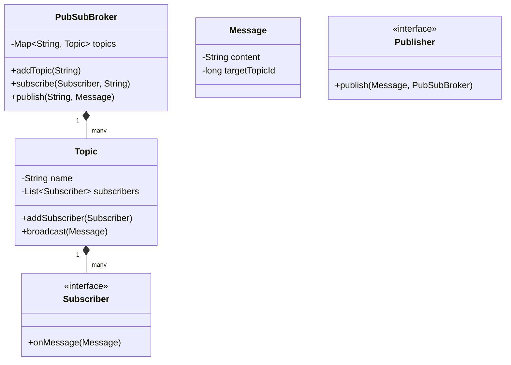

# 🛠️ Design Pub-Sub System (LLD)

A Publish-Subscribe (Pub/Sub) system is an asynchronous messaging paradigm where message senders (Publishers) do not send messages directly to specific receivers (Subscribers). Instead, published messages are characterized into classes (Topics), without knowledge of which subscribers, if any, there may be. 

This problem heavily tests the **Observer Pattern** and multi-threading/concurrency control.

---

## 1. Requirements

### Functional Requirements
- **Topics/Channels:** The system should support creating multiple topics.
- **Publishers:** Can publish messages to a specific topic.
- **Subscribers:** Can subscribe to one or more topics.
- **Message Dispatch:** When a publisher publishes to `Topic A`, all subscribers of `Topic A` should receive the message.

### Non-Functional Requirements
- **Decoupling:** Publishers and Subscribers should not know about each other.
- **Concurrency:** Multiple publishers might publish at the same time. The structure must be thread-safe.
- **Asynchronous Delivery:** Message delivery should not block the publisher from continuing its work.

---

## 2. Core Entities (Objects)

- `Message` (The DTO)
- `Topic` (The channel holding subscribers)
- `Broker` / `PubSubSystem` (The central manager)
- `Publisher` (Interface)
- `Subscriber` (Interface)

---

## 3. Class Diagram / Relationships



---

## 4. Key Algorithms / Design Patterns

### 1. The Observer Pattern
The core of Pub/Sub is the Observer pattern. The `Topic` is the Subject. The `Subscriber`s are the Observers.

```java
// Common Interface for all receivers
public interface Subscriber {
    void onMessage(Message msg);
}

// Concrete Subscriber
public class EmailService implements Subscriber {
    @Override
    public void onMessage(Message msg) {
        System.out.println("Emailing: " + msg.getPayload());
    }
}
```

### 2. The Topic (Subject)

The `Topic` manages its list of subscribers and handles the broadcasting loop.
**Concurrency note:** If a subscriber unsubscribes *while* the topic is broadcasting a message, iterating over a standard `ArrayList` will throw a `ConcurrentModificationException`. We must use thread-safe collections like `CopyOnWriteArrayList` or synchronize the block.

```java
import java.util.concurrent.CopyOnWriteArrayList;

public class Topic {
    private final String topicId;
    // Thread-safe list optimized for reads (iteration) over writes (adding/removing)
    private final List<Subscriber> subscribers = new CopyOnWriteArrayList<>();

    public Topic(String id) {
        this.topicId = id;
    }

    public void addSubscriber(Subscriber sub) {
        subscribers.add(sub);
    }
    
    public void removeSubscriber(Subscriber sub) {
        subscribers.remove(sub);
    }

    // Synchronous broadcast (Blocks the publisher)
    public void publish(Message message) {
        for (Subscriber sub : subscribers) {
            sub.onMessage(message);
        }
    }
}
```

### 3. The Central Broker
The Broker manages the topics. Publishers don't talk to Topics directly; they talk to the Broker.

```java
import java.util.concurrent.ConcurrentHashMap;

public class PubSubBroker {
    private final Map<String, Topic> topicMap = new ConcurrentHashMap<>();

    public void createTopic(String topicId) {
        topicMap.putIfAbsent(topicId, new Topic(topicId));
    }

    public void subscribe(String topicId, Subscriber sub) {
        Topic topic = topicMap.get(topicId);
        if (topic != null) {
            topic.addSubscriber(sub);
        }
    }

    public void publish(String topicId, Message message) {
        Topic topic = topicMap.get(topicId);
        if (topic != null) {
            topic.publish(message);
        }
    }
}
```

### 4. Advanced: Asynchronous Delivery (Producer-Consumer)

The design above is *synchronous*. If we have 10,000 subscribers, `publish()` loops 10,000 times, blocking the Publisher thread for seconds.
To make it genuinely asynchronous (like Kafka or RabbitMQ), we introduce a queue.

```java
import java.util.concurrent.*;

public class AsyncTopic {
    private final String topicId;
    private final List<Subscriber> subscribers = new CopyOnWriteArrayList<>();
    
    // A queue to hold messages waiting to be delivered
    private final BlockingQueue<Message> messageQueue = new LinkedBlockingQueue<>();
    private final ExecutorService executor = Executors.newFixedThreadPool(10);

    public AsyncTopic(String id) {
        this.topicId = id;
        
        // Start a background daemon to process the queue
        Thread dispatcher = new Thread(() -> {
            while (true) {
                try {
                    Message msg = messageQueue.take(); // Blocks until a msg arrives
                    broadcastWorker(msg);
                } catch (InterruptedException e) {}
            }
        });
        dispatcher.start();
    }

    // Publisher calls this. It returns instantly (O(1)).
    public void publish(Message msg) {
        messageQueue.offer(msg);
    }

    // Background thread delivers messages to subscribers using a thread pool
    private void broadcastWorker(Message msg) {
        for (Subscriber sub : subscribers) {
            executor.submit(() -> sub.onMessage(msg));
        }
    }
}
```
*Note for interviews: Building the synchronous version first proves you know the Observer pattern. Bumping it to the asynchronous BlockingQueue version proves you know concurrency.*