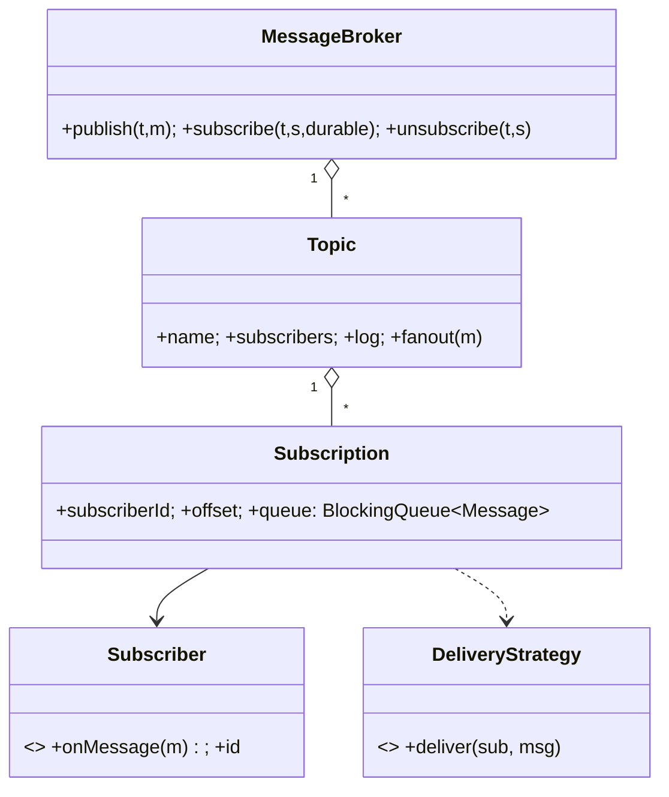

# 🛠️ Design In-Process Pub-Sub Messaging System (LLD)

> **Sources**: [Java Concurrency in Practice (Goetz et al.)](https://jcip.net/) on `BlockingQueue` and `CopyOnWriteArraySet`; [Apache Kafka design doc](https://kafka.apache.org/documentation/#design); [Enterprise Integration Patterns — Durable Subscriber](https://www.enterpriseintegrationpatterns.com/patterns/messaging/DurableSubscription.html); JMS spec on durable vs non-durable subscriptions; [`java.util.concurrent` JavaDocs](https://docs.oracle.com/javase/8/docs/api/java/util/concurrent/package-summary.html).

## 1. Requirements

### Functional
- **Publish/Subscribe**: Publishers push messages to a named `Topic`; all current subscribers receive them.
- **Topic management**: `createTopic`, `deleteTopic`.
- **Wildcard subscriptions**: `orders.*` matches `orders.created`, `orders.shipped`, …
- **Durable vs non-durable subscribers**: durable subscribers see messages produced while they were offline (replay from stored offset).
- **Unsubscribe** at any time.

### Non-Functional
- **Thread-safe** under concurrent publish + subscribe + unsubscribe.
- **Low-latency** delivery; one slow consumer must not block other consumers or the publisher.
- **No message loss** for durable subscribers.
- **Backpressure** for slow consumers (bounded queue + `BLOCK` or `DROP_OLDEST` policy).

## 2. Core Entities

| Entity | Key Fields |
|---|---|
| `Message` | `id`, `topicName`, `payload`, `timestamp`, `headers` |
| `Topic` | `name`, `subscribers: Set<Subscription>`, `log: List<Message>` (for durable) |
| `Subscriber` | `id`, `onMessage(msg)`, `isDurable` |
| `Subscription` | `subscriberId`, `topicName`, `offset` (durable only), `queue` (per-sub) |
| `MessageBroker` | Singleton facade: `topics: Map<String,Topic>` |

## 3. Class Diagram



## 4. Key Methods

```java
void  MessageBroker.publish(String topic, Message msg);
void  MessageBroker.subscribe(String topic, Subscriber sub, boolean durable);
void  MessageBroker.unsubscribe(String topic, Subscriber sub);
Topic MessageBroker.createTopic(String name);
void  MessageBroker.deleteTopic(String name);

interface Subscriber {
  void onMessage(Message m) throws InterruptedException;
  String id();
  boolean isDurable();
}
```

## 5. Design Patterns

| Pattern | Where | Why |
|---|---|---|
| **Observer** | `Subscriber` observes `Topic` | Foundational fan-out semantics. |
| **Mediator** | `MessageBroker` brokers Pub↔Sub; they never reference each other | Decoupling. |
| **Singleton** | `MessageBroker` | One global topic registry. |
| **Producer-Consumer** | Each `Subscription` has its own `BlockingQueue<Message>` | Decouples slow consumer from publisher. |
| **Strategy** | `DeliveryStrategy` (`AT_MOST_ONCE`, `AT_LEAST_ONCE`) | Configurable delivery guarantees. |
| **Decorator** | `FilteredSubscriber(predicate, delegate)` | Content-based filtering. |
| **Iterator** | Safe traversal of subscriber set during fanout via `CopyOnWriteArraySet` | Iteration without `ConcurrentModificationException`. |

## 6. Concurrency & Edge Cases

### 6.1 Thread-safe collections
- `topics: ConcurrentHashMap<String, Topic>` — lock-free reads.
- `Topic.subscribers: CopyOnWriteArraySet<Subscription>` — many concurrent reads (fanout) + occasional writes (subscribe/unsubscribe). Iteration is safe even if the set mutates mid-publish.

### 6.2 Per-subscriber `BlockingQueue` (the key insight)
A slow consumer must not block other consumers or the publisher. Each subscription has its own bounded `ArrayBlockingQueue<Message>(capacity)`. Publisher does `queue.put(msg)`; subscriber thread does `queue.take()`. If one consumer is slow:

| Backpressure policy | Behavior |
|---|---|
| **BLOCK** (default) | `put()` blocks the publisher when full → producer slows down. |
| **DROP_OLDEST** | `pollFirst()` then `put()` → newest wins; safe only for non-durable. |
| **DROP_LATEST** | Drop incoming `msg` → cheapest, lossy. |

### 6.3 Durable subscriber replay
- Each `Topic` keeps an append-only `log: List<Message>` (or capped ring + checkpointed file).
- `Subscription.offset` is the last delivered index; persisted (file/DB) on each successful `onMessage`.
- On reconnect, broker enqueues `log[offset+1 ..]` to the subscriber's queue, then resumes live delivery.
- Apache Kafka uses exactly this model — consumer offsets stored in a special `__consumer_offsets` topic.

### 6.4 Wildcard matching
Implementations vary — naive: linear scan of topic names with regex; production: trie keyed by `.`-separated segments for `O(depth)` lookup.

### 6.5 Subscriber callback errors (at-least-once)
If `onMessage` throws, **do not advance the offset**. Retry with exponential backoff; after N retries, push to a Dead Letter Queue topic and advance.

### 6.6 Broker crash recovery
Durable offsets and the topic log survive restart. Non-durable in-flight queue contents are lost (acceptable per JMS semantics).

## 7. Sources / Cross-Refs
- LLD-12 Concurrency Deep Dive (`BlockingQueue`, `CopyOnWriteArraySet`, producer-consumer)
- Solution-Producer-Consumer.md
- Solution-Blocking-Queue.md
- Apache Kafka design: https://kafka.apache.org/documentation/#design
- Java Concurrency in Practice (Goetz et al.) — Ch. 5 (Building Blocks) & Ch. 12 (Testing Concurrent Programs)
- EAI Patterns — Durable Subscriber: https://www.enterpriseintegrationpatterns.com/patterns/messaging/DurableSubscription.html
