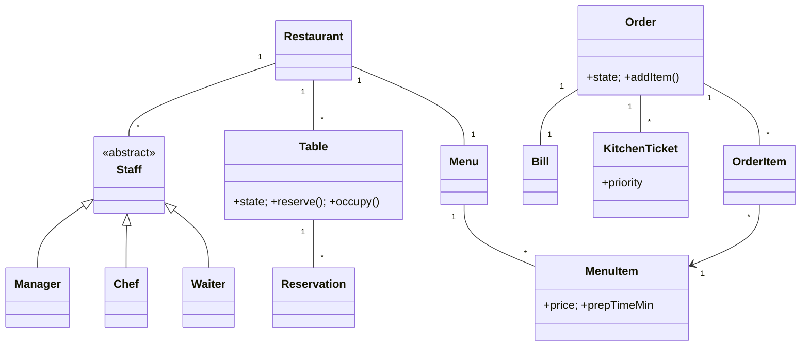

# 🛠️ Design Restaurant Management System (LLD)

> Object-oriented design for a restaurant — menu, tables, reservations, orders, kitchen routing, billing, and staff. Focus is the OOP class structure with proper state machines and concurrency on shared resources (tables, kitchen queue).

## 📚 Table of Contents

1. [Requirements](#1-requirements)
2. [Core Entities](#2-core-entities-objects)
3. [Class Diagram](#3-class-diagram--relationships)
4. [Key APIs](#4-api--interfaces)
5. [Design Patterns](#5-key-algorithms--design-patterns)
6. [Concurrency](#6-concurrency--edge-cases)
7. [Sources](#7-sources)

---

## 1. Requirements

### Functional
- **Menu management** — categories, items, prices, availability, customizations
- **Table reservation** — by date/time/party size; walk-ins also supported
- **Order placement** — dine-in, takeout, delivery
- **Kitchen routing** — orders flow as kitchen tickets, prioritized by prep time + arrival time
- **Billing & payment** — split bills, discounts, loyalty, tax
- **Staff & roles** — Waiter, Chef, Manager (RBAC on actions)

### Non-Functional
- Real-time order updates pushed to kitchen display
- Multiple concurrent waiters editing different (or even the same) order
- Accurate table state (no double-booking, no "phantom occupied")

---

## 2. Core Entities (Objects)

| Entity | Key Attributes |
|---|---|
| `Restaurant` | id, name, address, openHours |
| `Menu` | restaurantId, version, categories[] |
| `MenuItem` | itemId, name, category, price, prepTimeMin, availability, customizations[] |
| `Table` | tableId, capacity, state (AVAILABLE/RESERVED/OCCUPIED/CLEANING) |
| `Reservation` | resId, customerId, tableId, dateTime, partySize, status |
| `Order` | orderId, type (DINE_IN/TAKEOUT/DELIVERY), tableId?, items[], state, createdAt |
| `OrderItem` | itemId, quantity, customizations[], price |
| `Bill` | billId, orderId, subTotal, tax, tip, discount, total |
| `Payment` | paymentId, billId, method, amount, status |
| `KitchenTicket` | ticketId, orderId, items[], priority, status |
| `Staff` (abstract) | staffId, name, role |
| `Waiter`, `Chef`, `Manager` | role-specific methods |
| `Customer` | customerId, name, phone, loyaltyTier |

**Table state machine:** `AVAILABLE → RESERVED → OCCUPIED → CLEANING → AVAILABLE`
**Order state machine:** `PLACED → CONFIRMED → PREPARING → READY → SERVED → PAID`

---

## 3. Class Diagram / Relationships



---

## 4. API / Interfaces

```java
// Reservations
Reservation reserveTable(long customerId, long tableId, Instant dateTime, int partySize);
boolean cancelReservation(String resId);

// Orders
Order placeOrder(OrderType type, Long tableId, long waiterId);
void addItemToOrder(String orderId, long menuItemId, int qty, List<Customization> custom);
void modifyOrderItem(String orderId, String orderItemId, ModifyAction action);
void sendToKitchen(String orderId);
void markReady(String ticketId);
void serveOrder(String orderId);

// Billing & payment
Bill generateBill(String orderId, List<DiscountCode> discounts);
Bill splitBill(String billId, SplitStrategy strategy);
PaymentResult processPayment(String billId, PaymentMethod method);

// Table lifecycle
void releaseTable(long tableId); // OCCUPIED → CLEANING → AVAILABLE
```

---

## 5. Key Algorithms / Design Patterns

| Pattern | Where used | Why |
|---|---|---|
| **State** | `Table` and `Order` lifecycles | Each state encapsulates valid transitions; prevents invalid moves (e.g., `markReady()` on a non-`PREPARING` ticket) |
| **Observer** | Kitchen display + bill notifications | Kitchen UI subscribes to new tickets / status changes; cashier subscribes to `READY → SERVED` |
| **Strategy** | Billing | `SplitEqual`, `SplitByItem`, `LoyaltyDiscount`, `PercentDiscount`, `FlatTax` — composable calculators |
| **Command** | Order modifications | `AddItemCommand`, `RemoveItemCommand`, `ChangeQtyCommand`; queue them for undo before kitchen acceptance |
| **Factory** | Order creation | `DineInOrderFactory`, `TakeoutOrderFactory`, `DeliveryOrderFactory` — different validation rules per type |
| **Decorator** | Menu item customizations | `MenuItem → ExtraCheese(item) → NoOnion(item) → ExtraSauce(item)` — adds price + notes without subclass explosion |
| **Template Method** | Bill generation | `subtotal → applyDiscounts → applyTax → applyTip → finalize`; concrete bills override individual steps |
| **Chain of Responsibility** | Order validation | `MenuAvailability → AllergyCheck → PriceLimit → KitchenCapacity` before sending to kitchen |

**Kitchen queue prioritization:** `PriorityQueue<KitchenTicket>` ordered by composite key `(priority desc, longestPrepTimeFirst, createdAt asc)`. Long-prep dishes (e.g., a 25-min steak) start before quick ones for the same order so all items finish together.

---

## 6. Concurrency & Edge Cases

- **Double-booking of a table** — two reservations target the same table for overlapping times. Use **optimistic locking** with a `version` column on `Table`:
  ```sql
  UPDATE tables SET version = version + 1
  WHERE table_id = ? AND version = ?;
  ```
  If 0 rows affected → someone else booked it → retry/refuse. For higher-throughput, also add a `UNIQUE(table_id, time_slot)` constraint on a `reservations` table.
- **Concurrent waiters editing the same order** — use a `ReentrantLock` per `Order`, or optimistic concurrency on the `Order.version`. Modifications after the order is `PREPARING` are routed via Command + kitchen approval.
- **Kitchen queue** — multiple chef threads dequeue from a single `PriorityBlockingQueue<KitchenTicket>` (Java's thread-safe priority queue). One ticket → one chef; on completion, `markReady()` updates state atomically.
- **Cancellation after confirmation** — only allowed if `Order.state ∈ {PLACED, CONFIRMED}`. After `PREPARING`, route to manager for partial-cost approval.
- **Idempotent payment** — use an `idempotencyKey` per `Payment`; retried clicks of "Pay" don't double-charge.
- **Table release race** — a waiter releases the table just as a new reservation tries to seat. Atomic `state` transition: only `OCCUPIED → CLEANING → AVAILABLE`; reservation must wait for `AVAILABLE`.

---

## 7. Sources

- Workspace cross-reference: `Notes/LowLevelDesign/LLD-08-Behavioral-Patterns.md` (State, Command, Strategy, Template Method, Chain of Responsibility, Observer)
- Workspace cross-reference: `Notes/LowLevelDesign/LLD-07-Structural-Patterns.md` (Decorator)
- Workspace cross-reference: `Notes/LowLevelDesign/LLD-12-Concurrency-Deep-Dive.md` (PriorityBlockingQueue, optimistic locks)
- Java SE: `java.util.concurrent.PriorityBlockingQueue` documentation

📺 **Video walkthrough:** [Restaurant Management System – Low Level Design](https://www.youtube.com/watch?v=eme8G4-tXuo)
