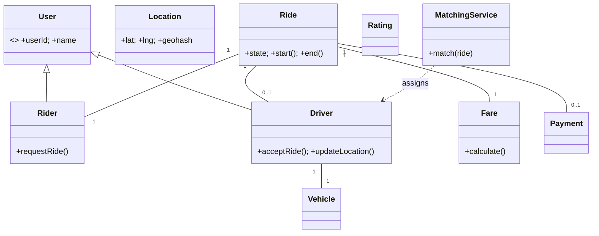

# 🛠️ Design Ride-Sharing (Uber/Lyft) (LLD)

> Object-oriented design for a ride-sharing platform — focus on class structure, ride lifecycle state machine, pricing strategies, and concurrent driver assignment. The HLD (geo-sharding, dispatch service architecture) is in the SD section.

## 📚 Table of Contents

1. [Requirements](#1-requirements)
2. [Core Entities](#2-core-entities-objects)
3. [Class Diagram](#3-class-diagram--relationships)
4. [Key APIs](#4-api--interfaces)
5. [Design Patterns](#5-key-algorithms--design-patterns)
6. [Concurrency](#6-concurrency--edge-cases)
7. [Sources](#7-sources)

---

## 1. Requirements

### Functional
- Rider requests a ride (source, destination, ride type)
- Driver matching from nearby available pool
- Real-time location tracking (driver → server → rider)
- Ride lifecycle: `REQUESTED → MATCHED → DRIVER_ARRIVED → IN_PROGRESS → COMPLETED`
- Multiple ride types — UberX, UberXL, UberPool, Premium
- Fare calculation (base + distance + time + surge), payment, ratings

### Non-Functional
- Sub-50 ms matching latency (rider request → driver notification)
- Accurate ETA using cached routing graphs
- Fair driver assignment, **no double-booking**
- Demand-aware **surge pricing** per geohash cell

---

## 2. Core Entities (Objects)

| Entity | Key Attributes |
|---|---|
| `User` (abstract) | userId, name, phone, email |
| `Rider` (extends User) | paymentMethods[], rating, history[] |
| `Driver` (extends User) | status (AVAILABLE/EN_ROUTE/IN_RIDE/OFFLINE), currentLocation, vehicle, rating, acceptanceRate |
| `Vehicle` | vehicleId, make, model, plate, type (X/XL/Pool), capacity |
| `Location` | lat, lng, geohash |
| `Ride` | rideId, riderId, driverId, source, destination, type, state, createdAt, fare |
| `Fare` | baseFare, distanceFee, timeFee, surgeMultiplier, total |
| `Payment` | paymentId, rideId, amount, method, status |
| `Rating` | rideId, raterId, rateeId, score (1–5), comment |

**Driver status state machine:** `OFFLINE → AVAILABLE → EN_ROUTE → IN_RIDE → AVAILABLE`
**Ride state machine:** `REQUESTED → MATCHED → DRIVER_ARRIVED → IN_PROGRESS → COMPLETED` (or any → `CANCELLED`)

---

## 3. Class Diagram / Relationships



---

## 4. API / Interfaces

```java
// Rider
Ride requestRide(long riderId, Location source, Location dest, RideType type);
boolean cancelRide(String rideId);
Rating rateDriver(String rideId, int score, String comment);

// Driver
boolean acceptRide(String rideId, long driverId);
void updateLocation(long driverId, Location loc);   // throttled to 1/4 sec
void startRide(String rideId);
void endRide(String rideId, Location dropoff);

// Internals
Driver matchDriver(Ride ride);                        // dispatch service
Fare   calculateFare(Location from, Location to, RideType t, double surge);
PaymentResult processPayment(String rideId);
```

---

## 5. Key Algorithms / Design Patterns

| Pattern | Where used | Why |
|---|---|---|
| **State** | `Ride` lifecycle and `Driver` status | Each state defines valid transitions; can't `start()` a non-`MATCHED` ride |
| **Strategy** | Pricing | Normal / Surge / Pool / Premium; swappable per request |
| **Strategy** | Matching | Nearest-driver / score-based / batched (DAG of candidates) |
| **Observer** | Location updates & ride status | Rider subscribes to driver-location events; ETA service subscribes to status changes |
| **Factory** | `Ride` / `Vehicle` creation | One factory per ride type encodes capacity rules and fare config |
| **Singleton** | `MatchingService` | Coordinator owns the live state of unmatched requests |
| **Command** | Ride actions (`accept`, `start`, `cancel`) | Decouples action invocation from execution; supports queuing & undo |

**Spatial indexing for matching:**
- **Geohash** — encode (lat, lng) into a Base32 string; nearby points share prefix; cheap nearest-neighbor lookup
- **Uber H3** — hexagonal hierarchical grid; superior to squares because every neighbor is equidistant
- **Redis `GEOSEARCH`** — `BYRADIUS` returns nearest N drivers within radius in O(log N)

**Surge pricing:** per geohash/H3 cell, compute `surge = f(activeRequests / availableDrivers)`; multiply base fare.

---

## 6. Concurrency & Edge Cases

- **Double-booking prevention** — two riders' requests both pick driver D9 simultaneously. Solve with **optimistic update**:
  ```sql
  UPDATE trips SET driver_id = D9
  WHERE trip_id = T1 AND driver_id IS NULL;
  ```
  Whichever update affects 1 row wins; the loser retries with the next-best candidate. Avoids row locks.
- **Distributed lock per geohash cell** — for high-density cells, take a short Redis-based lock (Redlock) on the cell key during the matching attempt to serialize candidate selection.
- **Driver location throughput** — every active driver pings location every ~4 sec. Use a write-optimized location service (e.g., Redis with `GEOADD`); aggregate writes by geohash bucket; never round-trip the main DB on heartbeat.
- **Atomic state transitions** — `Ride.state` updates use the same `UPDATE ... WHERE state = 'expected_prev'` optimistic pattern.
- **Driver disconnect during a ride** — heartbeat timeout → mark driver `OFFLINE`, but keep ride in `IN_PROGRESS`; if no recovery in N minutes, escalate (notify rider, partial-fare).
- **Cancellation race** — rider cancels at the same moment driver accepts. Whichever transitions the state first wins; the loser sees a "ride already in state X" error.

---

## 7. Sources

- Uber Engineering Blog — H3 hexagonal hierarchical spatial index (open-sourced 2018)
- Industry pattern: Redis `GEOADD`/`GEOSEARCH` (Redis docs)
- Workspace cross-reference: `Notes/SystemDesign/Solutions/Solution-Uber.md` (HLD with capacity, sharding)
- Workspace cross-reference: `Notes/SystemDesign/Topics/27-Proximity-Location-Services.md`

📺 **Video walkthrough:** [LLD Interview with Uber](https://www.youtube.com/watch?v=IkJMr_eV6e4)
