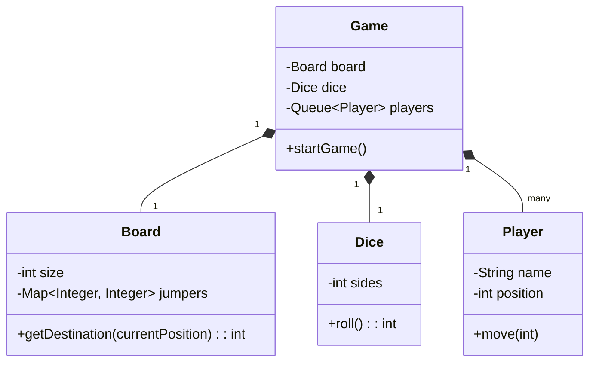

# 🛠️ Design a Snake and Ladder Game (LLD)

Snake and Ladder is a classic board game. The LLD focuses on separating the entities (Board, Dice, Players) and establishing the game loop until the winning condition is met.

---

## 1. Requirements

### Functional Requirements
- **Board:** Size $N \times M$ (usually 10x10 = 100 cells).
- **Entities:** Snakers (move player down) and Ladders (move player up).
- **Dice:** A configurable dice (e.g., 6-sided) that generates a random number.
- **Players:** Two or more players.
- **Game Flow:** Players take turns rolling the dice and moving. If they land on a ladder, they climb. If they land on a snake, they fall.
- **Winning:** The first player to reach the final cell (e.g., 100) exactly wins.

### Non-Functional Requirements
- **Configurability:** Easy to change the board size, the number of dice, or the positions of snakes/ladders.

---

## 2. Core Entities (Objects)

- `Game` (Orchestrates the match)
- `Board`
- `Player`
- `Dice`
- `Jumper` (Abstract/Interface representing Snakes and Ladders)

---

## 3. Class Diagram / Relationships



---

## 4. Key Algorithms / Design Patterns

### 1. Board & Jumpers (Snake/Ladder Mapping)

Instead of creating separate `Snake` and `Ladder` classes and putting them on a 2D array, we rely on a simpler optimization. The board is essentially a 1D array of length 100.
A snake from 99 to 10 is mathematically identical to a ladder from 10 to 99 — it's just an instantaneous displacement.
We can map displacements using a simple `HashMap<Integer, Integer>`.

```java
public class Board {
    private final int size;
    private final Map<Integer, Integer> jumpers;

    public Board(int size) {
        this.size = size;
        this.jumpers = new HashMap<>(); // Key: Start, Value: End
    }

    public void addSnake(int start, int end) {
        if (start <= end) throw new IllegalArgumentException("Snakes go down");
        jumpers.put(start, end);
    }

    public void addLadder(int start, int end) {
        if (start >= end) throw new IllegalArgumentException("Ladders go up");
        jumpers.put(start, end);
    }

    // Takes a position and applies any snakes/ladders indefinitely (if they chained)
    // Though usually rules forbid chaining.
    public int getFinalPosition(int position) {
        while (jumpers.containsKey(position)) {
            System.out.println("Encountered Jumper at " + position + " going to " + jumpers.get(position));
            position = jumpers.get(position);
        }
        return position;
    }
    
    public int getSize() { return size; }
}
```

### 2. The Game Loop & Queue

To manage turns efficiently without complex index tracking (`currentPlayerIndex = (currentPlayerIndex + 1) % n`), use a **Queue**.
Pop the player from the front, let them play, push them to the back.

```java
public class Game {
    private Board board;
    private Dice dice;
    private Queue<Player> players;
    private boolean isGameOver;

    public Game(Board board, Dice dice, List<Player> playerList) {
        this.board = board;
        this.dice = dice;
        this.players = new LinkedList<>(playerList);
        this.isGameOver = false;
    }

    public void play() {
        while (!isGameOver) {
            Player currentPlayer = players.poll();
            
            int diceValue = dice.roll();
            int newPosition = currentPlayer.getPosition() + diceValue;
            
            System.out.println(currentPlayer.getName() + " rolled a " + diceValue);

            // Bounds check
            if (newPosition <= board.getSize()) {
                // Check snakes and ladders
                newPosition = board.getFinalPosition(newPosition);
                currentPlayer.setPosition(newPosition);
                System.out.println("Moved to " + newPosition);

                // Win check
                if (newPosition == board.getSize()) {
                    System.out.println(currentPlayer.getName() + " WON THE GAME!");
                    isGameOver = true;
                    break; // Exit loop
                }
            } else {
                System.out.println("Overshot destination. Wait for next turn.");
            }
            
            // Re-add to back of the queue
            players.offer(currentPlayer);
        }
    }
}
```

### 3. The Configurable Dice

```java
public class Dice {
    private final int numberOfDice;
    private final int numberOfFaces;

    public Dice(int numberOfDice, int numberOfFaces) {
        this.numberOfDice = numberOfDice;
        this.numberOfFaces = numberOfFaces;
    }

    public int roll() {
        int totalSum = 0;
        Random r = new Random();
        for (int i = 0; i < numberOfDice; i++) {
            totalSum += r.nextInt(numberOfFaces) + 1;
        }
        return totalSum;
    }
}
```