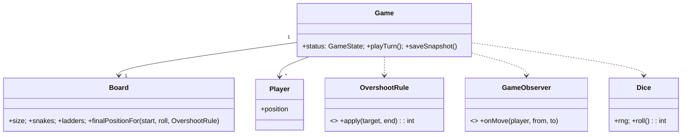

# 🛠️ Design Snake and Ladder (LLD)

> **Sources**: Standard board-game LLD treatments (awesome-lld GitHub), [Java SE `SecureRandom`](https://docs.oracle.com/javase/8/docs/api/java/security/SecureRandom.html) (or `Random(seed)` for tests), Gang of Four patterns. Game variants and overshoot rules per [Wikipedia: Snakes and Ladders](https://en.wikipedia.org/wiki/Snakes_and_Ladders).

## 1. Requirements

### Functional
- **Configurable board** of size `N×N` (typically 100 cells).
- **Snakes**: head → tail (head > tail).
- **Ladders**: bottom → top (top > bottom).
- **2+ players**, taking turns.
- **Dice**: 1+ dice with configurable `sides`.
- **Win**: reach the last cell exactly. **Overshoot rule** is configurable:
  - `FORBID_OVERSHOOT` (no move; turn forfeit)
  - `BOUNCE_BACK` (bounce off the end)
- **Multiple games concurrently** (one game per `gameId`).

### Non-Functional
- **Game state ↮ rendering** are decoupled (testable headless).
- **Deterministic with seeded RNG** for reproducible tests.
- **Save/restore** game by ID.

## 2. Core Entities

| Entity | Key Fields |
|---|---|
| `Board` | `size`, `snakes: Map<int,int>`, `ladders: Map<int,int>` |
| `Snake` | `headPos`, `tailPos` (`tail < head`) |
| `Ladder` | `bottomPos`, `topPos` (`top > bottom`) |
| `Player` | `id`, `name`, `currentPosition` |
| `Dice` | `sides`, `count`, `rng` |
| `Game` | `id`, `board`, `players[]`, `currentTurnIdx`, `winner?`, `status`, `moveLog[]` |

## 3. Class Diagram



## 4. Key Methods

```java
int      Dice.roll();                                   // sum of N rolls
int      Board.finalPositionFor(int start, int roll);   // applies overshoot, snake, ladder (chained)
TurnResult Game.playTurn();                             // rolls + moves currentPlayer
boolean  Game.isGameOver();
GameState Game.status();
GameSnapshot Game.saveSnapshot();                       // for restore
```

## 5. Design Patterns

| Pattern | Where | Why |
|---|---|---|
| **Strategy** | `OvershootRule` (`FORBID`, `BOUNCE_BACK`, custom variants) | Rule varies by edition. |
| **Observer** | `GameObserver` (UI, log, achievement engine) | Decouple side-effects from core loop. |
| **State** | `Game.status` (`NOT_STARTED → IN_PROGRESS → WON`) | Block illegal calls (e.g., `playTurn()` after win). |
| **Builder** | `BoardBuilder.size(100).addLadder(2,38).addSnake(99,7).build()` | Fluent, validated configuration. |
| **Iterator** | Player rotation (`(currentTurnIdx + 1) % players.size`) | Standard turn order. |
| **Command** | Each `Move` recorded for replay/audit | Replayable game history. |
| **Template Method** | Turn workflow: `roll → applyOvershoot → applyBoardJumps → checkWin` | Reuse + variability. |
| **Singleton** | `GameRegistry` | Look up active games by ID. |

## 6. Concurrency & Edge Cases

### 6.1 Board jumps are O(1) lookups (and chained)
```java
int finalPositionFor(int start, int roll, OvershootRule rule) {
  int target = rule.apply(start + roll, size);   // overshoot policy
  // chain snake → ladder → snake … (some rule sets cap chain length)
  while (true) {
    Integer jumpTo = snakes.getOrDefault(target, ladders.get(target));
    if (jumpTo == null) return target;
    target = jumpTo;
  }
}
```
Constant-time lookup via two `HashMap<Integer,Integer>` keyed by entry cell.

### 6.2 Overshoot rule (Strategy)
- `ForbidOvershoot`: if `target > size`, return `start` (turn ends with no move).
- `BounceBack`: if `target > size`, return `size − (target − size)` (mirror reflection).

### 6.3 Per-game lock
A `Game` instance is mutated only by the current player's request. Use a per-game lock (e.g., `ReentrantLock`) so that out-of-turn requests fail fast (`IllegalStateException`).

### 6.4 Seeded RNG for tests
```java
Dice diceForTest = new Dice(6, 1, new Random(42L));
// In production: new SecureRandom() or new Random()
```
Reproducible test cases verify exact movement on known seeds.

### 6.5 Immutable Board after construction
Snakes/ladders cannot move during a game. The `BoardBuilder` validates: no snake head < tail, no ladder bottom > top, no two jumps starting from the same cell, no jump landing on another jump's start.

### 6.6 Save/restore
`saveSnapshot()` returns an immutable `GameSnapshot` (positions, move log, RNG state); `Game.restore(snapshot)` rebuilds an equivalent game. Combined with seeded RNG, this enables crash recovery and replay.

### 6.7 Multi-dice variants
A roll of N dice is just `Σ singleDie.roll()`. Some house rules say "rolling all sixes ⇒ extra turn"; this is a `Strategy` plug-in to the turn workflow.

## 7. Sources / Cross-Refs
- LLD-08 Behavioral Patterns (Strategy, Observer, State, Command, Template Method, Iterator)
- LLD-06 Creational Patterns (Builder)
- Solution-Tic-Tac-Toe.md (similar turn-based game scaffolding)
- Wikipedia — Snakes and Ladders: https://en.wikipedia.org/wiki/Snakes_and_Ladders
