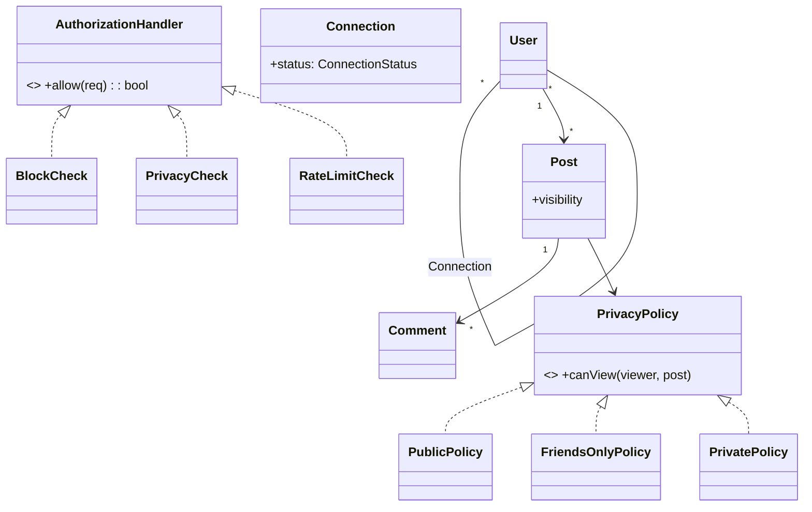

# 🛠️ Design a Social Network (Facebook / LinkedIn-style social graph) — LLD

> **Sources**: [Facebook Engineering — TAO: The Power of the Graph](https://engineering.fb.com/2013/06/25/core-infra/tao-the-power-of-the-graph/); LinkedIn Engineering — *Building the LinkedIn Knowledge Graph*; classic graph algorithms (BFS, bidirectional BFS); GDPR Article 17 (Right to Erasure).

> Scope: this note focuses on the **social graph and core actions** (connections, posts, comments, likes, privacy, blocks). The **news feed** with fanout-on-write/read is a separate problem — see Solution-Twitter-Timeline / news-feed solutions.

## 1. Requirements

### Functional
- Send / accept / reject **connection requests**; view connections; view **mutual connections** (friends-of-friends).
- **Profile** with name, bio, avatar, education, work history.
- **Posts** with text, image, link; **like** and **comment** on posts.
- **Groups** with members and roles.
- **Privacy**: per-post `PUBLIC / FRIENDS_ONLY / PRIVATE`.
- **Block** another user (revokes friendship, prevents future contact).

### Non-Functional
- Hundreds of friends per user; **billions of users** ⇒ social graph is the bottleneck.
- Common queries must be cheap: "are A and B connected?", "do A and B share a friend?", "shortest path A → B".
- **GDPR-style account deletion** must cascade reliably without locking the live system.

## 2. Core Entities

| Entity | Key Fields |
|---|---|
| `User` | `id`, `email`, `passwordHash`, `createdAt` |
| `Profile` | `userId` (1:1), name, bio, avatar, education[], work[], skills |
| `Connection` | `(userA, userB, status, since)` — **canonical ordering: `userA < userB`** |
| `ConnectionStatus` | `PENDING`, `ACCEPTED`, `BLOCKED` (rejected/withdrawn ⇒ delete row) |
| `Post` | `id`, `authorId`, `content`, `media[]`, `visibility`, `mentions[]`, `createdAt` |
| `Comment` | `id`, `postId`, `parentCommentId?`, `authorId`, `content`, `createdAt` |
| `Like` | `(postId, userId, at)` with `UNIQUE(postId, userId)` |
| `Group` | `id`, `name`, `members[]`, `roles: Map<userId, Role>` |
| `Mention` | `(postId, mentionedUserId)` |

### Relationships
- `User` M—M `User` via `Connection` (with status).
- `User` 1—M `Post`; `Post` 1—M `Comment`; `Post` 1—M `Like`.
- `User` M—M `Group`.

## 3. Class Diagram



## 4. Key Methods

```java
ConnectionId  sendConnectionRequest(UserId from, UserId to);
void          acceptConnectionRequest(ConnectionId c);    // atomic PENDING → ACCEPTED
void          rejectConnectionRequest(ConnectionId c);    // delete row
void          blockUser(UserId u, UserId target);         // single transaction
List<UserId>  getConnections(UserId u);
List<UserId>  getMutualConnections(UserId a, UserId b);   // set intersection
int           degreesOfSeparation(UserId a, UserId b);    // bidirectional BFS
List<UserId>  peopleYouMayKnow(UserId u, int k);          // FoF with mutual-count weighting

PostId        createPost(UserId author, String content, Visibility v);
boolean       canUserSeePost(UserId viewer, Post p);      // applies PrivacyPolicy
void          deleteUserAccount(UserId u);                // soft-delete + async cascade
```

## 5. Design Patterns

| Pattern | Where | Why |
|---|---|---|
| **State** | `Connection.status` (`PENDING → ACCEPTED` or `BLOCKED`) | Block illegal transitions (e.g., `ACCEPTED → PENDING`). |
| **Strategy** | `PrivacyPolicy` per post (`Public`, `FriendsOnly`, `Private`) | Add new policies (e.g., `CloseFriendsOnly`) without touching `Post`. |
| **Observer** | `NotificationObserver` for new requests, comments on your posts, mentions, likes | Decouples action from fan-out of notifications. |
| **Composite** | `Comment` may have a `parentCommentId` — uniform tree traversal for thread display | Arbitrary nesting depth. |
| **Chain of Responsibility** | `BlockCheck → PrivacyCheck → RateLimitCheck` for any user-initiated action | Add/remove guards freely. |
| **Singleton** | `SocialService` façade | Single coordinator. |
| **Visitor** | Profile aggregation (resume-builder, completeness score, ML-feature extraction) | Add behaviors without modifying `Profile`. |

## 6. Algorithms & Concurrency

### 6.1 Canonical-form connections
Store one row per pair with `userA < userB`. Halves storage and makes "are A and B connected?" a single key lookup.
```sql
CREATE TABLE connections (
  user_a BIGINT, user_b BIGINT,
  status SMALLINT, since TIMESTAMP,
  PRIMARY KEY (user_a, user_b),
  CHECK (user_a < user_b)
);
```

### 6.2 Atomic accept (race between two clicks)
```sql
UPDATE connections SET status = 'ACCEPTED', since = now()
WHERE user_a = ? AND user_b = ? AND status = 'PENDING';
-- 0 rows ⇒ already accepted/blocked; reject the second click.
```

### 6.3 Mutual connections — set intersection
```text
A_friends = HashSet from connections where (user_a=A or user_b=A) and status=ACCEPTED
B_friends = ... for B
mutual    = smaller-set.iterate { if other.contains(x) → keep }
// O(min(|A|, |B|)) — typically a few thousand at most for personal accounts.
```
Cache `friend-id sets` in Redis (`SREP/SINTER`) for hot users; fall back to DB on miss.

### 6.4 Degrees of separation — bidirectional BFS
Single-source BFS to depth d explores `O(b^d)` nodes. Bidirectional BFS — expand from both A and B, meet in the middle — explores `O(2 · b^(d/2))`, exponentially faster. Cap exploration at d=6 (small-world hypothesis).

### 6.5 People-you-may-know (PYMK)
For each friend `f` of `u`, iterate `f`'s friends and increment a counter for each non-friend non-blocked candidate. Sort by counter desc; top-K. Run **offline nightly**, store the result in a per-user cache. (At scale, replace with a learned ranker.)

### 6.6 Privacy — Strategy + Chain of Responsibility
```text
canUserSeePost(viewer, post):
  for handler in [BlockCheck, PrivacyCheck, RateLimitCheck]:
    if not handler.allow(viewer, post): return false
  return true

PrivacyCheck delegates to post.privacyPolicy.canView(viewer, post):
  PublicPolicy   → true
  FriendsOnlyPolicy → areFriends(viewer.id, post.authorId)
  PrivatePolicy  → viewer.id == post.authorId
```

### 6.7 Block semantics (atomic)
A `blockUser(U, T)` in one transaction:
1. `DELETE` any existing `(U, T)` connection row regardless of status.
2. `INSERT (min(U,T), max(U,T), BLOCKED, now())`.
3. Invalidate the friend-set caches for both users.

After commit, all reads will see U and T as not-friends and blocked; future `sendConnectionRequest` is rejected by `BlockCheck`.

### 6.8 GDPR account deletion
Soft-delete the row (`User.deletedAt = now()`) — the account is **immediately** invisible to everyone. Then enqueue an asynchronous **cascade job** (cron or queue worker) that, in chunks:
- removes the user from all connections (and invalidates friend caches),
- soft-deletes their posts and comments (or anonymises if public-record / regulatory hold applies),
- removes them from groups,
- deletes private messages.

Async + chunked ⇒ no live transaction is held for hours, even for a heavy user.

## 7. Sources / Cross-Refs
- 40-Graph-Databases-Social-Graphs.md (DAG storage, BFS at scale, Neo4j vs RDBMS)
- 14-Communication-Protocols.md (WebSocket / push for notifications)
- Solution-LinkedIn.md (sister LLD focused on professional graph + connection workflow)
- Solution-Twitter-Timeline.md (the **news-feed** problem — orthogonal)
- Facebook TAO; LinkedIn Knowledge Graph; GDPR Art. 17
