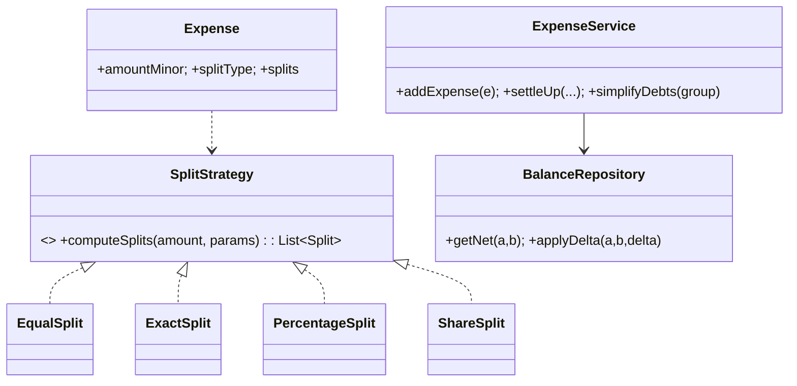

# 🛠️ Design Splitwise (Expense Sharing) — LLD

> **Sources**: [Splitwise public help docs](https://help.splitwise.com/) describing equal/exact/percentage/share split semantics; classic "minimum cash flow" graph reduction (GeeksforGeeks); Java `BigDecimal` / integer-minor-units guidance from Joshua Bloch's *Effective Java* (Item 60); idempotency pattern from Stripe API docs.

## 1. Requirements

### Functional
- **Groups**: Users join groups; expenses are typically scoped to a group.
- **Add expense** with `paidBy`, `amount`, `currency`, and a split among participants:
  - **Equal** — divide equally
  - **Exact** — each participant owes a precise amount (sum must equal total)
  - **Percentage** — each participant owes a percentage (sum must equal 100%)
  - **Share** — proportional to share counts
- **Settle up**: record a payment from A to B; updates pairwise balances.
- **Simplified balances** — show "X owes Y $A" with the **minimum number of transactions**.
- **Comments** on expenses; **multi-currency** with conversion captured at expense time.

### Non-Functional
- **Money is exact** — no penny lost to floating-point or rounding.
- **Atomic** expense add — all participant balances update consistently.
- **Idempotent** add (mobile retries are common).
- **Audit trail** of every balance change.

## 2. Core Entities

| Entity | Key Fields |
|---|---|
| `User` | `id`, `name`, `email` |
| `Group` | `id`, `name`, `members[]` |
| `Expense` | `id`, `groupId?`, `paidBy`, `amountMinor`, `currency`, `splitType`, `splits[]`, `date`, `description`, `requestId` (idempotency) |
| `Split` | `userId`, `owedAmountMinor` (after rounding adjust) |
| `Balance` | `(userIdA, userIdB)` → signed `amountMinor` (positive ⇒ A owes B) |
| `Settlement` | `id`, `fromUserId`, `toUserId`, `amountMinor`, `at` |
| `BalanceLog` | append-only audit (every delta with cause) |

> **All money fields are stored as integer minor units** (cents/paise), never as `double`.

## 3. Class Diagram



## 4. Key Methods

```java
ExpenseId   ExpenseService.addExpense(Expense e);   // idempotent on requestId
Settlement  ExpenseService.settleUp(fromId, toId, amountMinor, currency);
List<Tx>    ExpenseService.simplifyDebts(groupId); // greedy min-tx
Money       ExpenseService.getBalance(userA, userB);
```

## 5. Design Patterns

| Pattern | Where | Why |
|---|---|---|
| **Strategy** | `SplitStrategy` (`Equal`, `Exact`, `Percentage`, `Share`) | Add new split modes (e.g., "by adjustment") without touching `Expense`. |
| **Command** | `AddExpenseCommand` is the audit-logged unit of work | Idempotent replay + undo. |
| **Observer** | `ExpenseObserver` notifies group members on add | Decouple notifications from core flow. |
| **Composite** | An expense's UI breakdown (totals → per-participant) | Uniform aggregation. |
| **Visitor** | Reports (largest expenses, by category, monthly) | Traverse expense graph without modifying it. |
| **Memento** | Snapshot before edit | Undo / version-history. |
| **Singleton** | `ExpenseService` facade | Single coordination point. |

## 6. Concurrency & Edge Cases

### 6.1 Money in **integer minor units**
Never use `double`. Use `long amountMinor` (or `BigDecimal` with explicit scale). All arithmetic stays exact; format to display only at the UI boundary.

### 6.2 Equal split rounding (the classic gotcha)
For `total = 1000` cents split among 3:
```
base       = 1000 / 3 = 333
remainder  = 1000 - 333 * 3 = 1
splits[0] += 1   // first participant absorbs the leftover
// → [334, 333, 333]  Σ = 1000 ✓
```
A common alternative is to rotate the "absorber" expense-by-expense to avoid systematic bias against the same user.

### 6.3 Atomic balance update (single transaction)
For each `Split s`:
```
balance[paidBy][s.userId] -= s.owedAmountMinor   // s.userId owes paidBy
balance[s.userId][paidBy] += s.owedAmountMinor   // mirror
INSERT INTO balance_log (... cause=expenseId, delta ...);
```
All inside `BEGIN…COMMIT`. Partial failure rolls back.

### 6.4 Idempotent add
Client supplies `requestId`. The service stores the result keyed on `requestId`; replay returns the cached `ExpenseId` (Stripe-style idempotency).

### 6.5 Multi-currency
Capture the FX rate at expense time and store both the original `(amountMinor, currency)` and the group-currency-converted equivalent. Later FX moves don't retroactively change history.

### 6.6 Debt simplification (minimum cash flow)
**Greedy O(n log n)** algorithm:
1. Compute each user's **net** = (sum of credits) − (sum of debits) in the group.
2. Push positives (creditors) on a max-heap, negatives on a min-heap.
3. While both heaps non-empty: take top of each, settle `min(|cred|, |debit|)`, push back any remainder.

This does **not** always produce the absolute mathematical minimum (that's NP-hard in general), but for typical group sizes it produces a close-to-optimal small set of transactions and is what Splitwise's "Settle up balances" feature does.

Run **offline** (eventual consistency) — results are advisory; actual settlements still go through the atomic `settleUp` path.

## 7. Sources / Cross-Refs
- LLD-08 Behavioral Patterns (Strategy, Command, Observer, Visitor, Memento)
- 16-Security.md (idempotency-key contract)
- Solution-Stripe-Payment-Processor.md (idempotent add pattern)
- *Effective Java* — Item 60 (Avoid `float` and `double` for monetary calcs)
- Splitwise help: https://help.splitwise.com/
