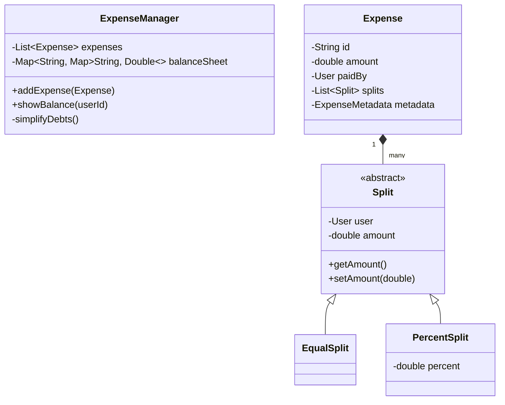

# 🛠️ Design Splitwise (LLD)

Splitwise is an app for splitting expenses with friends. The LLD focuses heavily on the algorithm used to simplify debts (minimizing the total number of transactions between users).

---

## 1. Requirements

### Functional Requirements
- **Users & Groups:** Users can register and form groups.
- **Add Expense:** A user can add an expense, specifying who paid and who owes how much.
- **Split Types:** Support different split strategies (Equal, Exact, Percentage, Shares).
- **Balances:** Show each user's total balance (who they owe, who owes them).
- **Simplify Debts:** The core feature. If A owes B $10, and B owes C $10, the system should simplify to: A owes C $10.

### Non-Functional Requirements
- **Extensibility:** Easy to add a new split type (e.g., By Ratios).
- **Correctness:** floating-point rounding errors must be handled gracefully so money isn't created or lost.

---

## 2. Core Entities (Objects)

- `User`
- `Group`
- `Expense`
- `Split` (Abstract) -> `EqualSplit`, `ExactSplit`, `PercentSplit`
- `ExpenseManager` / `BalanceSheet`

---

## 3. Class Diagram / Relationships



---

## 4. Key Algorithms / Design Patterns

### 1. Strategy Pattern for Splitting

Splitting logic is perfect for the Strategy pattern. But in Splitwise, the "Split" itself is an object holding the calculated amount. We create different types of Splits, and a factory or the Expense constructor validates them.

```java
public abstract class Split {
    protected User user;
    protected double amount;

    public Split(User user) { this.user = user; }
    // Getters and setters
}

public class PercentSplit extends Split {
    double percent;
    public PercentSplit(User user, double percent) {
        super(user);
        this.percent = percent;
    }
}
```

When an `Expense` is created, it validates the splits:
```java
public class ExpenseService {
    public static Expense createExpense(ExpenseType type, double amount, User paidBy, List<Split> splits) {
        switch (type) {
            case EXACT:
                // Sum of splits must equal total amount
                double total = splits.stream().mapToDouble(Split::getAmount).sum();
                if (total != amount) throw new InvalidSplitException();
                break;
            case PERCENT:
                // Sum of percentages must equal 100%
                double totalPercent = 0;
                for (Split split : splits) {
                    totalPercent += ((PercentSplit) split).getPercent();
                    // Calculate and set actual amount
                    split.setAmount((amount * ((PercentSplit) split).getPercent()) / 100.0);
                }
                if (totalPercent != 100.0) throw new InvalidSplitException();
                break;
            case EQUAL:
                // Divide total by number of users
                int totalSplits = splits.size();
                double splitAmount = Math.round((amount / totalSplits) * 100.0) / 100.0;
                for (Split split : splits) {
                    split.setAmount(splitAmount);
                }
                // Handle 1 cent rounding error by adding it to the first split
                splits.get(0).setAmount(splitAmount + (amount - (splitAmount * totalSplits)));
                break;
        }
        return new Expense(amount, paidBy, splits);
    }
}
```

### 2. The Balance Sheet (Tracking who owes who)

We use a nested HashMap (a 2D matrix) to track balances.
Rows = "I owe", Cols = "To this person". `balanceSheet[A][B] = 50` means A owes B 50.

```java
public class ExpenseManager {
    // Map of User -> (Map of User -> Amount)
    Map<String, Map<String, Double>> balanceSheet = new HashMap<>();

    public void addExpense(Expense expense) {
        String paidBy = expense.getPaidBy().getId();

        for (Split split : expense.getSplits()) {
            String paidTo = split.getUser().getId();
            double amountOwed = split.getAmount();

            if (paidBy.equals(paidTo)) continue; // Don't owe yourself

            // 1. Update what `paidTo` owes `paidBy`
            balances.putIfAbsent(paidTo, new HashMap<>());
            balances.get(paidTo).put(paidBy, balances.get(paidTo).getOrDefault(paidBy, 0.0) + amountOwed);

            // 2. Update what `paidBy` owes `paidTo` (negative)
            balances.putIfAbsent(paidBy, new HashMap<>());
            balances.get(paidBy).put(paidTo, balances.get(paidBy).getOrDefault(paidTo, 0.0) - amountOwed);
        }
    }
}
```

### 3. The Debt Simplification Algorithm (The real interview question)

This is a **Graph Algorithm**. The balances form a directed weighted graph. We want to clear intermediate edges.

**Step 1: Calculate Net Balance for everyone**
Instead of looking at $A \rightarrow B$ and $B \rightarrow C$, we just look at the total net money for each person across all their transactions.
- Net > 0: This person acts as a "Receiver" (Creditor).
- Net < 0: This person acts as a "Giver" (Debtor).

**Step 2: Greedy Settlement (Max Heap / Min Heap)**
Put all Net > 0 people in a `Receivers` priority queue (highest amount first).
Put all Net < 0 people in a `Givers` priority queue (lowest/most negative amount first).

Pop the top from both. The person who owes the most pays the person who is owed the most. Minimum transactions guaranteed!

```java
private void simplifyDebts() {
    // 1. Calculate net balances
    Map<String, Double> netBalance = new HashMap<>();
    for (String user : balanceSheet.keySet()) {
        for (String otherUser : balanceSheet.get(user).keySet()) {
            // If I owe otherUser 50, my net balance drops by 50.
            netBalance.put(user, netBalance.getOrDefault(user, 0.0) - balanceSheet.get(user).get(otherUser));
        }
    }

    // 2. Separate into Givers and Receivers
    PriorityQueue<Map.Entry<String, Double>> receivers = new PriorityQueue<>((a, b) -> Double.compare(b.getValue(), a.getValue()));
    PriorityQueue<Map.Entry<String, Double>> givers = new PriorityQueue<>((a, b) -> Double.compare(a.getValue(), b.getValue()));

    for (Map.Entry<String, Double> entry : netBalance.entrySet()) {
        if (entry.getValue() > 0) receivers.add(entry);
        else if (entry.getValue() < 0) givers.add(entry);
    }

    // 3. Greedy matching
    while (!receivers.isEmpty() && !givers.isEmpty()) {
        Map.Entry<String, Double> receiver = receivers.poll();
        Map.Entry<String, Double> giver = givers.poll();

        double settleAmount = Math.min(receiver.getValue(), Math.abs(giver.getValue()));

        System.out.println(giver.getKey() + " pays " + settleAmount + " to " + receiver.getKey());

        // Adjust remaining balances and push back into queues if not fully settled
        double remainingReceiver = receiver.getValue() - settleAmount;
        double remainingGiver = giver.getValue() + settleAmount;

        if (remainingReceiver > 0.01) {
            receiver.setValue(remainingReceiver);
            receivers.add(receiver);
        }
        if (remainingGiver < -0.01) {
            giver.setValue(remainingGiver);
            givers.add(giver);
        }
    }
}
```