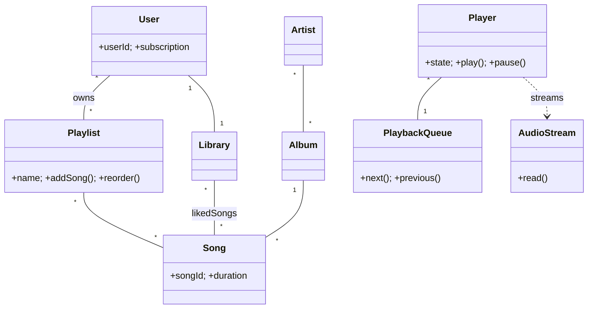

# 🛠️ Design Spotify (LLD)

> Object-oriented design for a music streaming client — catalog, playlists, playback engine, offline mode, and subscription tiers. The HLD (CDN, sharding, recommendations infra) is covered in the SD section.

## 📚 Table of Contents

1. [Requirements](#1-requirements)
2. [Core Entities](#2-core-entities-objects)
3. [Class Diagram](#3-class-diagram--relationships)
4. [Key APIs](#4-api--interfaces)
5. [Design Patterns](#5-key-algorithms--design-patterns)
6. [Concurrency](#6-concurrency--edge-cases)
7. [Sources](#7-sources)

---

## 1. Requirements

### Functional
- **Catalog & search** — browse songs, albums, artists, genres
- **Playlists** — create, edit, reorder, share, collaborative playlists
- **Playback** — play / pause / seek / skip / shuffle / repeat / queue
- **Library** — liked songs, followed artists, saved albums
- **Offline mode** — download songs (Premium); play without network
- **Recommendations** — Discover Weekly, Daily Mix, "More like this"
- **Subscription tiers** — Free (with ads, limited skips) vs. Premium

### Non-Functional
- **Low-latency playback** — first audio packet within ≈ 200 ms
- **Gapless playback** — no audible gap between consecutive tracks (pre-buffer next song)
- **Concurrent users** — desktop, mobile, web; one active playback per account at a time
- **Thread-safe queue** — multiple sources can enqueue concurrently (UI, recommendations, autoplay)

---

## 2. Core Entities (Objects)

| Entity | Key Attributes |
|---|---|
| `User` | userId, email, subscriptionType (FREE/PREMIUM) |
| `Subscription` | tier, startDate, renewalDate, features {ads, skips, downloads, hiFi} |
| `Song` | songId, title, durationMs, audioUrl, artistIds, albumId, bitrates[] |
| `Album` | albumId, title, artistId, releaseDate, songIds[] |
| `Artist` | artistId, name, genres[], albumIds[] |
| `Playlist` | playlistId, ownerId, name, isCollaborative, songIds[] (ordered) |
| `Library` | userId, likedSongs[], followedArtists[], savedAlbums[], downloadedSongs[] |
| `PlaybackQueue` | currentIdx, queue[], history[], shuffleEnabled, repeatMode |
| `Player` | state (Playing/Paused/Buffering/Stopped), currentSong, position, volume |
| `AudioStream` | bitrate, format, buffer (ring buffer of audio frames) |

**Player states:** `STOPPED → BUFFERING → PLAYING ⇆ PAUSED → STOPPED` (and back)

---

## 3. Class Diagram / Relationships



Cardinality:
- `User` 1:M `Playlist`; `Playlist` M:N `Song`
- `Album` 1:M `Song`; `Artist` M:N `Album`
- `User` 1:1 `Library`; `Library` M:N `Song` (likes), `Library` M:N `Artist` (follows)
- `Player` 1:1 `PlaybackQueue`; `PlaybackQueue` 1:M `Song` references

---

## 4. API / Interfaces

```java
// Playback
void play(long userId, long songId);
void pause(long userId);
Song skipNext(long userId);
Song skipPrevious(long userId);
void seek(long userId, long positionMs);
void setVolume(long userId, int level);

// Queue
void enqueue(long userId, long songId);
void enqueueNext(long userId, long songId);
void clearQueue(long userId);
void shuffle(long userId, boolean on);
void setRepeatMode(long userId, RepeatMode mode); // OFF / ONE / ALL

// Playlist
Playlist createPlaylist(long userId, String name, boolean collaborative);
void addToPlaylist(long playlistId, long songId, int position);
void reorderPlaylist(long playlistId, List<Long> newOrder);

// Library
void likeSong(long userId, long songId);
void followArtist(long userId, long artistId);

// Offline
void downloadForOffline(long userId, long songId);  // Premium only
void deleteOffline(long userId, long songId);

// Search
SearchResults search(String query, SearchType type); // SONG / ARTIST / ALBUM / PLAYLIST
```

---

## 5. Key Algorithms / Design Patterns

| Pattern | Where used | Why |
|---|---|---|
| **State** | `Player` state machine | Each state defines what's valid: can't `pause()` when STOPPED, can't `play()` while BUFFERING |
| **Strategy** | Playback mode | Normal / Crossfade / Gapless — swappable without touching `Player` |
| **Strategy** | Queue ordering | Sequential / Shuffle / Smart-shuffle |
| **Observer** | Now-playing | UI, scrobbling/analytics, recommendation engine subscribe to track-change & state events |
| **Decorator** | Audio pipeline | `AudioStream → EqualizerDecorator → VolumeDecorator → CrossfadeDecorator` — add effects without subclass explosion |
| **Singleton** | `Player` | Exactly one active player per app instance |
| **Factory** | `AudioStream` | Picks codec/bitrate based on subscription tier and connection quality |
| **Command** | User actions | `PlayCommand`, `SkipCommand` — supports undo (e.g. "undo skip") and remote control from another device |

**Gapless playback:** while the current song has < 5 sec remaining, pre-decode the first ~500 ms of the next song into a separate buffer; on track-end, swap buffers and resume audio output without flushing.

---

## 6. Concurrency & Edge Cases

- **PlaybackQueue is shared mutable state** — UI thread enqueues; recommendation thread enqueues "autoplay continuation"; playback thread dequeues. Use a `ConcurrentLinkedQueue` (or `BlockingQueue` for back-pressure) so add/remove are lock-free FIFO.
- **Playlist reordering** — use a `ReentrantReadWriteLock` per playlist: many viewers read concurrently, exclusive writer reorders. For collaborative playlists, also broadcast the change via WebSocket (Observer).
- **Buffer producer/consumer** — downloader thread fills a `BlockingQueue<AudioFrame>`; audio output thread drains. `BlockingQueue` provides clean back-pressure: when buffer is full, downloader blocks; when empty, output thread waits.
- **Single-active-session** — server enforces "only one device playing at a time" using a session token; an older session that emits a `play` gets a 409 and must reconnect.
- **Free-tier skip cap** — atomic counter per session per hour; reset on hour boundary; deny `skipNext` if exceeded.
- **Offline cache eviction** — LRU on local disk with a hard byte budget (e.g. 5 GB). Premium-required check guards entry to the cache.
- **Subscription downgrade** — moving Premium → Free must (a) revoke offline access (mark cache files for deletion within 30 days), (b) re-enable ads, (c) reset skip counter.

---

## 7. Sources

- Industry-standard design pattern application: Strategy & Decorator for media players (GoF + recent Medium write-ups)
- Concurrent queue selection: `java.util.concurrent.ConcurrentLinkedQueue` and `BlockingQueue` reference (Java SE docs)
- Cross-reference: `Notes/LowLevelDesign/LLD-08-Behavioral-Patterns.md` (State, Strategy, Command, Observer)
- Cross-reference: `Notes/LowLevelDesign/LLD-12-Concurrency-Deep-Dive.md` (producer/consumer with BlockingQueue)

📺 **Video walkthrough:** [Design Spotify – System Design Interview](https://www.youtube.com/watch?v=H7s1pvuhmTA)
