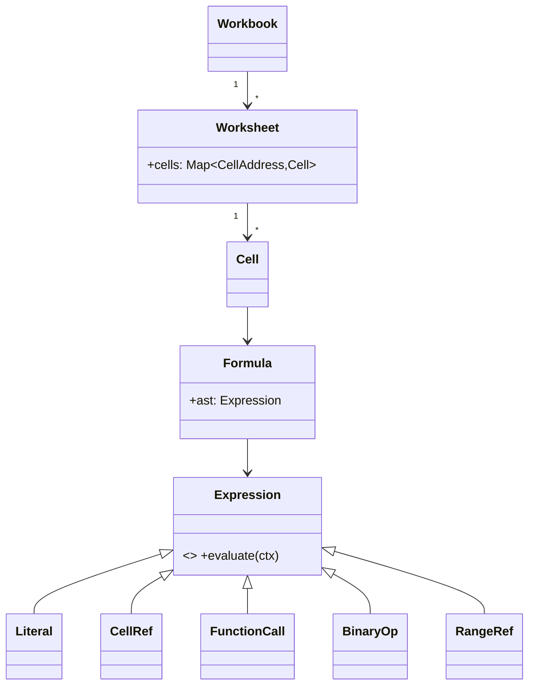

# 🛠️ Design a Spreadsheet (Excel/Sheets-like) — LLD

> **Sources**: [Wikipedia — Dependency graph](https://en.wikipedia.org/wiki/Dependency_graph) (DAG + topological sort); [HyperFormula docs](https://hyperformula.handsontable.com/) (range pooling + dependency graph implementation); LeetCode 2254 *Design a Spreadsheet*; OT/CRDT for collaboration — Sun & Ellis (1998), Shapiro et al. (2011).

## 1. Requirements

### Functional
- 2D grid with **`A1` addressing** (column letters + row number).
- A cell holds **either a literal** (number, string, date, bool) **or a formula** starting with `=` (e.g., `=A1+B2`, `=SUM(A1:A5)`, `=IF(A1>0,"y","n")`, `=VLOOKUP(...)`).
- **Formula evaluation** with cell references, ranges, and a built-in function library.
- **Auto-recalculate** dependents when an input changes.
- **Cell formatting**: number format, color, font, borders.
- **Undo / redo** of edits.

### Non-Functional
- **Recompute only the affected subgraph**, in correct order — never the whole sheet.
- **Detect circular references** before accepting an edit.
- Handle **large, sparse** sheets (most cells empty) with low memory overhead.

## 2. Core Entities

| Entity | Key Fields |
|---|---|
| `CellAddress` | `(sheetId, col, row)` — value-typed; `equals`/`hashCode` |
| `Cell` | `address`, `rawInput: String`, `value: Object?`, `format`, `precedents`, `dependents` |
| `Formula` | `ast: Expression`, `lastValue`, `dirty` |
| `DependencyGraph` | per-cell forward (`dependents`) + reverse (`precedents`) edge sets |
| `Workbook` ⟶ `Worksheet` ⟶ `Cell` | sparse `HashMap<CellAddress, Cell>` per sheet |
| `Format` | numberFormat, color, font, border |



## 3. Key Methods

```java
void   setCellValue(CellAddress a, String input);   // parse → cycle-check → recompute
Object getCellValue(CellAddress a);
Object evaluateFormula(Expression ast, EvalContext ctx);
void   recomputeDependents(CellAddress changed);    // topological order
boolean detectCircularReference(CellAddress newCell, Set<CellAddress> newPrecedents);
void   undo();  void redo();
```

## 4. Design Patterns

| Pattern | Where | Why |
|---|---|---|
| **Composite + Interpreter** | `Expression` AST: `BinaryOp`, `FunctionCall`, `CellRef`, `RangeRef`, `Literal` | Recursive uniform `evaluate(ctx)`; trivially extensible. |
| **Observer** | Cell-changed → notify `dependents` to recompute | Decouples value mutation from cascade. |
| **Command** | Each user edit (`SetCellCommand`, `FormatCommand`) | Undo/redo stack. |
| **Strategy** | Cell-type renderers; number-format strategies | Different format/parse for number/string/date/bool. |
| **Memoization** | `Formula.lastValue` cached until `dirty=true` | Avoid re-eval if inputs unchanged. |
| **Visitor** | Walk AST for analyses (precedent extraction, lint, cost-estimation) | Add behaviors without modifying nodes. |
| **Lazy evaluation / sparse maps** | `Worksheet.cells: HashMap<CellAddress, Cell>` | Empty cells consume zero memory. |

## 5. Algorithms & Concurrency

### 5.1 Edit flow (`setCellValue`)
1. Parse `input` → `Formula` with AST + extracted `precedents`.
2. **Cycle check**: DFS from `newCell` over its proposed `precedents`; if you revisit `newCell`, reject with `#CIRCULAR_REF!`.
3. Update the dependency graph (remove old edges, add new).
4. **Recompute the affected subgraph** in topological order — only cells reachable from `newCell` via `dependents`.
5. Push a `SetCellCommand` onto the undo stack (with the previous value/AST as memento).

### 5.2 Topological recompute (Kahn's algorithm)
```text
dirty = BFS(newCell, follow .dependents)
in_deg = compute in-degrees within `dirty` (count of precedents that are also dirty)
queue   = nodes in dirty with in_deg == 0
while queue not empty:
  c = queue.pop(); evaluate(c)
  for d in c.dependents ∩ dirty:
    in_deg[d] -= 1
    if in_deg[d] == 0: queue.push(d)
```
Guarantees each cell evaluates **after** all its precedents — no order-dependent stale reads.

### 5.3 Circular-reference detection (DFS)
Before committing a new formula, DFS from each new precedent following `dependents`; if we reach `newCell`, the edit would create a cycle.

### 5.4 Range pooling (HyperFormula optimization)
A naive engine treats `=SUM(B1:B100)` as 100 dependency edges into the dependent cell. With **range nodes**, each unique range becomes one graph node; `B1..B100` route through it. As HyperFormula notes, this collapses graphs that would otherwise grow O(n²) for adjacent rolling-sum formulas.

### 5.5 Sparse storage
A 1,000,000-cell sheet where only 200 cells are filled stores 200 entries — not 10⁶. `HashMap<CellAddress, Cell>` is the standard backing structure; cell ranges are computed lazily on read.

### 5.6 Concurrency
- **Single-user**: a single-threaded event loop is plenty fast (everything happens after a user keystroke).
- **Multi-user (Sheets-style)**: server sequences edits as **Operations**, then either uses **Operational Transform (OT)** to rebase concurrent ops onto a common base, or **CRDTs** (e.g., per-cell LWW register; per-sheet add-wins set for row/column structure). Server is authoritative; clients converge to its log.

## 6. Edge Cases
- **`#REF!`** — referenced cell deleted; downstream evaluations propagate the error.
- **`#CIRCULAR_REF!`** — cycle detected; reject edit with explanatory diagnostic.
- **`#NAME?`** — unknown function; surface to the user.
- **Type coercion** — `"1" + 1`: spreadsheets typically coerce; be explicit in the spec.
- **Volatile functions** (`NOW()`, `RAND()`) — recompute on every recalc, not memoized.

## 7. Sources / Cross-Refs
- LLD-08 Behavioral Patterns (Composite, Interpreter, Observer, Command, Visitor)
- Solution-Google-Docs.md (collaboration with OT/CRDT — same toolkit)
- Solution-Versioned-Document-Store.md (snapshot/version model)
- Wikipedia — Dependency graph, Topological sorting
- HyperFormula architecture docs
