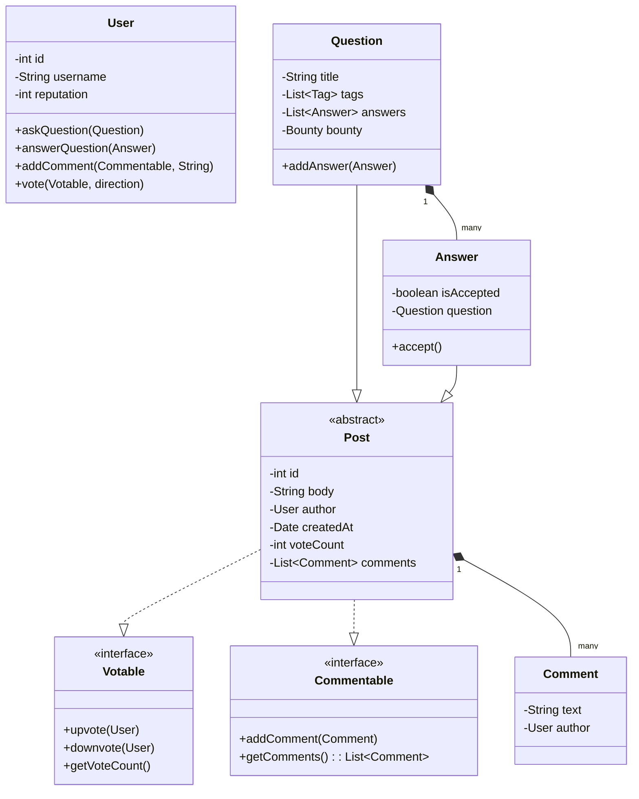

# 🛠️ Design Stack Overflow (LLD)

Designing Stack Overflow focuses heavily on clear object mapping, handling polymorphic relationships (e.g., both Questions and Answers can be voted on and commented on), and building a robust search/tagging system.

---

## 1. Requirements

### Functional Requirements
- **Posting:** Users can post questions and answers.
- **Commenting:** Users can leave comments on both questions and answers.
- **Voting:** Users can upvote or downvote questions and answers.
- **Acceptance:** The author of a question can mark one answer as accepted.
- **Tags:** Questions can have multiple tags.
- **Bounties:** Users can place bounties on questions.
- **Search:** Users can search for questions by text, tags, or author.

### Non-Functional Requirements
- **Scalable Search:** Easy integration with an external search engine (though at the LLD level, we focus on the domain model).
- **Extensibility:** The voting and commenting systems should not require duplicate code for Questions vs Answers.

---

## 2. Core Entities (Objects)

- `User`: The primary actor (Guest, Member, Admin, Moderator).
- `Question`: Contains a title, body, author, tags, and a list of answers.
- `Answer`: Contains a body, author, and an `is_accepted` flag.
- `Comment`: Short text attached to a Question or Answer.
- `Bounty`: Attached to a question, holding a reputation value.
- `Tag`: A label categorizing the question.

---

## 3. Class Diagram / Relationships

To avoid duplicate code for Voting and Commenting, we can use an interface or a base class. Since `Question`, `Answer`, and `Comment` all share the ability to have an author, a creation date, and a body, we can create a base `Entity` class. Even better, `Question` and `Answer` both support Votes and Comments, so they can inherit from a `VotableCommentable` base class.



---

## 4. Key Design Patterns & Logic

### 1. Interfaces for Shared Behaviors
Instead of duplicating the `voteCount` logic, `List<Comment>`, and methods inside both `Question` and `Answer`, we push these up to an abstract `Post` class, or use interfaces.
By making the `User.addComment()` method accept a `Commentable` interface, the User class doesn't need separate `addCommentToQuestion()` and `addCommentToAnswer()` methods.

```java
public interface Commentable {
    void addComment(Comment comment);
    List<Comment> getComments();
}

public abstract class Post implements Votable, Commentable {
    protected int id;
    protected String body;
    protected User author;
    protected int voteCount;
    protected List<Comment> comments = new ArrayList<>();
    
    // Implements upvote(), downvote(), addComment(), etc.
    public void upvote(User user) {
        this.voteCount++;
        this.author.addReputation(5); // Author of post gets rep
    }
}

public class Question extends Post {
    private String title;
    private List<Answer> answers;
    // Question specific logic
}
```

### 2. The Search Interface (Strategy / Gateway)
Searching involves the Database. In LLD, we mock this using interfaces so we aren't tied to MySQL or Elasticsearch.

```java
public interface SearchCatalog {
    List<Question> searchByQuery(String query);
    List<Question> searchByTag(String tag);
}

public class QuestionCatalog implements SearchCatalog {
    private Map<String, List<Question>> tagIndex = new HashMap<>(); // Mock index
    
    @Override
    public List<Question> searchByTag(String tag) {
        return tagIndex.getOrDefault(tag, new ArrayList<>());
    }
    // ...
}
```

### 3. Enumerations for Account Types
Stack Overflow relies heavily on privileges based on Reputation (e.g., you need 50 rep to comment).

```java
public class User {
    private int reputation;
    
    public void upvote(Post post) {
        if (this.reputation < 15) {
            throw new InsufficientReputationException("Need 15 rep to upvote");
        }
        post.upvote(this);
    }
}
```