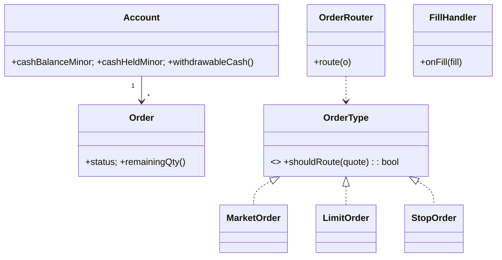

# 🛠️ Design a Stock Brokerage Trading System (LLD)

> **Sources**: [Robinhood — How orders work](https://robinhood.com/us/en/support/articles/types-of-orders/) and [trade settlement](https://robinhood.com/us/en/support/articles/settlement-period/) help center; [SEC — National Best Bid and Offer (NBBO) / Reg NMS](https://www.sec.gov/spotlight/regnms.htm); [Stripe API: idempotency keys](https://docs.stripe.com/api/idempotent_requests); FINRA day-trading rules. The **broker is not a matching engine** — see Solution-Order-Matching-Engine.md for the exchange side.

## 1. Requirements

### Functional
- Open account, deposit/withdraw funds.
- Place orders: **MARKET, LIMIT, STOP, STOP_LIMIT** × **BUY / SELL**.
- View **portfolio** (holdings, cash, mark-to-market P&L) and order history.
- Subscribe to **live price quotes** (market-data feed).
- **Real-time order status** updates.
- **Cancel** while pending; partial fills are first-class.

### Non-Functional
- **Atomicity**: cash + holdings never disagree (e.g., money debited but no position created).
- **Accurate P&L** with no float-drift.
- **No oversell / no overspend** even with concurrent orders.
- **Idempotent** fill ingestion (the exchange retries).
- **Audit trail** for every state-mutating event (regulator-grade).

## 2. Core Entities

| Entity | Key Fields |
|---|---|
| `User` | `id`, `name`, profile |
| `Account` | `id`, `userId`, `cashBalanceMinor`, `cashHeldMinor`, `holdings: Map<symbol, Position>` |
| `Position` | `symbol`, `qty`, `avgCostBasisMinor` |
| `Order` | `id`, `accountId`, `symbol`, `side`, `type`, `qty`, `limitPriceMinor?`, `stopPriceMinor?`, `status`, `filledQty`, `avgFillPriceMinor`, `clientOrderId` (idempotency), `createdAt` |
| `Trade` (Fill) | `id`, `orderId`, `qty`, `priceMinor`, `executedAt`, `exchangeFillId` (dedup) |
| `PriceQuote` | `symbol`, `bidMinor`, `askMinor`, `lastMinor`, `ts` |
| `LedgerEntry` | append-only audit row (cause, deltaCash, deltaQty) |

> **All money in integer minor units (cents).** All `qty` in integer shares (or fractional shares as integer ten-thousandths if your platform supports them).

## 3. Class Diagram



## 4. Key Methods

```java
OrderId placeOrder(PlaceOrderRequest req);   // validate → cash hold → route, idempotent on clientOrderId
void    cancelOrder(OrderId id);             // best-effort: ask exchange to cancel
void    onFill(Fill f);                      // idempotent on exchangeFillId
void    onPriceTick(PriceQuote q);           // wakes STOP orders
Money   getPortfolioValue(AccountId a);      // cash + Σ qty × lastPrice
```

## 5. Design Patterns

| Pattern | Where | Why |
|---|---|---|
| **State** | `Order.status` (`PENDING → PARTIAL → FILLED` or `CANCELLED`/`REJECTED`) | Block illegal transitions (e.g., cancel a `FILLED` order). |
| **Strategy** | `OrderType` (`Market`, `Limit`, `Stop`, `StopLimit`) — different routing/triggering | Add new types without touching `OrderRouter`. |
| **Observer** | `PriceObserver` for `Stop`/`StopLimit` orders | Wake them when price crosses the trigger. |
| **Command** | `PlaceOrderCommand` is the audited unit of work | Idempotent replay; saga compensation. |
| **Chain of Responsibility** | Order validation chain: `KycOk → SymbolValid → SufficientFunds → DailyLimit → PdtRule` | Add/remove checks freely. |
| **Saga** | Distributed flow: `holdCash → routeToExchange → onFill(applyToPortfolio + releaseHold)` | Compensate on each step's failure. |
| **Singleton** | `OrderRouter`, `MarketDataBus` | Single coordinator. |

## 6. Concurrency & Atomicity

### 6.1 Cash hold (no oversell/overspend)
Place a hold on funds **atomically** when the order is accepted; release on cancel/fill:
```sql
UPDATE accounts
SET    cash_held_minor = cash_held_minor + :need
WHERE  id = :acct
   AND cash_balance_minor - cash_held_minor >= :need;   -- 0 rows ⇒ insufficient funds
```
A **single-row conditional update** is the simplest race-free pattern. Withdrawals check `cashBalanceMinor − cashHeldMinor`.

For SELL orders, hold **shares** instead of cash:
```sql
UPDATE positions
SET    qty_held = qty_held + :need
WHERE  account_id = :acct AND symbol = :sym AND qty - qty_held >= :need;
```

### 6.2 Fill ingestion (idempotent, atomic)
Exchanges retry. Dedupe on `exchangeFillId`:
```sql
INSERT INTO trades (id, order_id, qty, price_minor, exchange_fill_id, executed_at)
VALUES (...) ON CONFLICT (exchange_fill_id) DO NOTHING;
```
If the row was newly inserted, in the same transaction:
1. Increment `orders.filledQty`, recompute `avgFillPriceMinor`.
2. Update `positions` (insert/update; recompute weighted-average cost basis):
   `newAvg = (oldQty × oldAvg + fillQty × fillPrice) / (oldQty + fillQty)` (all integer-math; round half-up).
3. **Release** the cash/share hold for the filled portion.
4. Append a `LedgerEntry`.
5. Mark order `FILLED` if `filledQty == qty`, else `PARTIAL`.

All five steps in one DB transaction.

### 6.3 STOP orders (Observer)
On every `PriceQuote`, the `MarketDataBus` notifies `StopOrderTrigger`s registered for that symbol. When `priceCrossesTrigger`, the stop is converted to a market (or limit) order and routed.

### 6.4 P&L (mark-to-market)
- **Unrealized** = `Σ qty × (lastPrice − avgCostBasis)`
- **Realized** = booked when shares are sold; computed against the held cost basis (FIFO is the U.S. tax default; LIFO and Specific-Lot also valid — pick policy per account).

### 6.5 Compliance & integration
- **PDT (Pattern Day Trader) rule** — FINRA: a non-margin account flagged PDT after 4+ day trades in 5 business days requires \$25k equity; enforce in the validation chain.
- **Market hours / halt detection** — block routing of equities outside RTH unless the account opted into pre/post-market.
- **Settlement (T+1 in U.S. equities)** — show "settled" vs "unsettled" cash; only settled cash supports withdrawal.

## 7. What the Broker Doesn't Do
The broker **does not match orders**. It routes to a venue (an exchange like NYSE/Nasdaq, an internalizer, or an ATS). Matching, NBBO compliance, and price discovery happen on the **exchange side** — see [Solution-Order-Matching-Engine.md](./Solution-Order-Matching-Engine.md) for that complementary design.

## 8. Sources / Cross-Refs
- Solution-Order-Matching-Engine.md (the exchange-side counterpart)
- Solution-Stripe-Payment-Processor.md (idempotency-key pattern)
- Solution-Distributed-ID.md (order/trade IDs)
- LLD-13 Architectural Patterns (Saga + compensation)
- Robinhood help center; SEC Reg NMS; FINRA PDT rules
