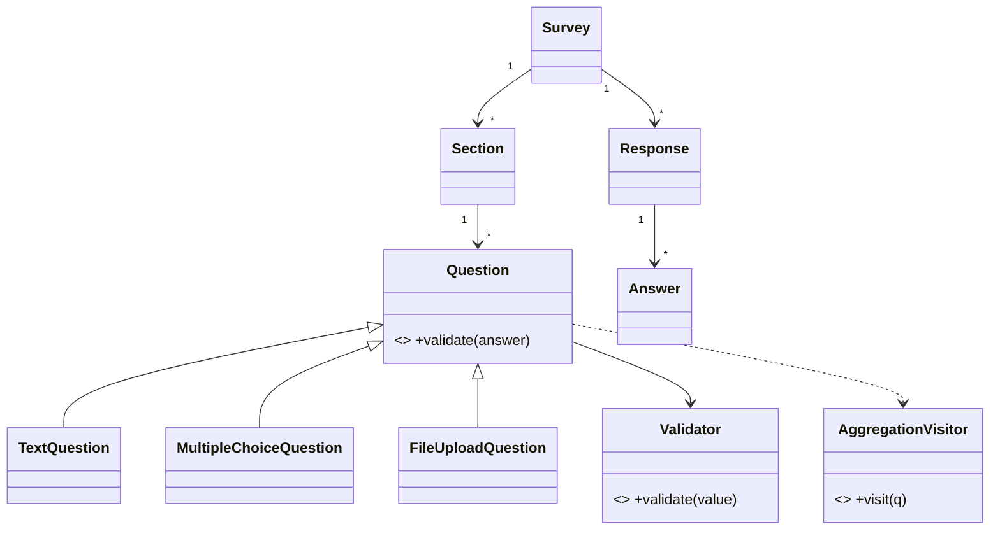

# 🛠️ Design an Online Survey System (Google Forms / SurveyMonkey-style) — LLD

> **Sources**: [Google Forms help center](https://support.google.com/docs/topic/9055404) (question types, sections, branching); [SurveyMonkey question library](https://help.surveymonkey.com/) (rating/Likert/dropdown semantics); [Stripe API — Idempotent requests](https://docs.stripe.com/api/idempotent_requests); standard Gang-of-Four patterns.

## 1. Requirements

### Functional
- A creator builds a `Survey` with multiple `Question`s of varied types: `TEXT`, `MULTIPLE_CHOICE`, `CHECKBOX`, `RATING`, `LIKERT_SCALE`, `FILE_UPLOAD`, `DROPDOWN`, `DATE`.
- **Skip-logic / branching**: "if Q1 = A → jump to Q5".
- **Required vs optional** flag per question.
- Per-question **validators**: min/max length, regex, numeric range.
- Surveys are **published** (shareable link); responses can be **anonymous** or authenticated; survey **closes** at deadline.
- View **aggregate analytics** (counts, averages, distribution) and export responses (CSV/JSON).

### Non-Functional
- **Prevent duplicate responses** (per user, per IP, per cookie).
- Scale to **large surveys** with many questions and high response volume.
- **Atomic submit** — never store a partially-saved response.

## 2. Core Entities

| Entity | Key Fields |
|---|---|
| `Survey` | `id`, `title`, `description`, `questions[]`, `status: DRAFT/PUBLISHED/CLOSED`, `deadline`, `allowAnonymous`, `createdBy` |
| `Question` (abstract) | `id`, `text`, `required`, `validators[]`, `skipLogic` |
| `TextQuestion` / `MultipleChoiceQuestion(options[])` / `CheckboxQuestion(options[])` / `RatingQuestion(scale)` / `LikertScaleQuestion` / `FileUploadQuestion(maxBytes, mimeTypes)` / `DropdownQuestion(options[])` / `DateQuestion` | type-specific |
| `Section` | groups a sub-list of questions (Composite — see below) |
| `Validator` (interface) | `validate(answer): ValidationResult` |
| `Response` | `id`, `surveyId`, `respondentId?`, `answers[]`, `submittedAt`, `clientToken` (idempotency) |
| `Answer` | `questionId`, `value` (string \| number \| date \| list-of-strings \| fileRef) |
| `AggregateResult` | per-question stats |

### Relationships
`Survey` 1—M `Question` (or `Section` 1—M `Question` when sections are used) · `Survey` 1—M `Response` · `Response` 1—M `Answer`.

## 3. Class Diagram



## 4. Key Methods

```java
SurveyId  SurveyService.createSurvey(SurveyDraft d);
void      SurveyService.addQuestion(SurveyId s, Question q);
PublishResult SurveyService.publish(SurveyId s);
SubmissionResult SurveyService.submitResponse(Response r);  // idempotent on clientToken
AggregateResult SurveyService.getResults(SurveyId s);
byte[]    SurveyService.exportResponses(SurveyId s, ExportFormat f);
```

## 5. Design Patterns

| Pattern | Where | Why |
|---|---|---|
| **Strategy** | Per-`Question` validation + aggregation behavior | New question types added without `if/else` chains. |
| **Composite** | `Section` contains `Question`s; sections can nest pages/tabs | Uniform traversal of a survey tree. |
| **Builder** | `SurveyBuilder` fluent construction (`.addText("Name").required().regex("...")`) | Readable, validated DSL for survey authors. |
| **Visitor** | `AggregationVisitor` (`CountVisitor`, `AverageVisitor`, `DistributionVisitor`) walks each question type | Add new analytics without modifying `Question`. |
| **Chain of Responsibility** | Per-answer validators: `Required → Length → Range → Regex → Custom` | Short-circuits on first failure with a precise message. |
| **Observer** | `ResponseObserver` notifies on each submission (email, webhook, Slack) | Decouples submission from notifications. |
| **State** | `Survey.status` (`DRAFT → PUBLISHED → CLOSED`) | Block illegal operations (e.g., reject submission to `DRAFT` or after `CLOSED`). |
| **Factory** | `QuestionFactory.create(type, spec)` | Create the right subtype from a JSON / API payload. |

## 6. Algorithms & Concurrency

### 6.1 `submitResponse` — atomic + idempotent
```text
1. If survey.status != PUBLISHED → reject (404/410).
2. If now > survey.deadline → mark CLOSED; reject.
3. validateAll(answers, survey) — runs per-question Chain-of-Responsibility.
   First failure → return 400 with the field path.
4. BEGIN TRANSACTION
     INSERT INTO responses (id, survey_id, respondent_id, client_token, submitted_at)
       VALUES (...) ON CONFLICT (client_token) DO NOTHING;
     -- Detect: was the row inserted, or did the client retry?
     If 0 rows → SELECT existing response, return its id (Stripe-style replay).
     If 1 row → INSERT all answers in batch.
   COMMIT
5. Notify ResponseObservers (after commit; outside transaction).
```
The `clientToken` UNIQUE constraint makes the submit **idempotent**, exactly as the Stripe API does for `Idempotency-Key`.

### 6.2 Skip-logic evaluation
A `SkipLogic` is a list of `Rule { condition, jumpToQuestionId }`. After answering question `Q`, the survey engine evaluates `Q.skipLogic.firstMatching(answer)`; if a rule matches, the next question pointer jumps; otherwise it advances normally. Server **must re-evaluate** skip-logic at submit time so a malicious client can't skip a required question by spoofing the next-pointer.

### 6.3 Duplicate-response prevention
Multiple defenses, layered:
- Authenticated: `UNIQUE (survey_id, respondent_id)` when `allowAnonymous = false`.
- Anonymous: optional `UNIQUE (survey_id, ip_hash)` and/or `UNIQUE (survey_id, browser_cookie)`.
- All idempotency replays go through the `clientToken` — the same client can safely retry the same submission, but a new visit gets a new token.

### 6.4 Aggregation (Visitor)
```text
class CountVisitor extends AggregationVisitor:
  visit(MultipleChoiceQuestion q): increment optionCounts[q.id][answer]
  visit(RatingQuestion q):         sum, count → mean
  visit(TextQuestion q):           noop (text not aggregated)
```
Run **offline** for large surveys (Spark / Flink batch); for small surveys (< 10k responses), incremental in-process aggregation in a `ConcurrentHashMap` is fine.

### 6.5 File uploads
Signed-URL uploads to object storage (S3/GCS); the answer stores a reference (bucket + key + checksum), not the bytes. The submit transaction is then small and fast.

## 7. Sources / Cross-Refs
- LLD-08 Behavioral Patterns (Strategy, Composite, Visitor, Observer, Chain of Responsibility, State)
- LLD-06 Creational Patterns (Builder, Factory)
- Solution-Stripe-Payment-Processor.md (idempotency-key contract)
- Solution-Notification.md (ResponseObserver fan-out)
- Google Forms / SurveyMonkey help docs
