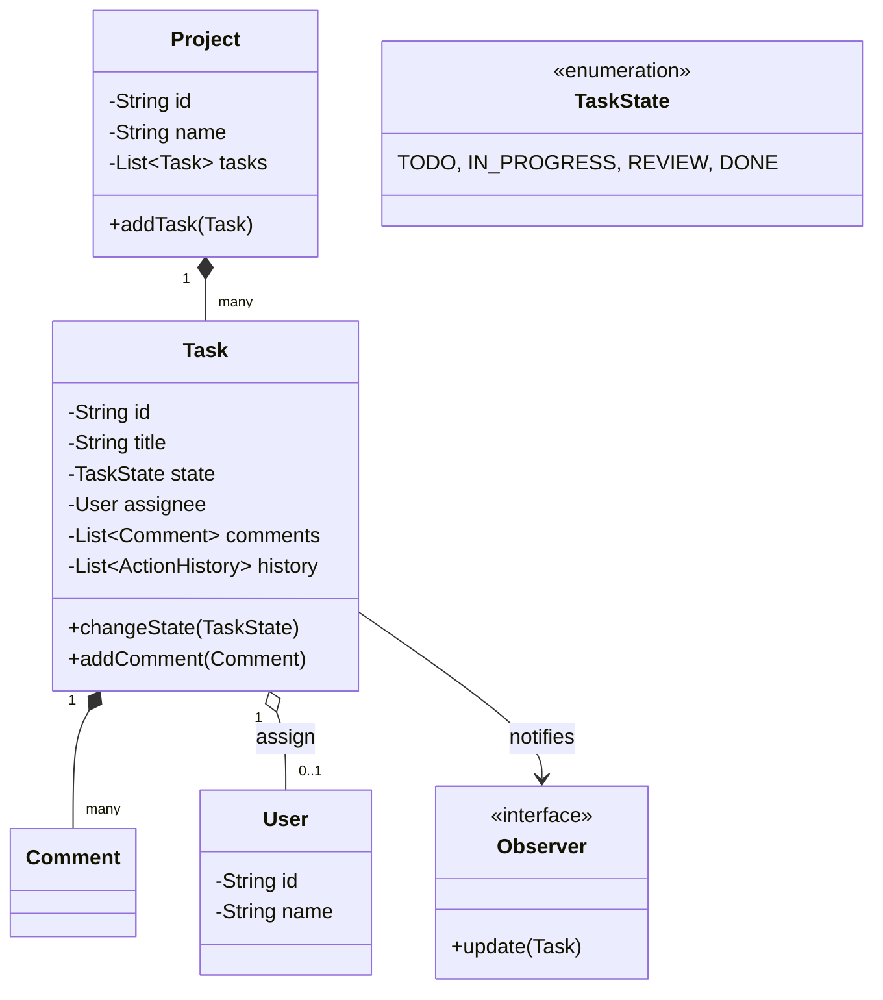

# 🛠️ Design a Task Management System (Jira / Trello)

A task management system allows users to create, assign, transition, and track the state of various tasks within a project. The core focus in this design is modeling the Task workflow (State Machine) and the Observer pattern for notifications.

---

## 1. Requirements

### Functional Requirements
- **Projects:** Users can create workspaces/projects.
- **Tasks:** Users can create tasks with a title, description, priority, and due date.
- **Assignment:** Tasks can be assigned to a User.
- **Sub-tasks:** A task can contain multiple smaller sub-tasks.
- **Transitions:** Tasks can transition through states (e.g., TODO -> IN_PROGRESS -> DONE).
- **History/Audit Log:** Track who changed what and when.
- **Notifications:** Inform the assignee when the task state changes or a comment is added.

### Non-Functional Requirements
- **Flexibility:** Easy to add new states or new Task Types (Bug, Feature, Epic).
- **Concurrency:** Basic handling of two people editing the same task.

---

## 2. Core Entities (Objects)

- `System` (The main orchestrator)
- `Project`
- `User`
- `Task` (Base class) -> `Epic`, `Story`, `Bug`
- `TaskState` (Enum or Interface)
- `Comment`
- `ActionHistory` (Audit Log)

---

## 3. Class Diagram / Relationships



---

## 4. Key Design Patterns & Logic

### 1. The Observer Pattern (Notifications)

When a task transitions from `IN_PROGRESS` to `REVIEW`, the User who created the task (Reporter) and the User assigned to it should be notified. The `Task` acts as the Subject/Publisher.

```java
public interface TaskObserver {
    void onTaskUpdated(Task task, String changeDescription);
}

public class User implements TaskObserver {
    @Override
    public void onTaskUpdated(Task task, String changeDescription) {
        System.out.println("Notify User: Task " + task.getId() + " changed: " + changeDescription);
    }
}

public class Task {
    private List<TaskObserver> watchers = new ArrayList<>();
    
    public void addWatcher(TaskObserver observer) { watchers.add(observer); }
    
    public void changeState(TaskState newState, User actor) {
        this.state = newState;
        String changeStr = actor.getName() + " moved task to " + newState;
        logHistory(changeStr);
        notifyWatchers(changeStr);
    }
    
    private void notifyWatchers(String changeMsg) {
        for (TaskObserver watcher : watchers) {
            watcher.onTaskUpdated(this, changeMsg);
        }
    }
}
```

### 2. The Composite Pattern (Sub-tasks / Epics)

In Jira, an Epic contains Stories, and Stories contain Sub-tasks. The **Composite Pattern** allows us to treat individual objects and compositions of objects uniformly.

```java
public abstract class TaskComponent {
    protected String title;
    public abstract int getEstimatedHours();
}

// Leaf
public class SubTask extends TaskComponent {
    private int hours;
    public int getEstimatedHours() { return hours; }
}

// Composite
public class Epic extends TaskComponent {
    private List<TaskComponent> children = new ArrayList<>();
    
    public void addTask(TaskComponent t) { children.add(t); }
    
    @Override
    public int getEstimatedHours() {
        int total = 0;
        for (TaskComponent child : children) {
            total += child.getEstimatedHours();
        }
        return total;
    }
}
```

### 3. State Machine (Handling Workflow Constraints)

By default, an enum works for `TaskState`. However, if you want strictly enforced transitions (e.g., A task cannot go from `TODO` straight to `DONE` without entering `IN_PROGRESS`), you need a State Machine or the **State Pattern**.

```java
// Using a simple Map-based state machine constraint router
public class WorkflowManager {
    // Map of <Current State -> List of Valid Next States>
    private Map<TaskState, List<TaskState>> validTransitions;

    public void transition(Task task, TaskState targetState) throws InvalidTransitionException {
        List<TaskState> allowed = validTransitions.get(task.getState());
        if (allowed != null && allowed.contains(targetState)) {
            task.setState(targetState);
        } else {
            throw new InvalidTransitionException();
        }
    }
}
```