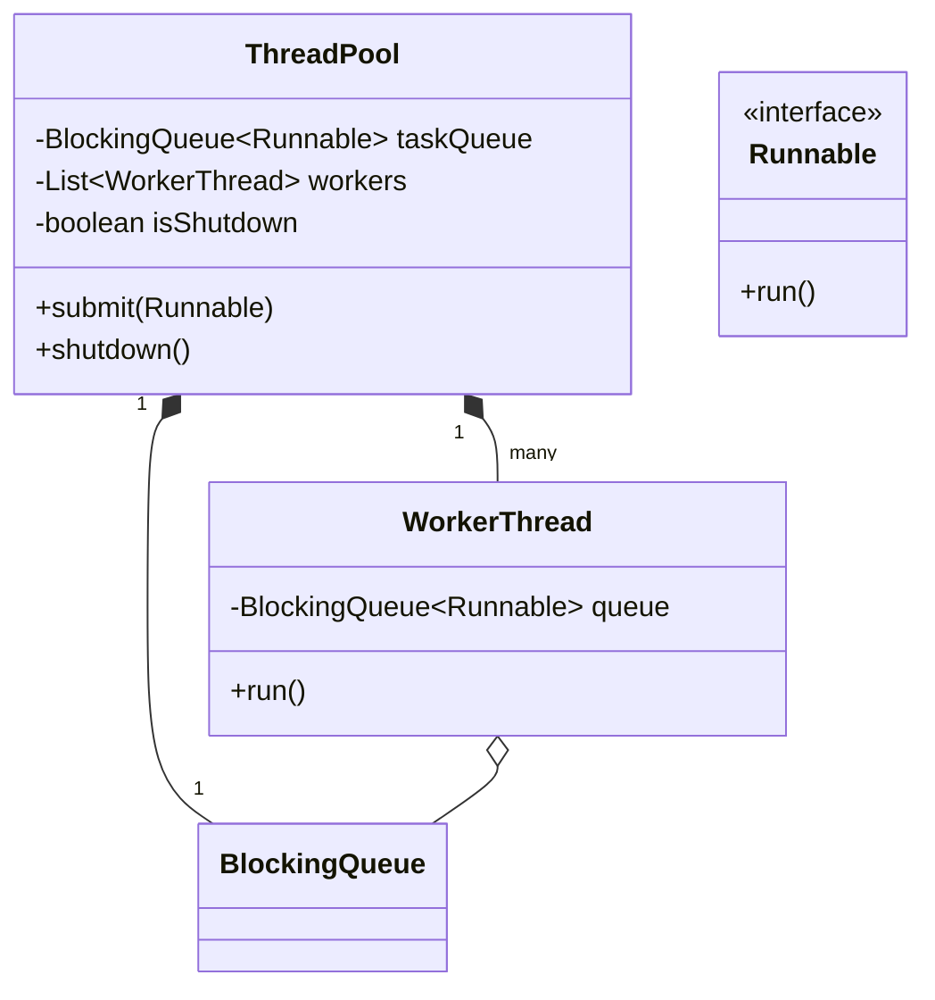

# 🛠️ Design a Thread Pool (LLD)

Designing a custom Thread Pool tests your deepest understanding of multi-threading, concurrency primitives (Locks, Monitors, Semaphores), and the Producer-Consumer problem. It's often asked by companies building core infrastructure (Oracle, Microsoft, Uber).

---

## 1. Requirements

### Functional Requirements
- Initialize a pool with a fixed number of worker threads.
- Accept incoming tasks (Runnable items) from the client application.
- If all workers are busy, place tasks in a waiting queue.
- Provide a `shutdown()` method to gracefully stop accepting new tasks and let workers finish current ones.

### Non-Functional Requirements
- **Thread Safety:** Multiple clients can submit tasks concurrently without crashing the queue.
- **Resource Efficiency:** Threads must absolutely NOT burn CPU cycles in a `while(true)` spin-loop waiting for tasks. They must block/sleep efficiently until woken up.

---

## 2. Core Entities (Objects)

- `ThreadPool` (The orchestrator)
- `TaskQueue` (A thread-safe blocking queue to hold tasks)
- `WorkerThread` (The actual `Thread` object that continuously pulls from the queue)
- `Task` (An implementation of `Runnable`)

---

## 3. Class Diagram / Relationships



---

## 4. Key Algorithms / Synchronization Logic

### 1. The Custom Blocking Queue (The core of the logic)

If you are allowed to use `java.util.concurrent.LinkedBlockingQueue`, the problem is trivial. 
Usually, the interviewer will ask you to build the blocking queue from scratch using primitive objects (`wait()` and `notifyAll()` in Java).

```java
import java.util.LinkedList;
import java.util.Queue;

public class CustomBlockingQueue<T> {
    private Queue<T> queue = new LinkedList<>();
    private int capacity;

    public CustomBlockingQueue(int capacity) {
        this.capacity = capacity;
    }

    // Producer calls this
    public synchronized void enqueue(T item) throws InterruptedException {
        // While queue is full, give up the lock and WAIT
        while (queue.size() == capacity) {
            wait(); // Thread suspends here, consuming zero CPU
        }
        
        queue.add(item);
        
        // Wake up any WorkerThreads stuck waiting for items
        notifyAll(); 
    }

    // Consumer (WorkerThread) calls this
    public synchronized T dequeue() throws InterruptedException {
        // While queue is empty, give up lock and WAIT
        while (queue.isEmpty()) {
            wait(); // Thread suspends here
        }
        
        T item = queue.poll();
        
        // Wake up any Producers stuck waiting for space
        notifyAll(); 
        
        return item;
    }
}
```

### 2. The Worker Thread

The Worker Thread is nothing but an infinite loop executing `task.run()`. It relies on the queue's `wait()` mechanism to sleep when there are no jobs.

```java
public class WorkerThread extends Thread {
    private CustomBlockingQueue<Runnable> queue;

    public WorkerThread(CustomBlockingQueue<Runnable> queue, String name) {
        super(name);
        this.queue = queue;
    }

    @Override
    public void run() {
        while (true) {
            try {
                // This will block and sleep if the queue is empty
                Runnable task = queue.dequeue(); 
                
                // Execute the task
                task.run();
                
            } catch (InterruptedException e) {
                // If interrupted during shutdown, exit the loop
                System.out.println(Thread.currentThread().getName() + " shutting down.");
                break;
            }
        }
    }
}
```

### 3. The Thread Pool Orchestrator

This class links the queue and the workers, and provides the public API to the application.

```java
import java.util.ArrayList;
import java.util.List;

public class MyThreadPool {
    private CustomBlockingQueue<Runnable> taskQueue;
    private List<WorkerThread> workers;
    private boolean isShutdown = false;

    public MyThreadPool(int numThreads, int maxQueueSize) {
        taskQueue = new CustomBlockingQueue<>(maxQueueSize);
        workers = new ArrayList<>();

        // Pre-start all the threads
        for (int i = 0; i < numThreads; i++) {
            WorkerThread worker = new WorkerThread(taskQueue, "Worker-" + i);
            worker.start();
            workers.add(worker);
        }
    }

    public synchronized void submit(Runnable task) throws Exception {
        if (isShutdown) {
            throw new Exception("ThreadPool is shut down, cannot accept new tasks.");
        }
        try {
            taskQueue.enqueue(task); // Blocks if the queue is currently full
        } catch (InterruptedException e) {
            Thread.currentThread().interrupt();
        }
    }

    public synchronized void shutdown() {
        this.isShutdown = true;
        // Interrupt all workers to break them out of their queue.wait() state
        for (WorkerThread worker : workers) {
            worker.interrupt();
        }
    }
}
```

### Example Usage:

```java
public class Main {
    public static void main(String[] args) throws Exception {
        MyThreadPool pool = new MyThreadPool(3, 10); // 3 workers, queue size 10

        // Submit 15 jobs
        for (int i = 1; i <= 15; i++) {
            final int taskId = i;
            pool.submit(() -> {
                System.out.println("Processing Task " + taskId + " by " + Thread.currentThread().getName());
                try {
                    Thread.sleep(500); // Simulate work
                } catch (InterruptedException e) {}
            });
        }

        Thread.sleep(2000);
        pool.shutdown();
    }
}
```

---

## 5. Review & Alternate Solutions

- **Using ReentrantLocks & Conditions:**
  Instead of using intrinsic `synchronized` blocks and `wait/notify` on the object monitor, modern Java uses `ReentrantLock` and `Condition` variables.
  - Doing `Condition notEmpty = lock.newCondition();` allows you to explicitly call `notEmpty.await()` and `notEmpty.signal()`. This is exactly how Java's actual `ArrayBlockingQueue` is implemented under the hood. It allows separating the "signal to producers" from the "signal to consumers" to avoid waking up the wrong type of thread.