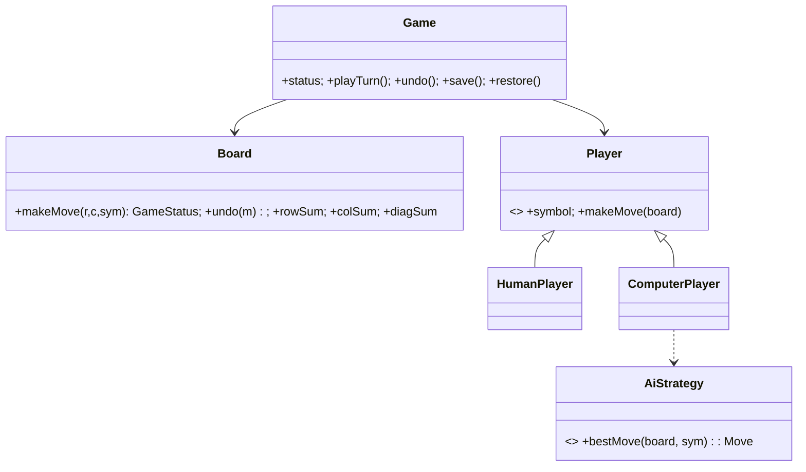

# 🛠️ Design Tic-Tac-Toe (LLD)

> **Sources**: [LeetCode 348 — Design Tic-Tac-Toe](https://leetcode.com/problems/design-tic-tac-toe/) (the canonical O(1) win-check via per-row/column/diagonal counters); standard Gang of Four patterns; classic AI references — Russell & Norvig, *Artificial Intelligence: A Modern Approach* — for Minimax + Alpha-Beta.

## 1. Requirements

### Functional
- **Configurable `N×N` board** (3×3 standard; M-in-a-row variants).
- **2 players** (X and O; generalizable to any symbol set).
- **Player types**: `HumanPlayer`, `ComputerPlayer` (AI difficulty plug-in).
- **Win detection** across rows, columns, and both diagonals.
- **Draw detection** when the board fills with no winner.
- **Undo** the last move.
- **Save/restore** game state.

### Non-Functional
- **O(1) win-check after each move** — no full-board scan.
- **Game logic decoupled from UI** (testable headless).
- **Immutable move history** (append-only `moves[]`).

## 2. Core Entities

| Entity | Key Fields |
|---|---|
| `Symbol` | enum `X`, `O`, `EMPTY` |
| `Board` | `size`, `grid[N][N]`, `emptyCount`, `rowSum[N]`, `colSum[N]`, `diagSum`, `antiDiagSum` |
| `Cell` | `row`, `col`, `symbol` |
| `Player` (abstract) | `name`, `symbol`, `makeMove(board): Move` |
| `HumanPlayer` | reads input |
| `ComputerPlayer` | uses `AiStrategy` |
| `Move` | `playerSymbol`, `row`, `col` |
| `Game` | `board`, `players[]`, `moves: Deque<Move>`, `currentTurnIdx`, `status` |
| `GameStatus` | `IN_PROGRESS` / `X_WON` / `O_WON` / `DRAW` |

## 3. Class Diagram



## 4. Key Methods

```java
GameStatus Board.makeMove(int row, int col, Symbol sym);  // O(1) win check
void       Board.undo(Move m);                            // O(1) decrement
boolean    Board.isFull();
GameStatus Game.playTurn();                               // delegates to current Player
Move       AiStrategy.bestMove(Board b, Symbol mySymbol);
GameSnapshot Game.save();
```

## 5. Design Patterns

| Pattern | Where | Why |
|---|---|---|
| **Strategy** | `AiStrategy` (`Random`, `RuleBased`, `Minimax`, `AlphaBeta`) | Plug-in difficulty levels. |
| **Template Method** | `Player.makeMove()` workflow | Subclasses override only the choice. |
| **State** | `Game.status` lifecycle | Block illegal `playTurn()` after `WON`/`DRAW`. |
| **Observer** | `GameObserver` (UI, replay logger, analytics) | Decouple presentation from core loop. |
| **Command** | `Move` is the unit of work; pushed on a stack ⇒ undo | Auditable + replayable. |
| **Memento** | `GameSnapshot` for save/restore | Restore exact prior state. |
| **Iterator** | Player rotation `(currentTurnIdx + 1) % players.size` | Standard turn order. |
| **Singleton** | `GameRegistry` for active games | Lookup by id. |
| **Factory** | `PlayerFactory.create(type, ...)` | Create `HumanPlayer` vs `ComputerPlayer(strategy)`. |

## 6. Concurrency & Algorithm Highlights

### 6.1 O(1) win-check (the famous trick)
Maintain four sums; mark X as `+1`, O as `−1`:

```java
public GameStatus makeMove(int r, int c, Symbol sym) {
  if (grid[r][c] != EMPTY) throw new IllegalArgumentException();
  grid[r][c] = sym;
  emptyCount--;
  int v = (sym == X) ? +1 : -1;
  rowSum[r] += v;  colSum[c] += v;
  if (r == c)             diagSum     += v;
  if (r + c == size - 1)  antiDiagSum += v;

  // O(1) win check
  if (Math.abs(rowSum[r]) == size ||
      Math.abs(colSum[c]) == size ||
      Math.abs(diagSum)   == size ||
      Math.abs(antiDiagSum) == size) {
    return (sym == X) ? X_WON : O_WON;
  }
  return (emptyCount == 0) ? DRAW : IN_PROGRESS;
}
```
This is the [LeetCode 348](https://leetcode.com/problems/design-tic-tac-toe/) optimization — eliminates the O(N²) full-board scan after every move; replaces it with constant-time updates and four constant-time comparisons.

### 6.2 Undo in O(1)
```java
public void undo(Move m) {
  int v = (m.symbol == X) ? +1 : -1;
  grid[m.row][m.col] = EMPTY;
  emptyCount++;
  rowSum[m.row] -= v;  colSum[m.col] -= v;
  if (m.row == m.col)             diagSum     -= v;
  if (m.row + m.col == size - 1)  antiDiagSum -= v;
}
```
Pop the move from the `Deque<Move>` and decrement the same counters.

### 6.3 AI strategies (Strategy pattern)

| Strategy | Algorithm |
|---|---|
| `RandomStrategy` | Pick any empty cell. |
| `RuleBasedStrategy` | Win-now → block-opponent → take-center → take-corner → take-side. |
| `MinimaxStrategy` | Recursive game-tree search; +10 win, −10 loss, 0 draw, prefer faster wins. |
| `AlphaBetaStrategy` | Minimax with α-β pruning; explores ~10× fewer nodes for 3×3. |

For 3×3 the full game tree has < 9! = 362,880 nodes; Minimax solves it instantly (game is a known draw with optimal play). For larger boards, alpha-beta + a depth limit + a heuristic evaluation is required.

### 6.4 Logic ↮ UI separation
`Game` and `Board` know nothing about rendering. The UI registers a `GameObserver` and re-draws on `onMove`. This makes headless unit tests trivial.

### 6.5 Immutable move history
`moves` is append-only. `undo()` pops the last `Move` and reverses it on the board; the popped move is **not** discarded — for replay we keep both `appliedMoves` and `undoneMoves` (Command pattern with redo).

## 7. Sources / Cross-Refs
- LLD-08 Behavioral Patterns (Strategy, State, Observer, Command, Memento, Template Method, Iterator)
- Solution-Connect-Four.md (same O(1) counters generalized to k-in-a-row)
- LeetCode 348 — Design Tic-Tac-Toe: https://leetcode.com/problems/design-tic-tac-toe/
- Russell & Norvig, *AIMA*, Ch. 5 (Adversarial Search)
