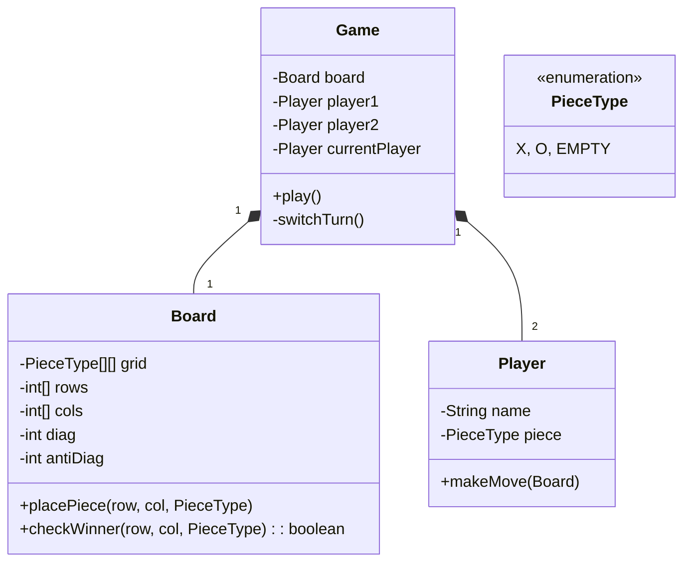

# 🛠️ Design Tic Tac Toe Game (LLD)

Tic Tac Toe is a classic LLD and algorithmic interview question. While modeling the board and players is straightforward, the core algorithmic challenge lies in designing an $O(1)$ method to determine if a player has won after making a move.

---

## 1. Requirements

### Functional Requirements
- **Board:** A 3x3 grid (or $N \times N$ for scalability).
- **Players:** Two players, 'X' and 'O'.
- **Moves:** Players take turns placing their mark on an empty square.
- **Winning:** A player wins if they get $N$ marks in a row (horizontally, vertically, or diagonally).
- **Draw:** If the board fills up without a winner, the game is a draw.

### Non-Functional Requirements
- **Scalability:** The logic should be easily scalable to an $N \times N$ board. Do not hardcode 3x3 `if-else` blocks for the winning logic.
- **Performance:** Checking the winning condition should be $O(1)$.

---

## 2. Core Entities (Objects)

- `System` / `Game` (Orchestrates the match, switching player turns)
- `Player` (Has an ID or Name, and a `PieceType`)
- `Board` (Holds the state of the grid)
- `PieceType` (Enum: X, O, EMPTY)

---

## 3. Class Diagram / Relationships



---

## 4. Key Algorithms / Design Patterns

### 1. The $O(1)$ Winning Algorithm (The Math Trick)

The naive way to check for a winner is to scan the entire 3x3 (or N x N) board every time a move is made -> $O(N^2)$ or $O(N)$.
We can do this in $O(1)$ using math.

Instead of storing 'X' and 'O', imagine 'X' has a value of `+1` and 'O' has a value of `-1`.
For an $N \times N$ board, we maintain:
- An array `rows` of size $N$. (Tracking the sum of each row)
- An array `cols` of size $N$. (Tracking the sum of each column)
- A single integer `diagonal`.
- A single integer `antiDiagonal`.

When Player 'X' moves at `(row 2, col 1)`:
We add `+1` to `rows[2]`, `cols[1]`, and (if applicable) the diagonals.
If the absolute value of any of these trackers reaches $N$, we know someone just got $N$ pieces in a row!

```java
public class TicTacToeBoard {
    private int[] rows;
    private int[] cols;
    private int diagonal;
    private int antiDiagonal;
    private int size;
    private int totalMoves = 0;

    public TicTacToeBoard(int n) {
        this.size = n;
        this.rows = new int[n];
        this.cols = new int[n];
    }

    /**
     * @param player 1 for 'X', -1 for 'O'
     * @return true if this move won the game
     */
    public boolean move(int row, int col, int player) throws IllegalArgumentException {
        // Assume logic exists to check if (row, col) is already taken
        
        int value = (player == 1) ? 1 : -1;

        rows[row] += value;
        cols[col] += value;

        // Check Top-Left to Bottom-Right diagonal
        if (row == col) {
            diagonal += value;
        }

        // Check Top-Right to Bottom-Left diagonal
        if (col == (size - row - 1)) {
            antiDiagonal += value;
        }

        totalMoves++;

        // Did they win?
        if (Math.abs(rows[row]) == size ||
            Math.abs(cols[col]) == size ||
            Math.abs(diagonal) == size ||
            Math.abs(antiDiagonal) == size) {
            return true;
        }

        return false;
    }
    
    public boolean isDraw() {
        return totalMoves == (size * size);
    }
}
```

### 2. The Game Loop

The `Game` class orchestrates the interaction.

```java
public class Game {
    private TicTacToeBoard board;
    private int currentPlayerMarker; // 1 for X, -1 for O

    public Game(int n) {
        board = new TicTacToeBoard(n);
        currentPlayerMarker = 1; // X goes first
    }

    public void playTurn(int row, int col) {
        try {
            boolean hasWon = board.move(row, col, currentPlayerMarker);
            
            if (hasWon) {
                System.out.println("Player " + currentPlayerMarker + " wins!");
                // end game
            } else if (board.isDraw()) {
                System.out.println("It's a draw!");
                // end game
            } else {
                // Switch turn
                currentPlayerMarker = (currentPlayerMarker == 1) ? -1 : 1;
            }
        } catch (IllegalArgumentException e) {
            System.out.println("Invalid move, try again.");
        }
    }
}
```

### 3. Alternative: Object-Oriented Grid
If the interviewer insists you MUST maintain an actual 2D grid of Enum types (because perhaps there's a UI rendering layer that needs to read it), you map the math algorithm alongside the board.

```java
public enum PieceType { X, O, EMPTY }

public class Cell {
    int row;
    int col;
    PieceType piece;
}

// Inside Board.java
private Cell[][] grid;

public void placePiece(int r, int c, PieceType p) {
    if (grid[r][c].piece != PieceType.EMPTY) throw Exception();
    grid[r][c].piece = p;
    
    // Call the math algorithm here to check win condition...
}
```