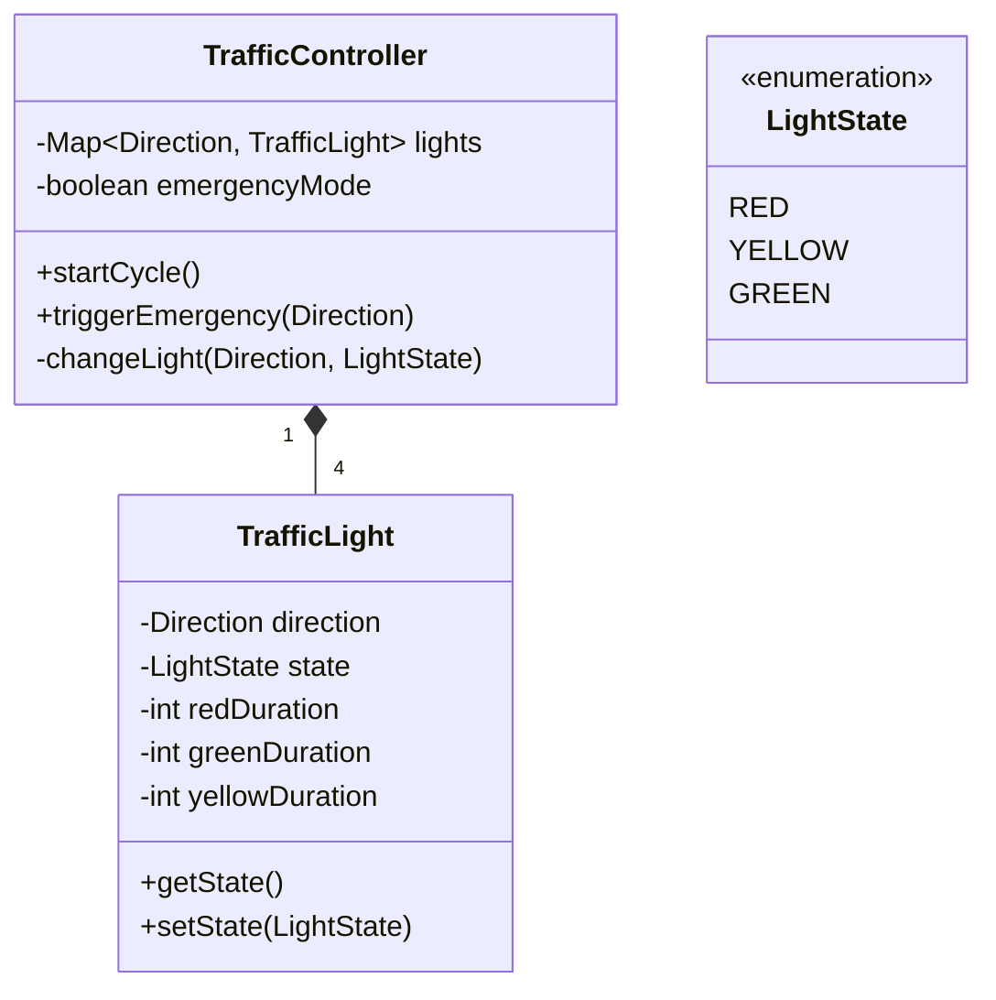

# 🛠️ Design Traffic Signal Control System (LLD)

This is a state machine and priority scheduling problem. It involves managing the varying states of an intersection while ensuring safety constraints (cross-traffic signals can never be green simultaneously).

---

## 1. Requirements

### Functional Requirements
- **Intersection Control:** Manage traffic lights for a standard 4-way intersection (North, South, East, West).
- **State Changes:** Signals transition automatically Green -> Yellow -> Red -> Green.
- **Opposing Safety:** N & S can be green at the same time. E & W can be green at the same time. But N/S cannot be green if E/W is not Red.
- **Pedestrian Crossing:** Allow pedestrians to push a button to request a walk signal.
- **Emergency Override:** Ambulances can trigger an override to force a direction green.

### Non-Functional Requirements
- **Thread Safety / Concurrency:** The timing loop and emergency interrupts must be handled safely.
- **Safety First:** The system must default to a safe state (e.g., all Red) if a conflict is detected.

---

## 2. Core Entities (Objects)

- `TrafficController` (The central orchestrator)
- `Intersection`
- `TrafficLight` (Holds State)
- `LightState` (Enum: RED, YELLOW, GREEN)
- `Direction` (Enum: NORTH, SOUTH, EAST, WEST)
- `EmergencySensor` / `PedestrianButton`

---

## 3. Class Diagram / Relationships



---

## 4. Key Algorithms / Design Patterns

### 1. The Strategy / Control Loop (Observer or standard Thread)

The system is fundamentally an infinite loop running on a background thread.

```java
public class TrafficController implements Runnable {
    private TrafficLight north, south, east, west;
    private volatile boolean isRunning = true;

    @Override
    public void run() {
        while (isRunning) {
            try {
                // Phase 1: North/South Green, East/West Red
                setLights(LightState.GREEN, LightState.RED);
                Thread.sleep(30000); // 30s Green

                // North/South Yellow
                setLights(LightState.YELLOW, LightState.RED);
                Thread.sleep(5000); // 5s Yellow
                
                // Safety Buffer: All Red
                setLights(LightState.RED, LightState.RED);
                Thread.sleep(2000);

                // Phase 2: East/West Green, North/South Red
                setLights(LightState.RED, LightState.GREEN);
                Thread.sleep(30000);
                
                // East/West Yellow
                setLights(LightState.RED, LightState.YELLOW);
                Thread.sleep(5000);

            } catch (InterruptedException e) {
                // Interrupted by an Emergency!
            }
        }
    }

    private void setLights(LightState nsState, LightState ewState) {
        // Enforce safety constraint!
        if (nsState == LightState.GREEN && ewState == LightState.GREEN) {
            throw new FatalSafetyException();
        }
        north.setState(nsState);
        south.setState(nsState);
        east.setState(ewState);
        west.setState(ewState);
    }
}
```

### 2. Handling Interrupts (Emergency Vehicles)

When an emergency vehicle approaches, the normal run loop must pause, set all other lights to red, and specific lights to green. By utilizing Java thread interruptions, we can halt the `Thread.sleep()` instantly.

```java
public class TrafficController {
    private Thread controllerThread;

    public void triggerEmergency(Direction approachDir) {
        // 1. Interrupt standard loop
        controllerThread.interrupt();
        
        // 2. Force safety state
        forceAllRed();
        
        // 3. Grant emergency access
        if (approachDir == Direction.NORTH || approachDir == Direction.SOUTH) {
            north.setState(LightState.GREEN);
            south.setState(LightState.GREEN);
        } else {
            east.setState(LightState.GREEN);
            west.setState(LightState.GREEN);
        }
        
        // In a real system, the controllerThread would be designed 
        // to wait on a monitor or latch until the emergency clears.
    }
}
```

### 3. The State Pattern (Alternative approach)

If the intersection has complex left-turn logic and pedestrian phases, an infinite `run()` loop gets messy. The **State Pattern** can model the intersection's phase.
States: `NorthSouthGreenState`, `NorthSouthYellowState`, `EastWestGreenState`.
The `TrafficController` simply calls `currentState.handleTimeout(this)` which automatically switches the machine to the next state and resets the timer.