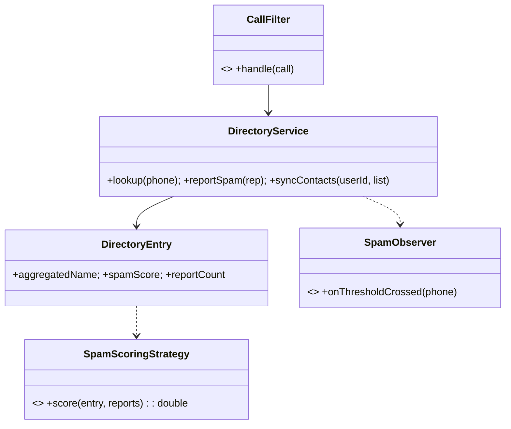

# 🛠️ Design Truecaller-style Caller ID + Spam Detection (LLD)

> **Sources**: [Google `libphonenumber`](https://github.com/google/libphonenumber) for E.164 normalization; [Bloom filter (Wikipedia)](https://en.wikipedia.org/wiki/Bloom_filter) for negative-existence pre-filter; Truecaller engineering blog posts on crowd-sourced names + spam reports; [GDPR Art. 17 — Right to Erasure](https://gdpr-info.eu/art-17-gdpr/); standard cache-aside / write-behind patterns.

## 1. Requirements

### Functional
- **User registration** with phone number + name (verified via OTP).
- **Reverse lookup**: query any phone number → return aggregated `displayName` + `spamScore`.
- **Spam reporting**: any user can report a number with a reason.
- **Contact sync**: a user uploads their address book to enrich the global directory (with consent).
- **Block list**: per-user blocked numbers.
- **International numbers** in E.164 (`+15551234567`).

### Non-Functional
- **<100 ms** lookup p95 even with billions of numbers.
- **False-positive sensitivity** (legitimate businesses must not be flagged on a few reports).
- **GDPR right-to-erasure** must cascade across all replicas + caches.
- **Privacy**: contacts are shared only with consent; deleted users are scrubbed.

## 2. Core Entities

| Entity | Key Fields |
|---|---|
| `User` | `id`, `phoneNumber` (E.164), `displayName`, `consentSyncedContacts` |
| `PhoneNumber` | normalized E.164 string (the global key) |
| `DirectoryEntry` | `phoneNumber`, `aggregatedName`, `nameSources[]`, `spamScore`, `reportCount`, `lastUpdatedAt` |
| `SpamReport` | `id`, `reporterId`, `phoneNumber`, `reason`, `timestamp` |
| `Contact` | `ownerUserId`, `phoneNumber`, `displayNameAsSaved` |
| `BlockEntry` | `userId`, `blockedPhoneNumber`, `createdAt` |
| `CallEvent` | `callerPhone`, `calleePhone`, `timestamp`, `wasBlocked` |

## 3. Class Diagram



## 4. Key Methods

```java
DirectoryEntry  DirectoryService.lookupByPhone(String e164);
void            DirectoryService.reportSpam(String reporterUserId, String e164, String reason);
void            DirectoryService.blockNumber(String userId, String e164);
void            DirectoryService.syncContacts(String userId, List<Contact> contacts);  // idempotent
double          SpamScoringStrategy.score(DirectoryEntry e, List<SpamReport> recent);
void            DirectoryService.deleteUserData(String userId);  // GDPR cascade
```

## 5. Design Patterns

| Pattern | Where | Why |
|---|---|---|
| **Strategy** | `SpamScoringStrategy` (count-based, time-decayed, ML, trust-weighted) | Scoring rules evolve; swap without touching `DirectoryEntry`. |
| **Chain of Responsibility** | `CallFilter`: `IsBlocked → IsKnownSpam → IsContact → Ring` | Each handler decides whether to short-circuit. |
| **Observer** | `SpamObserver` notified when `reportCount` crosses a threshold → broadcast warning | Real-time alerting decoupled from reporting flow. |
| **Singleton** | `DirectoryService` facade | Single coordination point. |
| **Cache-Aside** | Redis cache in front of the directory store | Read-heavy lookups served from RAM. |
| **Composite** | `aggregatedName` is composed from many `nameSources` (registered, contacts, ML) | Uniform aggregation algorithm. |

## 6. Concurrency & Edge Cases

### 6.1 Read-heavy lookup pipeline (sub-100 ms)

```
client → API gateway
       → Bloom filter (per-shard) ──► miss = number unknown ⇒ return "Unknown" in O(1)
       → Redis (LRU) ──► hit = return cached entry
       → DB read replica (sharded by phoneNumber hash)
       → DirectoryEntry (composed)
```

The bloom filter rejects never-seen numbers in microseconds with no false negatives, only ~1 % false positives that fall through to the cache; this is the classic "Don't even check the cache for things that can't exist" optimization.

### 6.2 Phone-number normalization
Always normalize to E.164 *at the edge* using `libphonenumber`. Stored numbers are always normalized; a query for `+1 (555) 123-4567`, `5551234567` (US default region), and `+15551234567` all resolve to the same key.

### 6.3 Spam reporting (write path)
- `INCR spam:{phone}` in Redis (lock-free atomic counter).
- Append `SpamReport` row to DB asynchronously (write-behind, batched every 1 s).
- If `INCR` returns ≥ threshold (e.g., 50 recent reports / 24 h), publish `SpamThresholdCrossed` event → observers notify users with this number in their contacts.

### 6.4 Trust-weighted scoring (false-positive defense)
```
spamScore = Σᵢ (reporterTrustᵢ × exp(-λ · ageDays_i))
```
Reporters who frequently flag legitimate numbers see their trust decay. Long-known business numbers carry "verified" weight that requires many high-trust reports to flip.

### 6.5 Idempotent contact sync
Each `Contact` row has `(ownerUserId, phoneNumber)` as the natural key. Sync uses upsert + `lastModifiedAt` to converge regardless of how many times a flaky client retries.

### 6.6 GDPR cascade delete
`deleteUserData(userId)` runs:
1. Remove `User` row.
2. Remove all `Contact` rows where `ownerUserId = userId`.
3. Remove `BlockEntry`, `CallEvent` for the user.
4. **Anonymize** `SpamReport` rows authored by the user (`reporterId = NULL`) — preserves aggregate spam stats while breaking the link to the user (a common compromise).
5. Invalidate Redis cache entries.
6. Recompute affected `DirectoryEntry.aggregatedName`.

## 7. Sources / Cross-Refs
- 12-Caching.md (Redis cache-aside, LRU)
- LLD-08 Behavioral Patterns (Strategy, Chain of Responsibility, Observer)
- Solution-Notification.md (real-time alert fanout)
- Google libphonenumber: https://github.com/google/libphonenumber
- Bloom filter: https://en.wikipedia.org/wiki/Bloom_filter
