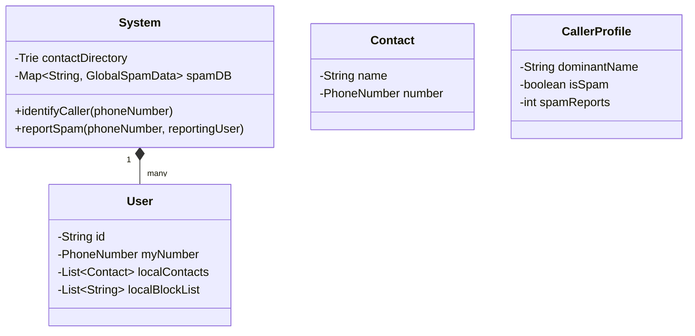

# 🛠️ Design Truecaller (LLD)

Truecaller is a Caller ID and Spam Blocking app. It maps incoming phone numbers to names, even if the number isn't saved in the user's local contact book, by crowdsourcing contacts globally. 

---

## 1. Requirements

### Functional Requirements
- **Register User:** End users can register with their Name and Phone Number.
- **Import Contacts:** The system ingests a user's address book to map numbers to names.
- **Search (Caller ID):** Given a phone number, return the likely Name and Spam status instantly.
- **Mark as Spam:** Users can report a phone number as spam. After $N$ reports, it gets officially flagged as spam.
- **Block:** Users can block a spam number personally, or rely on the global spam list.

### Non-Functional Requirements
- **High Read Throughput:** When a phone rings, the look-up must happen in < 100ms.
- **Trie / Inverted Index:** Efficient searching using prefix trees if doing a reverse name-to-number search.

---

## 2. Core Entities (Objects)

- `System`
- `User` (A registered app user)
- `Contact` (A record scraped from someone's phone)
- `PhoneNumber` (Value object holding country code and number)
- `SpamRecord` 

---

## 3. Class Diagram / Relationships



---

## 4. Key Algorithms / Design Patterns

### 1. Identifying the Caller (The Crowdsourcing Logic)

If 5 different users have the number `999-9999` saved in their imported contacts under different names ("Mom", "Jane Doe", "Jane D", "Plumber", "Jane"), how does Truecaller know what to show?
It usually groups and counts. The most frequent full name associated with that number wins (ignoring generic labels if possible, though that requires ML).

```java
public class UserDirectory {
    // Map of Phone Number -> (Map of "Name" -> Count)
    private Map<String, Map<String, Integer>> crowdsourcedNames = new HashMap<>();
    
    public void importContact(String phoneNumber, String nameSavedAs) {
        crowdsourcedNames.putIfAbsent(phoneNumber, new HashMap<>());
        Map<String, Integer> nameCounts = crowdsourcedNames.get(phoneNumber);
        
        nameCounts.put(nameSavedAs, nameCounts.getOrDefault(nameSavedAs, 0) + 1);
    }
    
    public String resolveBestName(String phoneNumber) {
        if (!crowdsourcedNames.containsKey(phoneNumber)) return "Unknown";
        
        Map<String, Integer> nameCounts = crowdsourcedNames.get(phoneNumber);
        
        // Find the name with the absolute highest count
        String bestName = "Unknown";
        int max = 0;
        
        for(Map.Entry<String, Integer> entry : nameCounts.entrySet()) {
            if(entry.getValue() > max) {
                max = entry.getValue();
                bestName = entry.getKey();
            }
        }
        return bestName;
    }
}
```

### 2. Spam Calculation

If a number gets reported as spam, we don't block it globally immediately (to prevent abuse where 1 person maliciously blocks a legitimate business). It requires a threshold.

```java
public class SpamManager {
    // Phone Number -> List of User IDs who reported it
    private Map<String, Set<String>> spamReports = new HashMap<>();
    private final int GLOBAL_SPAM_THRESHOLD = 10;
    
    public void reportSpam(String spammerNumber, String reporterUserId) {
        spamReports.putIfAbsent(spammerNumber, new HashSet<>());
        spamReports.get(spammerNumber).add(reporterUserId);
    }
    
    public boolean isGlobalSpam(String phoneNumber) {
        if (!spamReports.containsKey(phoneNumber)) return false;
        
        return spamReports.get(phoneNumber).size() >= GLOBAL_SPAM_THRESHOLD;
    }
}
```

### 3. Fast Prefix Searching (The Trie)

If the app also allows searching for a Person's Name (e.g., typing "Rob" and seeing "Robert S.", "Robin G."), a HashMap won't work because HashMaps don't support `LIKE 'Rob%'` prefix searching efficiently.
We must construct a **Trie (Prefix Tree)** for O(L) searches, where L is the length of the string.

```java
class TrieNode {
    Map<Character, TrieNode> children = new HashMap<>();
    boolean isEndOfName = false;
    List<String> associatedPhoneNumbers = new ArrayList<>();
}

public class ContactTrie {
    private TrieNode root = new TrieNode();

    public void insert(String name, String phoneNumber) {
        TrieNode current = root;
        for (char c : name.toLowerCase().toCharArray()) {
            current.children.putIfAbsent(c, new TrieNode());
            current = current.children.get(c);
        }
        current.isEndOfName = true;
        current.associatedPhoneNumbers.add(phoneNumber);
    }

    public List<String> searchPrefix(String prefix) {
        TrieNode current = root;
        for (char c : prefix.toLowerCase().toCharArray()) {
            if (!current.children.containsKey(c)) {
                return new ArrayList<>(); // Prefix doesn't exist
            }
            current = current.children.get(c);
        }
        
        // From this node, we would run a DFS to collect all valid names/numbers
        // below this prefix. (DFS logic omitted for brevity).
        return gatherAllNumbersBelow(current);
    }
}
```

### 4. Client-Side Optimization (Bloom Filter)

If your phone rings without internet, Truecaller often still knows it's spam. How?
Before you go offline, the app downloads a heavily compressed representation of the Top 1 Million spam numbers to your phone's local storage. Storing 1 million raw strings takes 10-20 MB. Storing them in a **Bloom Filter** takes < 2 MB of RAM. The app checks the incoming number against the local Bloom Filter in 1 millisecond. If it returns true (possible spam), it rejects the call.