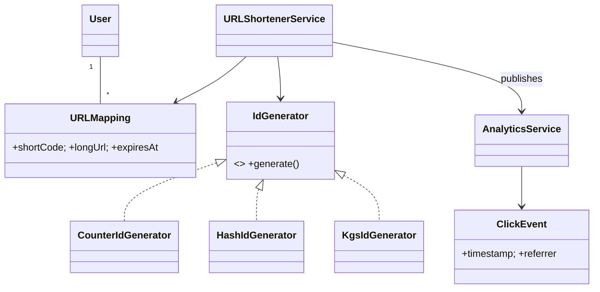

# 🛠️ Design URL Shortener (LLD)

> Object-oriented design for a TinyURL/Bitly-style service — focus on class structure, ID-generation strategies, and concurrency. The system-wide architecture (sharding, CDN, capacity) lives in the SD section.

## 📚 Table of Contents

1. [Requirements](#1-requirements)
2. [Core Entities](#2-core-entities-objects)
3. [ID Generation Strategies](#3-id-generation-strategies)
4. [Class Diagram](#4-class-diagram--relationships)
5. [Key APIs](#5-api--interfaces)
6. [Design Patterns](#6-key-algorithms--design-patterns)
7. [Concurrency](#7-concurrency--edge-cases)
8. [Sources](#8-sources)

---

## 1. Requirements

### Functional
- **Shorten** — given a long URL, return a short alias
- **Redirect** — given a short alias, redirect to the original URL (302)
- **Custom alias** — let users pick the alias (`bit.ly/myname`)
- **Expiration** — optional TTL on links
- **Analytics** — click count + per-click metadata (timestamp, referrer, UA, country)

### Non-Functional
- **Uniqueness** — no two long URLs share a short code, no collisions ever
- **Low latency** — redirect ≤ 100 ms p99 (cache-first lookup)
- **Eventual consistency** for analytics is fine; the redirect must be strongly read-your-write
- **Idempotency** — shortening the same long URL twice should ideally return the same short code

---

## 2. Core Entities (Objects)

| Entity | Key Attributes |
|---|---|
| `URLMapping` | shortCode (PK), longUrl, ownerId, createdAt, expiresAt, isCustom |
| `User` | userId, email, plan (free/pro) |
| `ClickEvent` | eventId, shortCode, timestamp, referrer, userAgent, ipHash, country |
| `AnalyticsCounter` | shortCode, totalClicks, lastClickAt (denormalized for fast read) |

---

## 3. ID Generation Strategies

| Strategy | How | Pros | Cons |
|---|---|---|---|
| **Counter + Base62** | Atomic global counter → encode in `[0-9A-Za-z]` | Zero collisions; short codes; cheap | Needs distributed counter (Redis `INCR`); leaks order/volume |
| **Hash prefix** | `base62(md5(longUrl))[0..7]` | Idempotent (same URL → same code); decentralized | Collisions possible → must check + retry |
| **KGS (Key-Gen Service)** | Pre-generate pool of unique 7-char codes into `available_keys` table; pop on demand | Fast; collision-free; supports custom alias namespace | Extra service; DB hot-spot if not partitioned |

**7 chars in Base62** = 62⁷ ≈ **3.5 trillion** unique codes — enough for any realistic service.

**Counter batching** — each app server reserves a batch of 1000 counter values from Redis at a time, eliminating per-request round-trips while still guaranteeing uniqueness.

---

## 4. Class Diagram / Relationships



---

## 5. API / Interfaces

```java
public interface IdGenerator {
    String generate();              // returns next unique short code
}

public interface URLShortenerService {
    String shorten(String longUrl, Long ownerId, String customAlias, Instant expiresAt);
    String expand(String shortCode);                      // throws if expired/missing
    void   trackClick(String shortCode, ClickMeta meta);  // async
    AnalyticsSummary getStats(String shortCode);
}

public interface URLRepository {
    Optional<URLMapping> findByShortCode(String code);
    Optional<URLMapping> findByLongUrl(String longUrl);   // for idempotency
    void save(URLMapping m);                              // UNIQUE(shortCode)
}
```

`expand()` flow:
1. Lookup cache (`shortCode → longUrl`) — Redis
2. Cache miss → DB lookup → populate cache with TTL
3. Validate `expiresAt`
4. Async: publish `ClickEvent` to analytics queue
5. Return 302 with `Location: longUrl`

---

## 6. Key Algorithms / Design Patterns

| Pattern | Where used | Why |
|---|---|---|
| **Strategy** | `IdGenerator` | Swap counter / hash / KGS at runtime via DI; benchmark each |
| **Factory** | `URLMapping` creation | Different paths for auto-generated vs. custom-alias mappings; each enforces own validation |
| **Observer** | Analytics | `URLShortenerService` publishes `ClickEvent`; `AnalyticsService`, `LoggingService`, `MetricsCollector` subscribe — keeps redirect path lean |
| **Cache-aside** | `expand()` reads | Read-through Redis with TTL; on miss → DB + repopulate |
| **Singleton** | `IdGenerator` instance | One per process; counter batch state lives here |

---

## 7. Concurrency & Edge Cases

- **Distributed counter** — Redis `INCR` is atomic and single-threaded, so two app servers never see the same value. Without Redis you'd need a database sequence.
- **Concurrent shorten of the same long URL** — two clients call `shorten("https://x.com/a")` simultaneously. Both miss the dedup index, both insert. Two short codes for one URL is *not a correctness bug* — it's a minor space waste. If strict idempotency is required, take a row lock on a hash of `longUrl`.
- **Custom alias collision** — a user picks `myname`; the KGS could later auto-generate the same code. Solve by **namespace separation**: auto-generated codes are exactly 7 chars; custom aliases are ≥ 8 chars or contain a non-Base62 character.
- **Race on `INSERT`** — short code generated → another insert lands first → `UNIQUE` violation. Catch the exception, get next counter value, retry. Bounded retry (≤ 3) prevents infinite loop.
- **Click counter contention** — incrementing one row per click on a popular link is a hot-spot. Buffer increments in memory (or Redis `INCR`), flush every N seconds to the database. Acceptable since analytics are eventually consistent.
- **Expired link** — return `410 Gone` (not `404`); cache the negative result with short TTL to avoid DB hammering on viral expired links.

---

## 8. Sources

- Workspace cross-reference: `Notes/SystemDesign/Solutions/Solution-URL-Shortener.md` (capacity, sharding)
- Workspace cross-reference: `Notes/LowLevelDesign/Solutions/Solution-Distributed-ID.md` (Snowflake-style IDs)
- Industry standard: 7-char Base62 = 62⁷ ≈ 3.5T (basic combinatorics)
- Redis docs — `INCR` is atomic on a single Redis node

📺 **Video walkthrough:** [High-Level vs Low-Level Design: URL Shortener Explained](https://www.youtube.com/watch?v=84m4h_xxNBg)
