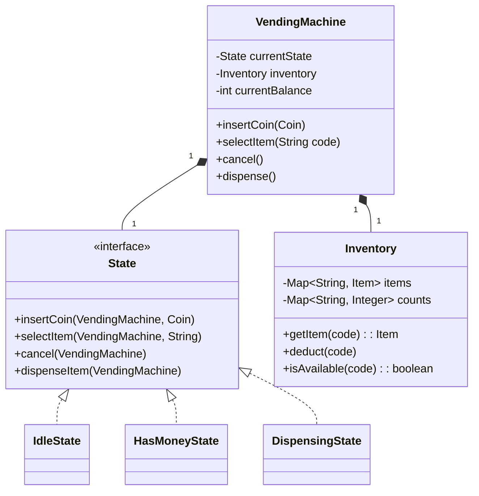

# 🛠️ Design a Vending Machine (LLD)

The Vending Machine is a classic Object-Oriented Design problem. It specifically tests your ability to model finite state machines using the **State Design Pattern**, managing inventory, and handling real-world transaction flows (inserting money, selecting items, dispensing change).

---

## 1. Requirements

### Functional Requirements
- **Select Product:** Users can select a product (e.g., Coke, Pepsi, Snickers) by entering a code.
- **Accept Payment:** The machine accepts different denominations of coins/bills (e.g., $1, $5, Quarters).
- **Dispense Item:** The machine dispenses the product if the payment is sufficient.
- **Return Change:** It must return the correct change if the inserted money exceeds the price.
- **Refund/Cancel:** The user can cancel the transaction before dispensing to get a full refund.
- **Inventory Management:** The machine tracks the count of items. It displays an "Out of Stock" message if an item is empty.

### Non-Functional Requirements
- **Maintainability:** Easy to add new states or payment methods.
- **Robustness:** Handles cases like not having enough change in the machine to give back.

---

## 2. Core Entities (Objects)

Identify the primary objects/models involved.

- `VendingMachine` (Context class holding the current State)
- `State` (Interface) -> `IdleState`, `HasMoneyState`, `DispensingState`
- `Item` (Product details: name, price)
- `Inventory` (Tracking item counts and slots)
- `Coin` / `Banknote` (Enums for valid denominations)

---

## 3. Class Diagram / Relationships



---

## 4. Key Algorithms / Design Patterns

### 1. The State Pattern (Crucial)

If you implement the vending machine with a giant `switch` statement or a dozen `if (state == IDLE)` blocks inside `insertCoin()`, your code will be brittle and fail the interview. The **State Pattern** is mandatory here.

**The State Interface:**
```java
public interface VendingMachineState {
    void insertCoin(VendingMachine machine, int amount);
    void selectItem(VendingMachine machine, String itemCode);
    void cancelAndRefund(VendingMachine machine);
    void dispense(VendingMachine machine);
}
```

**Concrete State: `IdleState`**
```java
public class IdleState implements VendingMachineState {
    public void insertCoin(VendingMachine machine, int amount) {
        machine.addBalance(amount);
        System.out.println("Money inserted.");
        // Transition to next state
        machine.setState(new HasMoneyState()); 
    }

    public void selectItem(VendingMachine machine, String itemCode) {
        System.out.println("Please insert money first.");
    }

    public void cancelAndRefund(VendingMachine machine) {
        System.out.println("No money to refund.");
    }
    
    public void dispense(VendingMachine machine) {
        System.out.println("Cannot dispense. Insert money.");
    }
}
```

**Concrete State: `HasMoneyState`**
```java
public class HasMoneyState implements VendingMachineState {
    public void insertCoin(VendingMachine machine, int amount) {
        machine.addBalance(amount);
    }

    public void selectItem(VendingMachine machine, String itemCode) {
        if (!machine.getInventory().isAvailable(itemCode)) {
            System.out.println("Item out of stock.");
            return;
        }
        Item item = machine.getInventory().getItem(itemCode);
        if (machine.getBalance() >= item.getPrice()) {
            machine.setSelectedItem(item);
            // Transition to dispensing
            machine.setState(new DispensingState()); 
            machine.getState().dispense(machine); // Auto-trigger dispense
        } else {
            System.out.println("Insufficient funds.");
        }
    }
    // ... Implement cancel/refund ...
}
```

### 2. Inventory Management

The `Inventory` class acts as an internal Database. It should encapsulate the counting logic.
```java
public class Inventory {
    private Map<String, Integer> stockCount = new HashMap<>();
    private Map<String, Item> products = new HashMap<>();
    
    public void addItem(Item item, String code, int quantity) {
        products.put(code, item);
        stockCount.put(code, stockCount.getOrDefault(code, 0) + quantity);
    }
    
    public void deduct(String code) {
        stockCount.put(code, stockCount.get(code) - 1);
    }
}
```

### 3. Calculating Change (Greedy Algorithm)

When $10 is inserted for a $2.50 item, the machine must return $7.50 using its internal coin storage.
Use a **Greedy Algorithm** to return the largest denominations first. Note: In reality, real vending machines can hit edge cases where greedy fails (e.g., if you have weird coin denominations), but for standard US currency ($5, $1, $0.25, $0.10, $0.05), Greedy always yields the minimum number of coins.

```java
public void returnChange(int balanceDue) {
    int[] denominations = {500, 100, 25, 10, 5}; // in cents
    for (int coin : denominations) {
        int count = balanceDue / coin;
        if (count > 0 && machineHasAvailable(coin, count)) {
            dispenseCoins(coin, count);
            balanceDue -= (coin * count);
        }
    }
    if (balanceDue > 0) {
        throw new RuntimeException("Exact change not possible!");
    }
}
```