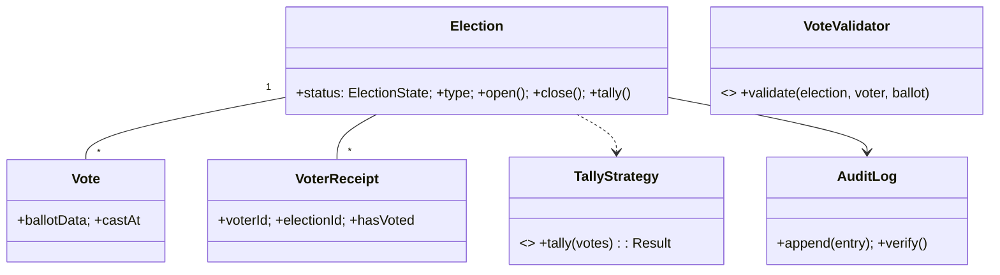

# 🛠️ Design Online Voting System (LLD)

> **Sources**: [NIST SP 1500-103 voluntary voting-system guidelines](https://www.nist.gov/itl/voting); [Helios voting system paper (Ben Adida, 2008)](https://www.usenix.org/legacy/event/sec08/tech/full_papers/adida/adida.pdf) on the receipt-vs-vote separation pattern; standard tally algorithms (FPTP, IRV/Hare); database `UNIQUE` + transactional patterns.

## 1. Requirements

### Functional
- **Election**: admin defines title, candidates, `openTime`, `closeTime`, type (`SINGLE_CHOICE` / `MULTI_CHOICE_N` / `RANKED_CHOICE`).
- **Voter eligibility**: pre-loaded roster or runtime registration with verification.
- **Cast vote**: an eligible voter casts **exactly one** vote per election, **anonymously**.
- **Tally**: only after `closeTime` ⇒ produce results per the election type.
- **Audit trail**: tamper-evident log of every operation.

### Non-Functional
- **One-vote-per-voter** strictly enforced even under concurrency.
- **Vote secrecy**: server MUST NOT be able to link a `Vote` row to a `Voter` row.
- **Tamper-evident audit** (hash chain).
- **Atomic vote cast**.
- **Tally locked** until election is `CLOSED`.

## 2. Core Entities

| Entity | Key Fields |
|---|---|
| `Election` | `id`, `title`, `candidates[]`, `openTime`, `closeTime`, `status` (`SCHEDULED`/`OPEN`/`CLOSED`/`COUNTED`), `type` |
| `Candidate` | `id`, `electionId`, `name` |
| `Voter` | `id`, `eligibilityVerified` |
| **`Vote`** | `id`, `electionId`, `ballotData` (e.g., `candidateId` or ranked list), `castAt` — **no `voterId`** |
| **`VoterReceipt`** | `voterId`, `electionId`, `hasVoted=true`, `castAt` — **no `voteId`** |
| `AuditLogEntry` | `id`, `prevHash`, `payload`, `hash` (tamper-evident chain) |

The split between `Vote` (anonymous) and `VoterReceipt` (identifiable) is the core privacy design: the server can verify "did this voter vote?" without ever being able to retrieve "what did this voter vote?".

## 3. Class Diagram



## 4. Key Methods

```java
Election  AdminService.createElection(title, candidates, openTime, closeTime, type);
void      Election.open();   // SCHEDULED -> OPEN  (state guard)
void      Election.close();  // OPEN -> CLOSED
Receipt   VotingService.castVote(voterId, electionId, ballot);  // atomic, validated
Result    Election.tally();  // CLOSED -> COUNTED
boolean   AuditLog.verifyChain();
```

## 5. Design Patterns

| Pattern | Where | Why |
|---|---|---|
| **State** | `Election.status` (`SCHEDULED → OPEN → CLOSED → COUNTED`) | Strict transitions; e.g., `tally()` is a no-op except in `CLOSED`. |
| **Strategy** | `TallyStrategy` (`FptpTally`, `MultiChoiceTally`, `IrvTally`) | Election type defines counting algorithm. |
| **Command** | `CastVoteCommand` is the audit-logged unit of work | Auditability + recountability. |
| **Observer** | `ResultPublisher` listens for `ElectionCounted` | Decouples publication from counting. |
| **Chain of Responsibility** | `VoteValidator`: `electionOpen? → voterEligible? → hasNotVoted? → ballotWellFormed?` | Easy to add new rules (residency, ID-verified). |
| **Singleton** | `ElectionService` | Centralized coordinator. |
| **Memento** | Immutable election snapshot taken at close | Recountable evidence. |
| **Template Method** | Common voting workflow with type-specific ballot validation | Reuse + variability. |

## 6. Concurrency & Edge Cases

### 6.1 One-vote-per-voter (the headline correctness property)
```sql
CREATE TABLE voter_receipts (
  voter_id    BIGINT NOT NULL,
  election_id BIGINT NOT NULL,
  has_voted   BOOLEAN NOT NULL DEFAULT TRUE,
  cast_at     TIMESTAMPTZ NOT NULL DEFAULT now(),
  CONSTRAINT pk_receipt PRIMARY KEY (voter_id, election_id)
);
```
The composite `PRIMARY KEY` (or equivalent `UNIQUE`) is enforced by the database under any concurrency. Two concurrent inserts ⇒ exactly one wins.

### 6.2 Atomic vote cast (Vote + Receipt together, decoupled identities)
```sql
BEGIN;
  INSERT INTO voter_receipts(voter_id, election_id) VALUES (:v, :e);
  -- Above fails (constraint violation) if voter already voted ⇒ ROLLBACK
  INSERT INTO votes(election_id, ballot_data) VALUES (:e, :ballot);
  INSERT INTO audit_log(prev_hash, payload, hash) VALUES (:prev, :payload, :h);
COMMIT;
```
**Both rows are inserted in the same transaction**, but they share no foreign key — so the database physically cannot link them. (Hardened deployments rotate vote `id`s, drop precise timestamps, and shuffle insertion order to defeat correlation by row order.)

### 6.3 State machine guards tally
```java
public synchronized Result tally() {
  if (status != ElectionState.CLOSED) {
    throw new IllegalStateException("Tally allowed only in CLOSED state, was " + status);
  }
  Result r = strategy.tally(voteRepository.findAllByElection(id));
  status = ElectionState.COUNTED;
  return r;
}
```

### 6.4 Tamper-evident audit (hash chain)
Each `AuditLogEntry.hash = sha256(prevHash || payload)`. A verifier walks the chain from genesis; any tampering breaks the chain at the modified row.

### 6.5 Tally algorithms (Strategy)
- **FPTP** (single choice): `argmax(count)` per candidate.
- **MULTI_CHOICE_N**: each ballot contributes 1 to each chosen candidate; cap N enforced at validation.
- **IRV (ranked)**: iterative elimination — drop the lowest first-preference, transfer to next preference, repeat until one candidate has > 50 % first-place votes (or ties broken per spec).

### 6.6 Edge cases
- **Open before scheduled openTime**: rejected by state machine.
- **Cast after closeTime**: rejected by `electionOpen?` validator.
- **Late ballot due to clock skew**: NTP-sync clocks; reject by server timestamp, not client.
- **Recount**: re-run `TallyStrategy` against the immutable `Vote` set + audit chain — must be deterministic.

## 7. Sources / Cross-Refs
- LLD-08 Behavioral Patterns (State, Strategy, Command, Observer, Chain of Responsibility, Memento, Template Method)
- Solution-Concert-Booking.md (atomic state transitions on hot resources)
- NIST voting-system guidelines: https://www.nist.gov/itl/voting
- Helios end-to-end voting paper: https://www.usenix.org/legacy/event/sec08/tech/full_papers/adida/adida.pdf
