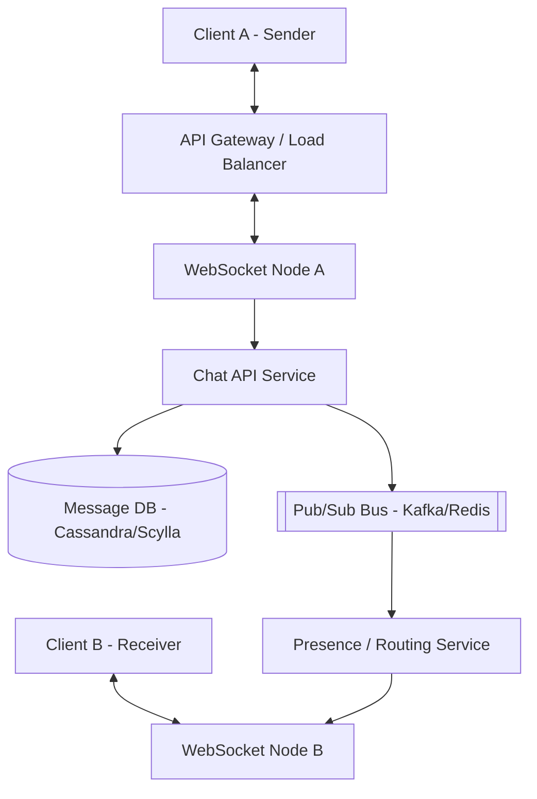

# Design Discord / Slack

Discord and Slack are real-time, channel-based chat applications. While similar to 1-on-1 messaging apps like WhatsApp, their defining feature is supporting massive groups (guilds/servers) with hundreds of thousands of concurrent users in a single shared channel.

---

## Step 1 — Understand the Problem & Establish Design Scope

### Clarifying Questions
**Candidate:** What is the primary focus? Direct messages (DMs), or large group channels?
**Interviewer:** Focus heavily on large group channels (e.g., a massive public Discord server or a large corporate Slack workspace).

**Candidate:** What are the key features?
**Interviewer:** Sending text messages, seeing new messages in real-time, seeing online/offline presence of other members, and storing chat history indefinitely. 

**Candidate:** What is the scale?
**Interviewer:** 50 million Daily Active Users (DAU). A single super-server can have 500,000 members, with 50,000 online simultaneously, chatting in one channel.

### Functional Requirements
- **Real-time Messaging:** Send and receive messages instantly within channels.
- **Message History:** If a user logs in after being offline, they can scroll up and read historical messages.
- **Presence:** Know which channel members are online/offline.

### Non-Functional Requirements
- **Low Latency:** Messages should appear almost instantly (sub-100ms) to online users.
- **High Concurrency:** Must handle the "thundering herd" problem of pushing one message out to 50,000 online users concurrently.
- **High Consistency for Chat History:** Messages must appear in the exact correct chronological order for everyone.

### Back-of-the-Envelope Estimation
- **Traffic:** Let's say 50M DAU, each sending 40 messages a day = 2 Billion writes per day (~23k writes/sec).
- **Fan-out:** 1 message sent to a channel with 1,000 online users = 1,000 network pushes. The internal read/push traffic is astronomically higher than the write traffic.
- **Storage:** 2B messages * 100 bytes = 200 GB/day new text data. Chat data grows perpetually without deletion, so it quickly hits Petabytes.

---

## Step 2 — High-Level Design

### Core Concept: The WebSockets & The Fan-out
Because chat is real-time, the client cannot constantly "poll" (ask) the server via HTTP if there are new messages. The server must hold a persistent connection open to the client and push the data. We will use **WebSockets**.

### System Architecture

---

## Step 3 — Design Deep Dive

### 1. Connection Management
Maintaining 50 million concurrent WebSocket connections requires a vast, distributed tier of servers (e.g., written in Erlang, Go, or Node.js).
- When a user logs in, the Load Balancer assigns them to a specific WebSocket Server node. 
- The user's client establishes a persistent WebSocket connection to that specific node.
- The system must maintain a **Routing Table** (often kept in Redis): `User A is connected to WebSocket Server Node 12`. `User B is connected to WebSocket Server Node 45`.

### 2. Message Flow (Sending & Fan-out)
Here is what happens when someone sends a message in a massive channel:

1. **Write:** Client A sends the message metadata (text, channel ID) over their WebSocket to `Node 12`.
2. `Node 12` forwards it to the `Chat Service`.
3. The `Chat Service` assigns the message a globally unique, chronologically sortable ID (like Snowflake ID) and persists it in the **Message Database**.
4. **The Fan-out:** The `Chat Service` publishes the message to a **Message Broker / Pub-Sub system** (like Kafka or Redis Pub/Sub), targeted at the specific channel ID.
5. In a naive system, the broker would try to find all 50,000 online members and push the message individually. This is too slow.
6. **Smart Fan-out:** Each WebSocket Server Node subscribes to the channels that its currently connected users are looking at. 
   - E.g., `Node 45` knows its connected `User B` is looking at the "General" channel. So `Node 45` subscribes to the Pub/Sub topic for "General".
   - The Pub/Sub system broadcasts the message once to `Node 45`. 
   - `Node 45` then pushes it down the individual WebSockets of User B (and User C, User D, etc., if they are also on Node 45 and in that channel).

### 3. Database Schema & Choice (Message History)

Due to the extreme volume of writes (23k/sec) and the requirement for infinite retention, **Apache Cassandra** (or ScyllaDB) is the industry standard for chat applications (used by Discord originally). It is a Wide-Column NoSQL store, hyper-optimized for heavy writes and sequential range reads.

**Message Table:**
- `channel_id` (Partition Key)
- `message_id` (Clustering Key - Snowflake ordered by time)
- `user_id`
- `content`

By using `channel_id` as the partition key, all messages for a specific channel are stored contiguously on the same database node. When a user scrolls up, querying `SELECT * FROM messages WHERE channel_id = XYZ ORDER BY message_id DESC LIMIT 50` is incredibly fast, O(1) disk seek.

### 4. Online Presence Service
Showing green/grey dots for 500,000 people in a server is famously difficult to optimize.
- When a user connects, their WebSocket node updates a global Redis cluster with an expiring key: `SET user:123:status "online" EX 60`.
- The node sends a "ping" every 30 seconds to refresh the expiry. If the user disconnects, the heartbeat stops, the key expires, and the user goes "offline".
- **The Group Problem:** In a server of 500k people, if one person logs off, broadcasting that "User A is offline" to 499,999 other people creates an apocalyptic storm of useless network traffic.
- **Lazy Loading (Optimization):** Discord only tracks presence for people who are visible on your screen. Furthermore, servers over 100k members often disable the "Offline" list entirely. Presence updates are batched (e.g., every 3 seconds) rather than sent instantly, significantly reducing network spam.

---

## Step 4 — Wrap Up

### Dealing with Scale & Edge Cases

- **The Super Server Problem:** What if a celebrity streamer drops a message in a channel of 1 million active users? The write to Cassandra is fast (1 write), but the fan-out is monstrous. 
  - To mitigate parsing lag, the Pub/Sub topics must be heavily partitioned. The WebSocket nodes themselves handle the final massive multiplexing in highly optimized C++ or Rust loops, bypassing standard application logic layers.
- **Message Consistency & Conflicts:** What if User A and B send a message at the exact same millisecond? The system relies on the central `Chat Service` assigning a Snowflake ID. Whichever request hits the ID generator first gets the smaller ID and therefore appears formally "first" in the database sequence.
- **Search:** To search old messages, Cassandra is terrible. We must asynchronously pipe all text through Kafka into an **Elasticsearch** cluster. When a user searches, the query bypasses Cassandra entirely and hits Elasticsearch, which returns the matching `message_id`s.

### Architecture Summary

1. Millions of clients maintain persistent TCP/WebSockets to a fleet of edge gateway nodes.
2. Messages are sent via sockets to an internal Chat API, which persists them instantly to a Write-Optimized DB (Cassandra).
3. The message is immediately dropped into a high-throughput Pub/Sub bus (Kafka/Redis).
4. The WebSocket nodes, subscribing only to the channels their users are active in, catch the broadcasted message.
5. The nodes simultaneously push the message down the pipes to the endpoints, achieving <100ms real-time delivery without polling HTTP.