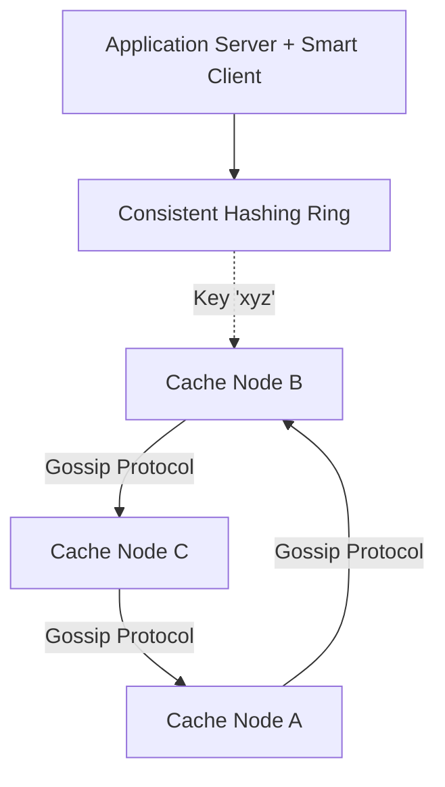

# Design a Distributed Cache (like Redis / Memcached)

A distributed cache is a fast, in-memory data store spread across multiple machines. It acts as an intermediary between the application logic and the primary database, severely reducing database load and drastically improving read latency. Common examples are Redis and Memcached.

---

## Step 1 — Understand the Problem & Establish Design Scope

### Clarifying Questions
**Candidate:** Are we designing an in-memory cache for a single application, or a generalized distributed caching system like Redis?
**Interviewer:** Design a generalized, distributed caching system that can be used by multiple downstream services.

**Candidate:** What is the maximum data size it needs to hold?
**Interviewer:** It should scale theoretically indefinitely by adding more nodes, but assume tens of terabytes of hot data. No single machine can hold all the data.

**Candidate:** Does it need to be highly available?
**Interviewer:** Yes, node failures are common and should not result in catastrophic cache misses (which would crash the underlying database).

### Functional Requirements
- **Put(key, value):** Store a value against a key.
- **Get(key):** Retrieve a value by key.
- **Eviction:** Provide a mechanism to evict old data when memory is full (e.g., LRU).
- **TTL:** Values should optionally expire after a Time-To-Live.

### Non-Functional Requirements
- **Extreme Low Latency:** Read/Write operations should execute in < 1ms.
- **High Throughput:** Millions of QPS.
- **Scalability:** We must be able to add or remove cache servers (nodes) without bringing down the system.
- **High Availability:** Data should be replicated so a node crash doesn't immediately evict everything on it.

---

## Step 2 — High-Level Design

We cannot store 10 TB of RAM on one machine. We need dozens or hundreds of Cache Servers. The core problem is **Routing**: When the application says `GET("user_profile_123")`, how does the client know *which* of the 100 cache servers holds that exact key?

### Architecture Approaches

1. **Proxy-based Routing:**
   Clients talk to a central proxy router. The proxy knows the locations of all keys and forwards the request to the correct Cache Node. (e.g., Twemproxy).
2. **Client-side Routing (Smart Client):**
   The application imports a "Smart Cache Client" library. This library maintains a map of all available Cache Nodes and routes the request directly to the correct one. (e.g., Redis Cluster smart clients).

We will proceed with the **Smart Client** / **Decentralized topology** to eliminate the Proxy as a single point of failure and bottleneck.

---

## Step 3 — Design Deep Dive

### 1. Consistent Hashing (The Routing Mechanism)

If we use simple hashing `Hash(key) % N` (where N is the number of servers), the system breaks when a server crashes. If N drops from 10 to 9, *every single key* hashes to a different server. We would experience a 100% cache miss rate, instantly crashing our backend SQL databases (a "Cache Stampede" apocalypse).

**Solution: Consistent Hashing.**
- Imagine a circular ring of values from 0 to 2^32 - 1.
- We hash the IP addresses of our 10 Cache Nodes and place them on this ring.
- To find where to store `key="user_123"`, we hash the key, place it on the ring, and traverse *clockwise* until we hit the first Server Node. That is where we store the data.
- **Node Failure:** If Node B dies, only the keys that explicitly mapped to Node B are re-routed to Node C. The keys on Node A, D, E, etc., remain untouched. We only lose `1/N` of our cache, not 100%.
- **Virtual Nodes:** To prevent "hot spots" on the ring (where one server accidentally handles 50% of the ring's space), we hash each server multiple times (e.g., Node B_1, Node B_2, Node B_3). This evenly distributes the load.

### 2. Internal Data Structure (The Single Node)

Once we route to the correct machine, how does it store the data?
- **Hash Table:** An in-memory hash map. O(1) lookup.
- **Concurrency:** Because this server runs to the limits of the CPU, standard locks on the whole Hash Table would bottleneck it. We can either:
  1. Use concurrent hash maps (lock-striping by bucket).
  2. Implement an **Event Loop with a Single Thread** (The Redis approach). Since RAM access is so fast, a single C-based thread processing operations sequentially avoids lock contention entirely and can easily achieve 100k+ QPS per core.

### 3. Eviction Policies (When RAM gets full)

RAM is finite. When a node hits 100% capacity, it must delete old data to make room for new data.

**Least Recently Used (LRU) Algorithm:**
Internally, the cache implements a **Doubly Linked List + Hash Map**.
- Hash Map mapping `Key -> Node in Linked List` (for O(1) reads).
- The Linked List tracks recency.
- When you `GET` or `PUT` an item, you detach its node from the list and move it to the `Head` (Most Recently Used).
- When memory is full, you look at the `Tail` of the list (Least Recently Used), delete it from both the list and the Hash Map, and insert the new data at the Head.

### 4. High Availability & Replication

If a Cache Node crashes, we lose its fraction of the ring. While Consistent Hashing prevents a total meltdown, losing 1/N of the cache can still cause a painful spike to the primary database.

- **Primary-Replica Setup:** For every "Primary" node on the hash ring, we deploy 1 or 2 "Replica" nodes.
- The Primary asynchronously replicates all `PUT` requests to its Replicas.
- If the Primary dies, a consensus algorithm (or a system like ZooKeeper / Redis Sentinel) detects the failure via heartbeats. It instantly promotes the Replica to become the new Primary.
- The Smart Clients update their routing tables to point the specific ring segment to the new Primary IP. Zero cache misses occur.

---

## Step 4 — Wrap Up

### Dealing with Scale & Edge Cases

- **Cache Penetration / Stampede:** What happens if 10,000 requests hit the app simultaneously asking for `user_xyz`, and `user_xyz` is currently missing from the Cache? All 10,000 requests will bypass the cache and hit the SQL Database simultaneously, crushing it.
  - *Fix:* Implement a "Mutex" or Lock at the application/client level. If 10,000 threads miss the cache, only the *first* thread is allowed to query the DB and write back to the cache. The other 9,999 threads wait 50ms and check the cache again (by which time the first thread has populated it).
  
- **Cache Avalanche:** What if we boot up the system and set the TTL for *all* keys to exactly 60 minutes? In exactly 60 minutes, the entire cache will expire instantly, ruining the database.
  - *Fix:* Add "Jitter" to TTLs. Instead of `TTL = 60 mins`, do `TTL = 60 mins + random(0, 5) mins` so expirations are smoothed out over time.

- **Hot Keys (Celebrity Problem):** Let's say Elon Musk tweets, and his user profile (`key_elon_musk`) is requested 5 million times a second. Consistent hashing routes all 5 million requests to a *single* Cache Server, maxing out its CPU and network card, bringing it down.
  - *Fix:* The cache nodes must monitor request frequencies. If a key is deemed "hot", the Smart Client is informed to cache this specific key locally inside the Application Server's own RAM (a Local Cache) for a few seconds, completely bypassing the network and the distributed cache tier.

### Architecture Summary

1. The system utilizes a Decentralized Smart Client topology to eliminate single points of failure.
2. **Consistent Hashing with Virtual Nodes** is used to deterministically route keys to a specific horizontal shard without needing a central lookup table, surviving node scale-ups and scale-downs gracefully.
3. Internally, each node uses a memory-mapped Hash Table bound to a Doubly Linked List to support O(1) **LRU Eviction**.
4. Every node has automated synchronous/asynchronous Replicas. Heartbeat (Gossip) protocols detect failures and execute leader election to maintain high availability.