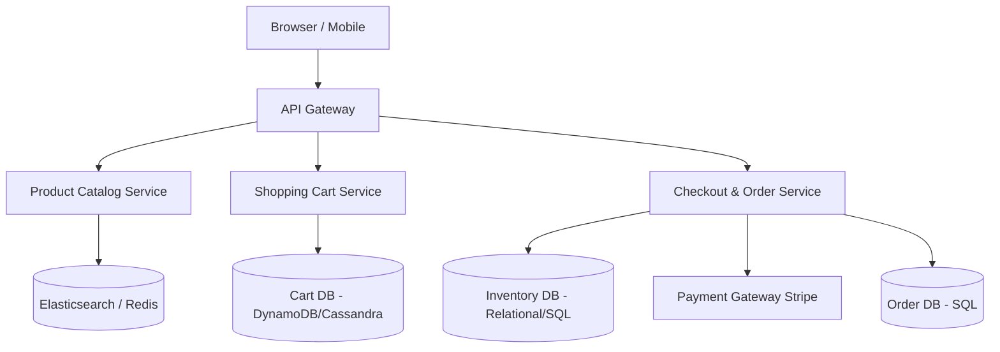

# Design an E-Commerce Platform (Amazon)

Designing a full e-commerce platform encompasses dozens of distributed systems. In a 45-minute interview, you must focus on the core user journey: Viewing Products, Adding to Cart, and Checkout.

---

## Step 1 — Understand the Problem & Establish Design Scope

### Clarifying Questions
**Candidate:** Which parts of the e-commerce journey should we focus on?
**Interviewer:** Browsing the product catalog, managing the shopping cart, and the checkout process. Do not worry about seller-side inventory management or shipping logistics.

**Candidate:** What is the scale?
**Interviewer:** Think Amazon scale. 100 million Daily Active Users. Huge spikes during "Black Friday" or flash sales.

**Candidate:** How important is data consistency?
**Interviewer:** Extremely important for the Checkout and Inventory systems. Browsing the catalogue can be eventually consistent.

### Functional Requirements
- Users can search for and view product details.
- Users can add multiple items to a persistent shopping cart.
- Users can check out and place an order.

### Non-Functional Requirements
- **High Availability (Reads):** The product catalog must never go down, even during massive traffic spikes.
- **High Consistency (Writes):** We cannot sell an item we don't physically have in stock. The inventory checkout must be strongly ACID compliant.
- **Scalability:** The system must survive "Black Friday" localized traffic spikes without dropping orders.

---

## Step 2 — High-Level Design

Because an e-commerce site has completely different operational requirements for reading (browsers) vs writing (buyers), we strongly adopt a **Microservices** architecture, specifically utilizing a **CQRS** (Command Query Responsibility Segregation) mindset for inventory.

### System Architecture



---

## Step 3 — Design Deep Dive

### 1. The Product Catalog Service
This system is 99% reads. People view 100 products for every 1 they buy.
- **Database:** The source of truth is an RDBMS, but the user *never* queries it directly.
- **Search & Retrieval:** We index all product metadata (title, specs, price) into a distributed search engine like **Elasticsearch**. 
- **Caching:** The top 10% most viewed products are cached heavily in **Redis** and CDNs (including all the product's image assets). 
- **Eventual Consistency:** When a seller updates a product's price, we publish an event to a Message Queue. A worker updates Elasticsearch and invalidates the Redis cache. It is acceptable if an old price shows in search for a few seconds.

### 2. The Shopping Cart Service
The cart must be highly available and durable. We don't want to lose a user's cart if a server crashes, because an abandoned cart represents lost revenue.
- **Storage Choice:** Key-Value stores like **Amazon DynamoDB**, **Riak**, or **Redis** (with persistence enabled) are perfect here.
- **Schema:** Key = `user_id` (or `session_id` for anonymous users), Value = JSON string of `[ {product_id, quantity}, ... ]`.
- **Handling High Writes:** Users add/remove items frequently. A NoSQL data store handles this massive write volume effortlessly compared to updating rows in a SQL database.

### 3. The Checkout & Inventory Service (The Hard Part)
When the user clicks "Place Order", the system transitions from "Eventually Consistent / Highly Available" to "Strictly Consistent / Transactional".

**The Flash Sale Problem:**
Let's say we have 10 PS5s in stock. 100,000 people click "Buy" at the exact same millisecond. If we do not handle this correctly:
- We might hit a race condition, deduct the inventory 100,000 times to negative -99,990, and charge 100,000 credit cards for items we cannot ship.

**Solution: Strong ACID Transactions with Row Locking.**
The Inventory Database *must* be an RDBMS (PostgreSQL, MySQL).
When the Checkout Service attempts to fulfill the order, it utilizes an atomic database transaction with the `FOR UPDATE` clause.

```sql
BEGIN TRANSACTION;
-- 1. Grab an exclusive lock on the specific Row, validating stock exists
SELECT available_quantity FROM inventory WHERE product_id = 'PS5' FOR UPDATE;

-- 2. If available_quantity >= requested_quantity
UPDATE inventory SET available_quantity = available_quantity - 1 WHERE product_id = 'PS5';

-- 3. Insert the order record
INSERT INTO orders (user_id, total, status) VALUES (123, 499, 'PAID');

COMMIT;
```
If 100,000 threads execute this at once, the `FOR UPDATE` lock forces the database to process them *sequentially* for that specific row. The first 10 succeed. The 11th reads `available = 0` and the application logic cancels the transaction.

### 4. Distributed Sagas / Orchestration vs Choreography
What if the checkout involves 4 different Microservices? (Inventory, Payment, Shipping, Loyalty Points).
You cannot run a SQL `JOIN / BEGIN TRANSACTION` across 4 different databases. You must use a **Distributed Transaction Pattern** like the **Saga Pattern**.

If Step 1 (Deduct Inventory) succeeds, and Step 2 (Charge Card) fails... the system must automatically execute a *Compensating Transaction* (Refund/Add back to Inventory) to roll back Step 1.
For e-commerce, it's recommended to have a central **Order Orchestrator** service (like AWS Step Functions or Netflix Conductor) that manages the state machine of an order, explicitly triggering compensations if any downstream network call fails.

---

## Step 4 — Wrap Up

### Edge Cases & Optimizations
- **Idempotency:** The "Place Order" button must pass an Idempotency Key (usually a UUID generated when the checkout page loaded) to the backend. If the network drops and the user mashes "Buy" 5 times, the backend must use a unique constraint on the Idempotency Key in the `Orders` database to guarantee they are only charged once.
- **Virtual Inventory / Pre-Allocation:** To prevent locking the SQL DB on every single cart addition, modern systems use **Redis** to create a "Soft Reservation". When a user hits "Checkout", we decrement a counter in Redis using a Lua Script. They are given 10 minutes to finish entering their credit card. If 10 minutes passes, a TTL expires, a pub/sub event fires, and the stock is added back to Redis. Only upon final success do we hit the SQL database to make the deduction permanent. This protects the heavy SQL DB during flash sales.

### Architecture Summary
1. The platform splits reads (Catalog/Search) from writes (Checkout/Inventory) via microservices.
2. The product catalog achieves ultra-low latency through NoSQL data stores, Elasticsearch, and aggressive CDN/Memory caching.
3. The shopping cart acts as a transient, highly available Key-Value store mapped to user sessions.
4. The checkout pipeline aggressively enforces **Strong Consistency** utilizing RDBMS row-level locking (Pessimistic concurrency) and Distributed Sagas to prevent double-spending and overselling inventory.
5. All checkout API endpoints are wrapped in strict **Idempotency** guarantees to protect the financial transaction boundary.