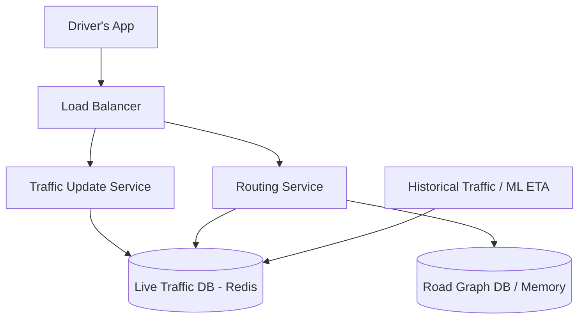

# Design Google Maps

Google Maps is a complex, data-heavy routing and navigation system. The core interview challenge usually focuses on the **Navigation / Route Finding** algorithm, rather than rendering the 3D map tiles.

---

## Step 1 — Understand the Problem & Establish Design Scope

### Clarifying Questions
**Candidate:** Which feature should I focus on? Map rendering, location search (Yelp), or Turn-by-Turn Navigation?
**Interviewer:** Focus primarily on Turn-by-Turn Navigation. Specifically: calculating the fastest route between Point A and Point B, considering real-time traffic.

**Candidate:** How large is the map?
**Interviewer:** Assume global scale. The entire world's road network.

**Candidate:** How many active users?
**Interviewer:** 50 million active users concurrently driving and relying on ETA data.

### Functional Requirements
- Given a source and destination, calculate the fastest route.
- Continually update the Estimated Time of Arrival (ETA) based on live traffic.
- Handle massive route computations quickly.

### Non-Functional Requirements
- **Low Latency:** Route calculation should take less than 1 second.
- **High Availability:** People driving depend on this; downtime literally causes people to get lost.
- **Data Volume:** Storing the global road network graph is enormous.

---

## Step 2 — High-Level Design

### Core Concept: The Graph Data Structure
The road network is a mathematical **Graph**. 
- **Nodes (Vertices):** Intersections, dead-ends, or points where speed limits change.
- **Edges:** The roads themselves connecting the nodes. 
- **Edge Weights:** The cost to traverse the road. Without traffic, Cost = (Distance / Speed Limit). With traffic, Cost = Real-time data.

Finding a route is effectively finding the Shortest Path in a weighted graph using Algorithms like **Dijkstra's** or **A*** (A-Star).

### Architecture

---

## Step 3 — Design Deep Dive

### 1. Scaling the Graph (Hierarchical / Hierarchical Pathfinding)

To route from New York to San Francisco, Dijkstra's algorithm would theoretically have to explore millions of small residential streets in Ohio, Kansas, and Illinois before finding the destination. This would take hours and exhaust server RAM.

**Solution: Hierarchical Routing / Contraction Hierarchies.**
We do not treat all roads equally. We break the graph into levels:
- **Level 1 (Local):** Residential streets.
- **Level 2 (Arterial):** Main city roads.
- **Level 3 (Highway):** Interstates / Highways.

**The Routing Logic:**
1. The algorithm starts at the Local level in New York, and quickly finds the nearest ramp onto an Arterial road, and then the nearest Highway.
2. It does the same in reverse from San Francisco (backing up to the San Francisco highway exit).
3. The vast majority of the routing calculation happens *only* on the Level 3 Highway graph. It essentially deletes 95% of the minor roads from the data structure during the long-distance phase.
4. *Result:* Computing a cross-country trip takes milliseconds instead of minutes.

### 2. Sharding the Graph

Even a hierarchical graph of the entire world is too large to fit in one server's working memory for ultra-fast processing.
We partition the graph geometrically into **Tiles/Regions**.
- Instead of finding a path from Boston to Miami on one machine, the request is broken up.
- The system determines the bounding boxes (Regions) the path will cross.
- It queries the servers managing the NY Region, the PA Region, the TN Region, etc.
- The central Routing Service stitches the sub-paths together where the regions border each other.

### 3. Handling Live Traffic (The Feedback Loop)

How does Google know there is a traffic jam on Route 66 right now?
**Crowdsourcing:** Millions of phones with Google Maps open are constantly sending their GPS coordinates and speed back to the `Traffic Update Service`.

1. **Ingestion:** The driver's phone sends `(lat, long, speed, timestamp)` every 5 seconds.
2. **Map Matching:** The backend must figure out exactly which Graph Edge (road) that coordinate belongs to. GPS is noisy; "Map Matching" algorithms utilize Hidden Markov Models to snap the bouncy GPS point to the logical road.
3. **Aggregation:** A Stream Processor (like Flink) aggregates thousands of pings on "Highway 101 Edge ID 45" over the last 2 minutes and calculates the average speed is currently 15 mph.
4. **Updating the Weight:** The Stream Processor updates the **Edge Weight** for Edge ID 45 in the `Live Traffic DB`.

### 4. Recalculating ETA Real-Time

When you are driving, the route sometimes flashes "We found a faster route, save 5 minutes." How did it know?
- The App does not ask the server for a full A* recalculation every 5 seconds. That would destroy the servers.
- The server pushes major traffic incident events (accidents, sudden slow-downs) mapped to specific **Tiles** via WebSockets or long polling to the client.
- The local mobile device (which already downloaded a localized subset of the graph) performs the recalculation itself, or only pings the server if a major parameter changes.

---

## Step 4 — Wrap Up

### Trade-offs & Bottlenecks

- **Pre-computation vs Real-time:** To achieve sub-second routing across a country, much of the route is pre-computed (Contraction Hierarchies). However, pre-computing relies on static edge weights. If a bridge suddenly collapses (weight = infinity), the pre-computed highway shortcuts are suddenly invalid. The system must implement dynamic dynamic Graph invalidation, combining the pre-computed static graph with the highly volatile live traffic overlay.
- **Dealing with Dead Zones:** Users drive through mountains without cell service. The phone must download the entire geometry and localized road graph for the planned route (and alternatives) *before* the trip starts, so it can do local offline rendering and localized GPS map-matching without a server connection.

### Architecture Summary
1. The global road network is modeled as a massive **Weighted Graph**, heavily partitioned geographically into Tiles.
2. **Hierarchical Pathfinding algorithms** (like A* on Contraction Hierarchies) ignore local streets in favor of highways for middle segments to guarantee < 200ms route generation.
3. A massive data-streaming pipeline acts as a feedback loop, aggregating live GPS pings from millions of phones to dynamically update the Graph's Edge Weights (traffic conditions).
4. For efficiency, dynamic re-routing calculations are often offloaded partially to the edge device (phone), triggered by pub/sub traffic anomaly alerts pushed from the server.