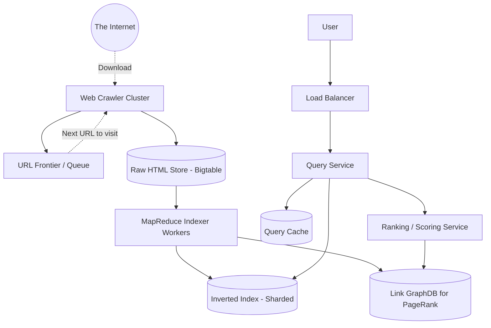

# Design Google Search

Google Search is arguably the most complex software system ever built. For a 45-minute interview, you are expected to design the high-level architecture of a fundamental Web Search Engine, focusing on crawling, indexing, and querying text.

---

## Step 1 — Understand the Problem & Establish Design Scope

### Clarifying Questions
**Candidate:** What aspects of the search engine should we focus on?
**Interviewer:** Focus on three main pillars: The Web Crawler (finding the pages), The Indexer (organizing the words), and the Query Service (serving the user's search query).

**Candidate:** What is the scale?
**Interviewer:** Assume we want to index 50 Billion web pages. We handle 50,000 search queries per second.

**Candidate:** Do we need to handle PageRank or ML-based relevance sorting?
**Interviewer:** Keep the ranking algorithm simple for the high-level design, but acknowledge where it fits.

### Functional Requirements
- **Crawling:** Systematically download web pages from the internet.
- **Indexing:** Parse the downloaded HTML, extract text, and build an index.
- **Searching:** Given a text query (e.g., "fastest car"), return the top 10 most relevant URLs.

### Non-Functional Requirements
- **Low Latency:** Search queries must return in < 200ms.
- **High Throughput:** Handle 50k QPS without crashing.
- **Freshness (Eventual Consistency):** New news articles should appear in the index within a few minutes/hours.

### Back-of-the-Envelope Estimation
- **Storage:** 50 Billion pages * 20KB average text size = ~1 Petabyte of raw text.
- **Index Size:** An inverted index usually takes up ~20-30% of the raw text size. The index alone will be hundreds of Terabytes.
- **Query Traffic:** 50,000 QPS is massive and requires severe caching and horizontal scaling.

---

## Step 2 — High-Level Design

The architecture is divided into two distinct, massive asynchronous pipelines:
1. **The Offline Data Pipeline:** Discovering, downloading, and indexing the internet.
2. **The Online Query Pipeline:** Taking a user's word, looking it up in the index, scoring it, and returning the UI.

### System Architecture

---

## Step 3 — Design Deep Dive

### 1. The Web Crawler
The Crawler is essentially an infinite loop program.
1. It pops a URL from the **URL Frontier** (A massive priority queue of URLs waiting to be visited).
2. It resolves the DNS, connects to the server, and downloads the HTML.
3. It parses the HTML and extracts all the `<a href="...">` links on that page.
4. It normalizes those new links and pushes them *back* into the URL Frontier to be visited later.
5. It saves the raw HTML document to a massive distributed datastore like **Google Bigtable / HBase**.

*Challenges:* 
- **Politeness:** If the crawler hits `wikipedia.org` 10,000 times a second, it acts as a DDoS attack. The URL Frontier must group queues by domain and enforce a rate limit/delay between requests to the same host.
- **Loops / Traps:** `A -> B -> A`. The crawler must check a Bloom Filter or Redis cache: "Have I seen this exact URL or exact HTML body hash before?" If yes, skip it.

### 2. The Indexer (The Inverted Index)
You cannot search 1 Petabyte of text on-the-fly. We must build an **Inverted Index**.
An inverted index maps a *word* to a list of *Document IDs* where that word appears.

*Example:*
- Page 1: "The fast car"
- Page 2: "The slow car"
- Index:
  - `fast` -> [Page 1]
  - `slow` -> [Page 2]
  - `car`  -> [Page 1, Page 2]

**How it's built:**
- A massive **MapReduce** job (e.g., Hadoop or Spark) runs over the Raw HTML Store. 
- **Map Phase:** Tokenizes the HTML into words, strips punctuation, removes stop-words ("the", "and"), and outputs `(word, document_id)` pairs.
- **Reduce Phase:** Aggregates all values for a given word into a single list `word -> [doc1, doc2, doc89]`, and saves it to the distributed Index database.

### 3. The Query Service
When a user types "fast car":
1. The Query Service parses the query into tokens (`fast`, `car`).
2. It hits the **Inverted Index**. 
3. It looks up the list for `fast` (e.g., Doc 1, Doc 5).
4. It looks up the list for `car` (e.g., Doc 1, Doc 2, Doc 5).
5. It performs an intersection (Boolean `AND`) of the two lists. The matching documents are Doc 1 and Doc 5.

### 4. Ranking (PageRank & TF-IDF)
The intersection above might return 50 million matching documents. How do we know which 10 to show on page 1?
We must apply a scoring algorithm.

1. **TF-IDF (Term Frequency-Inverse Document Frequency):** Measures relevance. If the word "car" appears 50 times on Doc 1, it's highly relevant. But if the word "the" appears 50 times, it doesn't matter, because "the" appears on every page on the internet.
2. **PageRank (Authority):** Evaluates the quality of a page based on its inbound links. If a page has 100,000 other websites linking to it (like Wikipedia), it is considered highly authoritative. The MapReduce job parses the links between pages to build a mathematical matrix and pre-computes the PageRank score for every URL.

The `Ranking Service` takes the 50 million matching docs, calculates `Score = (TF-IDF relevance * PageRank authority)`, sorts them, and returns the top 10. *Note: In reality, Google uses heavy Machine Learning models utilizing hundreds of signals, but PageRank and TF-IDF are the foundational concepts.*

---

## Step 4 — Wrap Up

### Dealing with Scale & Edge Cases

- **Sharding the Index:** The Inverted Index is hundreds of Terabytes. You cannot load it into one machine's RAM. We must shard it. 
  - *Document-partitioned index:* Shard by Document ID. Node A holds the index for Docs 1-10k. Node B holds Docs 10k-20k. When a query comes in, we must scatter the query to *all* nodes concurrently, gather their local top 10 results, and do a global merge-sort. This is the industry standard for search engines (like Elasticsearch).
  - *Term-partitioned index:* Shard by the word. Node A holds words A-M. Node B holds words N-Z. If someone searches "apple zebra", we must query Node A and Node B and intersect the massive lists over the network. This network transfer is often too slow.
- **Query Caching:** 50,000 queries a second is huge, but search queries follow a Pareto distribution (20% of the queries make up 80% of the traffic). Searches for "facebook", "weather", and "news" happen millions of times a day. We place a massive **Cache cluster (Memcached/Redis)** in front of the Query API. If the exact query string matches the cache, we return the pre-computed HTML page 1 instantly, bypassing the Index and Ranker entirely.

### Architecture Summary

1. A **Distributed Crawler** reads the internet, utilizing a URL Priority Queue to respect domain rate limits, and dumps raw HTML into an immutable Big Data store.
2. An asynchronous **MapReduce pipeline** processes the raw HTML, building a massive **Inverted Index** and a Link Graph.
3. The Inverted Index is **Document-Sharded** across thousands of machines. 
4. The Online Query API uses **Scatter-Gather** to broadcast the user's words to all index shards, intersect the matching documents, apply a **Ranking Algorithm**, and return the top 10 results, backed by a massive memory cache to absorb repeated identical queries.