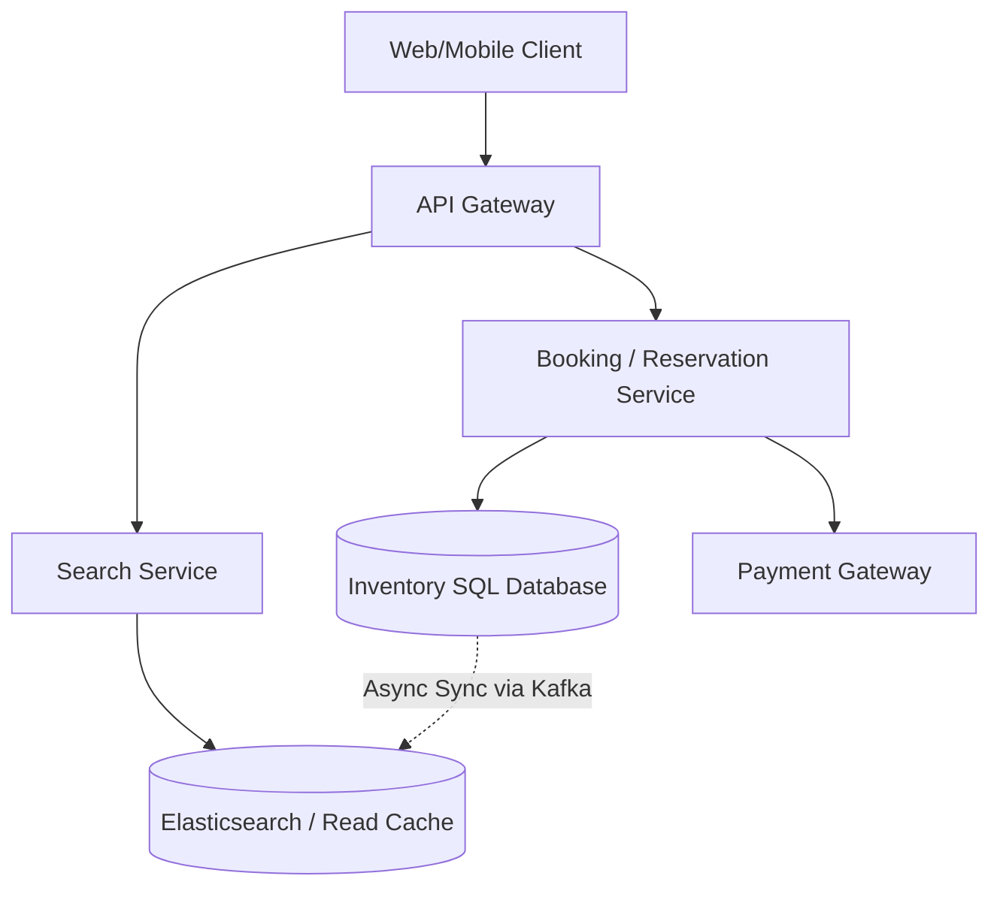

# Design a Hotel Booking Service (Airbnb / Booking.com)

A hotel booking system allows users to search for available rooms, view details, and book a room for specific dates. Like an E-Commerce system, it combines a highly read-heavy search experience with a strictly consistent transaction engine.

---

## Step 1 — Understand the Problem & Establish Design Scope

### Clarifying Questions
**Candidate:** Are we designing a platform for a single hotel chain (like Marriott), or a marketplace for many hotels (like Booking.com)?
**Interviewer:** A marketplace for many hotels. 

**Candidate:** Which user journeys should I cover?
**Interviewer:** Focus on searching for available hotels by city and date, and the actual room booking/reservation process.

**Candidate:** What is the scale?
**Interviewer:** 5,000 hotels, 1 million rooms total. 10 million daily active users browsing. About 10,000 bookings made per day.

### Functional Requirements
- Search hotels by location, date range, and number of guests.
- View hotel and room details.
- Book a room for a specific date range.

### Non-Functional Requirements
- **High Read Availability:** The search and browsing experience must be fast and always up.
- **Strict Data Consistency (No Overbooking):** This is the core challenge. We cannot allow two users to book the same room for the same dates.
- **Low Latency:** Searches must return quickly, even with complex date-availability filtering.

### Back-of-the-Envelope Estimation
- **Read Traffic:** 10M DAU searching ~10 times = 100M search queries/day (~1,200 QPS).
- **Write Traffic:** 10,000 bookings/day is less than 1 write per second. The system is extremely read-heavy.
- **Storage:** 5,000 hotels * 200 rooms * 365 days = ~365 million inventory rows per year. Easily fits in a modern SQL database.

---

## Step 2 — High-Level Design

### Architecture



---

## Step 3 — Design Deep Dive

### 1. Database Schema (The Inventory Model)

How do we model time and availability? A naive approach is to have a `Bookings` table with `start_date` and `end_date`, and when a user searches, the system runs a complex SQL query to see if those dates overlap with existing rows. This is incredibly slow and hard to lock correctly.

**The Solution: The Inventory Table (Row per room per day)**
We pre-populate a massive table representing the calendar.
Every single room has a dedicated row for every single day of the year.

**Table: `room_inventory`**
- `hotel_id` (Indexed)
- `room_type_id` (e.g., "Standard Queen")
- `date` (Indexed)
- `total_inventory` (e.g., 10 rooms available)
- `reserved_inventory` (e.g., 2 rooms booked)

*Composite Primary Key:* `(hotel_id, room_type_id, date)`

If a user wants to book a "Standard" room at Hotel X from Oct 1 to Oct 5, we query exactly 5 rows. We check if `total_inventory - reserved_inventory > 0` for all 5 rows.

### 2. The Booking Process (Preventing Overbooking)

Two users see that there is 1 room left for Oct 1st. They both click "Book" at the same time.

We must rely on the ACID properties of a **Relational Database (PostgreSQL / MySQL)**. NoSQL is a poor choice here.

When the Booking Service receives the request, it opens a database transaction with a **Pessimistic Lock** using the `FOR UPDATE` clause on the exact date rows.

```sql
BEGIN TRANSACTION;

-- 1. Lock the 5 rows for this specific room type and these 5 days 
SELECT reserved_inventory, total_inventory 
FROM room_inventory 
WHERE hotel_id = 123 AND room_type_id = 4 AND date BETWEEN '2023-10-01' AND '2023-10-05'
FOR UPDATE;

-- Application logic checks if (total - reserved) > 0 for all 5 rows. If so:

-- 2. Update the inventory
UPDATE room_inventory 
SET reserved_inventory = reserved_inventory + 1 
WHERE hotel_id = 123 AND room_type_id = 4 AND date BETWEEN '2023-10-01' AND '2023-10-05';

-- 3. Insert reservation record
INSERT INTO reservation (user_id, hotel_id, status) VALUES (999, 123, 'PENDING_PAYMENT');

COMMIT;
```
If Thread 2 arrives a millisecond later, the DB forces it to wait at Step 1 until Thread 1 commits. When Thread 2 gets the lock, it reads the *new* state, sees 0 availability, and rejects the user. No overbooking is possible.

### 3. The 10-Minute Cart Hold (Soft Reservations)

If a user clicks "Book", it takes them 5 minutes to type in their credit card. We cannot hold a SQL `FOR UPDATE` transaction open for 5 minutes; it would crash the database.
- When the user clicks "Book", we execute the SQL above, but set the reservation status to `PENDING_PAYMENT`.
- The user has 10 minutes to pay.
- We utilize a **Delayed Message Queue** (or a Redis Key Expiry / TTL). We drop a message in the queue: `Check Reservation 888 in 10 minutes`.
- After 10 minutes, a worker wakes up. It checks the DB. If the status is still `PENDING_PAYMENT` (the user closed their browser or payment failed), the worker executes a compensating transaction: it deletes the reservation completely and runs `UPDATE room_inventory SET reserved_inventory = reserved_inventory - 1` to release the room back to the public.
- If the user paid successfully, the status is already `CONFIRMED`, and the worker does nothing.

### 4. Fast Searching with Elasticsearch

1,200 QPS of users doing complex text and date searches will melt the primary SQL database.
We must separate the read path.
- We index all hotel metadata (Name, Amenities, GPS coordinates) into **Elasticsearch**.
- **The complex part:** How does Elasticsearch know if a hotel is available for Oct 1 - Oct 5?
- **Option A (Stale cache):** We routinely sync the `room_inventory` table to Elasticsearch. A user searches "Hotels in Paris for Oct 1-5". ES instantly returns hotels that *it thinks* are available. When the user clicks the hotel to see the checkout page, the UI makes a live API call directly to the SQL database for the true, up-to-the-second availability.
- The trade-off is the user might see a hotel in the search results, click it, and be told "Sorry, sold out just now". This happens often on real booking sites and is considered an acceptable UX trade-off for blazing fast search speeds.

---

## Step 4 — Wrap Up

### Edge Cases
- **Idempotency:** When the client submits the final payment, the request must include a UUID Identempotency Key. If the user clicks "Pay" twice due to a frozen screen, the API must ignore the second request to prevent double-charging.
- **Geography/Localization:** Prices and rooms vary by timezone. The `room_inventory` dates must be normalized (e.g., UTC) or explicitly tied to the Hotel's local timezone to prevent booking offset errors.

### Architecture Summary
1. The search path is heavily separated from the booking/write path. 
2. A fast **Elasticsearch** cluster handles geographical text queries and serves slightly lagging availability data.
3. The true source-of-truth is a strict **Relational Database**, modeling time by creating a distinct inventory row for every single day a room exists.
4. Concurrency anomalies (overbooking) are algorithmically prevented using **Row-Level Pessimistic Locking (FOR UPDATE)** within brief ACID transactions.
5. "Cart holding" is managed via a state machine and a **TTL / Delayed Job Worker** pattern to temporarily reserve inventory while the user completes 3rd-party payment flows.