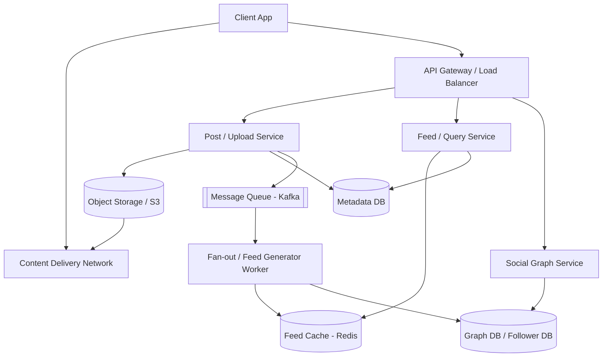

# Design Instagram

Instagram is a photo and video-sharing social networking service. Users can upload media, follow other users, and view a personalized feed of media from the users they follow.

---

## Step 1 — Understand the Problem & Establish Design Scope

### Clarifying Questions

**Candidate:** What are the key features we need to focus on?
**Interviewer:** Focus on uploading photos, following other users, generating the news feed (viewing photos from followed users), and basic search functionality by username.

**Candidate:** What is the scale of the system?
**Interviewer:** Let's assume 500 million Daily Active Users (DAU) and 1 billion total users.

**Candidate:** Are we dealing with just photos, or videos too?
**Interviewer:** Let's stick with just photos for this design to keep it focused.

**Candidate:** How many users can one person follow?
**Interviewer:** A user can follow up to 10,000 people. There are no limits on followers (e.g., celebrities can have hundreds of millions).

### Functional Requirements
- **Upload:** Users can upload/share photos with a caption.
- **Social Graph:** Users can follow/unfollow other users.
- **News Feed:** Users can view a feed consisting of top photos from people they follow, sorted chronologically or by an algorithm.
- **Search:** Users can search for other users by name or username.

### Non-Functional Requirements
- **High Availability:** The system should remain highly available. If the feed slows down, it's not the end of the world, but photo uploads should not fail.
- **Low Latency:** Generating the news feed should be very fast (< 200ms).
- **Reliability (No Data Loss):** Uploaded photos should never be lost.
- **Eventual Consistency:** It's acceptable if a newly uploaded photo takes a few seconds to appear in followers' feeds.

### Back-of-the-Envelope Estimation
- **Traffic:** 500M DAU. If each user posts an average of 2 photos a week, that's roughly ~140 million photos per day, or ~1,600 photos uploaded per second on average.
- **Storage for Photos:** Assume the average photo size is 2MB.
  - 140M photos/day * 2MB = 280 TB/day.
  - Over 10 years, considering growth, we need Exabytes of storage.
- **Storage for Metadata:** Assume 1KB of metadata per photo.
  - 140M * 1KB = 140 GB/day of database storage.
- **Bandwidth:** 280 TB/day = ~3.2 GB/s upload bandwidth. Let's say each user views 50 photos a day. Read bandwidth will be significantly higher: 50 * 2MB * 500M = 50 PB/day read bandwidth (~580 GB/s).

---

## Step 2 — High-Level Design

### Core Entities
1. **User:** Describes user profile (ID, Username, Email, Bio, Creation Date).
2. **Photo:** Metadata describing the photo (Photo ID, User ID, S3 Path, Timestamp, Caption).
3. **User_Follow:** Mapping of social connections (Follower ID, Followee ID).

### API Design
We need a few core APIs to interact with the system.

**1. Upload Photo API:** `POST /api/v1/media`
- **Params:** `auth_token`, `image_file`, `caption`
- **Returns:** `{ "media_id": "12345", "url": "https://cdn.insta.com/...", "status": "success" }`

**2. Get Feed API:** `GET /api/v1/feed`
- **Params:** `auth_token`, `cursor` (for pagination), `limit`
- **Returns:** List of JSON photo objects (id, url, author_info, timestamp, caption) and `next_cursor`.

**3. Follow User API:** `POST /api/v1/users/{user_id}/follow`
- **Params:** `auth_token`
- **Returns:** `{ "status": "success" }`

### System Architecture



---

## Step 3 — Design Deep Dive

### 1. Database Schema & Storage Choice

We need different datastores for different types of data:
- **Media Storage:** Amazon S3 or similar blob storage for photos. S3 is highly durable and scalable.
- **Relational Data (Users, Photos Metadata):** PostgreSQL or MySQL. Since our scale is massive, a single relational DB will choke. We need to shard the database.
- **Social Graph:** We can use an RDBMS with sharding, or a specialized Graph Database (like Neo4j), or a Wide-Column Store (like Cassandra) to store `follower_id` -> `followee_id` mappings.

**Metadata DB Schema:**
- `User` table: `id` (PK), `username` (Indexed), `email`, `created_at`
- `Photo` table: `photo_id` (PK), `user_id` (Indexed), `s3_bucket_path`, `caption`, `created_at`
- `User_Follow` table: `follower_id` (PK part 1), `followee_id` (PK part 2), `created_at`

### 2. Generating the Unique `photo_id`

To shard our database effectively, we need globally unique IDs for photos. We cannot use standard auto-incrementing integer IDs in a distributed database.
- **Twitter Snowflake:** We can use a Snowflake-like ID generation service (e.g., a 64-bit ID comprising timestamp, worker machine ID, and an auto-incrementing sequence). 
- Using timestamps as part of the ID makes the IDs sortable by time, which is incredibly useful for generating feeds.

### 3. Uploading Photos

When a user uploads a photo:
1. The client sends the image to the `Upload Service`.
2. The `Upload Service` generates a new `photo_id`, saves the raw image to S3, and retrieves the URL.
3. It inserts a record into the `Photo` metadata table.
4. It publishes an event `PhotoUploadedEvent` to a Kafka message queue. This allows the upload to return quickly to the user (low latency) while background workers handle the heavy lifting of updating feeds.

### 4. Generating the News Feed (The "Fan-Out" Process)

Generating a feed dynamically on every user request (querying all followed users, gathering their photos, and sorting) is too slow. Instead, we pre-compute feeds.

**Fan-out on Write (Push Model):**
When User A uploads a picture, a background worker consumes the `PhotoUploadedEvent` from Kafka.
It queries the Social Graph for all followers of User A.
It goes into a Redis cluster where feed caches are stored, and pushes the new `photo_id` onto the feed list of *every single follower*.
- **Feed Cache Structure in Redis:** We can use a Redis `List` or `Sorted Set` mapped by the user's ID (`feed:user_id`) containing a bounded list of `photo_id`s (e.g., max 500 photos).

**The Celebrity Problem:**
If Cristiano Ronaldo (with 500M followers) posts a photo, pushing the `photo_id` to 500 million Redis lists takes too long and causes severe lag (the "hotkey" problem).
- **Solution (Hybrid Approach):** 
  - For normal users (e.g., < 10,000 followers), we use **Fan-out on write**.
  - For celebrities, we use **Fan-out on read** (Pull Model). We *do not* push their photos to follower caches. 
  - When a user requests their feed, the system first retrieves their pre-computed feed from Redis, then queries the database for recent photos from any *celebrities* the user follows, merges the lists in memory, sorts them, and returns to the client.

### 5. Media Delivery & CDN

Loading images directly from S3 is slow, especially for users far from the data center.
- All media URL requests should point to a **CDN (Content Delivery Network)** like CloudFront or Akamai.
- When an image is requested, the CDN checks its edge caches. If missing, it fetches from the origin (S3), caches it locally, and serves it. This drastically reduces latency and S3 egress costs.

---

## Step 4 — Wrap Up

### Dealing with Scale & Reliability

- **Database Sharding:** The `Photo` table will grow exponentially. We can shard it based on `user_id`. Doing so ensures that all photos by a single user exist on one shard, making it very fast to fulfill the query "give me all photos for User X" (e.g., when visiting their profile). However, this might lead to uneven shards if some users post a lot. Alternatively, sharding by `photo_id` achieves better distribution but requires scatter-gather queries when loading a user's profile.
- **Resilience:** Use multiple geographic database replicas. If the main DB goes down in a region, failover to a replica.
- **Cache Eviction Policy:** Redis memory is expensive. Feed caches should only store the latest 500 or 1,000 photo IDs. If a user scrolls deeper, the system falls back to querying the database directly. For users who haven't logged in for >30 days, their feed caches can be completely evicted from Redis to save space and recomputed when they eventually log back in.
- **Photo Compression:** To save on the 280TB/day storage cost and improve load times, compress incoming photos asynchronously via workers before storing the final version in S3. Keep multiple resolutions (thumbnail, medium, high) for different screen sizes.

### Additional Talking Points
- **Feed Ranking Algorithms:** While this design sorted chronologically, modern feeds use ML algorithms. Mention that feed lists in Redis would be passed through an ML ranking service that scores photos based on user affinity, engagement history, and photo recency before returning them to the client.
- **Search:** To search for users by name quickly, use an inverted index datastore like **Elasticsearch**, pushing updates to Elasticsearch whenever a new user registers or updates their profile.

---

## 🔬 Operational Depth — How Instagram Actually Ranks the Feed

This section is grounded in Meta's own Transparency Center publications ("Instagram Feed AI system" and "Instagram Explore AI system") and Instagram's official ranking-explained blog. The exact model architectures change frequently; the **stages and signal categories** below are what Meta publicly documents.

### The Four Surfaces, Four Algorithms

Instagram (and Meta more broadly) does **not** run a single algorithm. There are separate AI systems for:
- **Feed** — content from accounts you follow + recommended posts
- **Stories** — only from accounts you follow (no recommendations in Stories)
- **Explore** — entirely recommendations; you've never followed these accounts
- **Reels** — discovery-first; mostly accounts you don't follow

Each system has different **prediction targets** and different **ranking weights**. This matters in interviews: never claim "Instagram uses one algorithm." It's a family of models sharing infrastructure.

### The Three-Stage Pipeline (per Meta's Transparency Center)

For both Feed and Explore, Meta publicly documents the same multi-stage funnel:

```
[ Candidate generation ]   →   [ Early-stage ranking ]   →   [ Late-stage ranking ]
   ~thousands of posts          ~500 surviving posts          Final ordered list
   cheap retrieval              lightweight ML model          heavy multi-task NN
```

**1. Candidate generation (retrieval).** Pulls a few thousand posts that *could* be relevant. Techniques cited by Meta for Explore include **collaborative filtering, personalized PageRank, and two-tower sparse network sourcing**. For Feed, candidates come from accounts you follow plus recommended accounts.

**2. Early-stage ranking.** A **lightweight model** (cheap to evaluate) trims the candidate set down to ~500 posts. This stage is throughput-optimized; you can't run a giant transformer over thousands of candidates per request.

**3. Late-stage ranking.** A **multi-task multi-label neural network** (heavier, more accurate) scores each of the surviving ~500 posts on multiple predicted actions and combines them into a single relevance score. The top N are returned.

This funnel pattern (cheap retrieval → coarse ranking → fine ranking) is **the standard architecture for personalized feeds at scale**, used by YouTube, TikTok, Pinterest, etc. Worth memorizing.

### The Ranking Predictions (What the Model Actually Predicts)

Meta says there are "roughly a dozen" prediction tasks per post. The five that Instagram itself has called out for **Feed** are:

| Prediction | What it estimates |
|---|---|
| Probability you spend a few seconds on the post | Dwell time / scroll-stop rate |
| Probability you comment | Engagement depth |
| Probability you like | Light engagement |
| Probability you reshare | Distributability — strongest signal |
| Probability you tap the profile photo | Interest in the creator beyond this post |

Each prediction has a **weight**; final score = weighted sum. Meta tunes weights frequently; **shares (especially DM sends)** have grown to be the most heavily weighted signal in recent years per Adam Mosseri's public statements.

### Input Signals

Meta groups signals into **three buckets** (in roughly decreasing importance for Feed):

1. **Your activity** — what you've liked, shared, saved, commented on recently
2. **Information about the post** — popularity (likes/comments velocity), timestamp, location, format (photo vs Reel vs carousel)
3. **Information about the poster** — how often *people in general* engage with them, your past interactions with them
4. **Context** — current device, connection quality, time of day, what you've already seen this session (avoid repetition)

There are reportedly **thousands** of underlying signals feeding into these models — Meta's Transparency Center page enumerates dozens by name.

### A Concrete Example: How a Single Post Is Scored

For a single post P being ranked for user U:

```
features = extract_features(U, P, context)
  # ~thousands of signals: U's activity, P's popularity, creator-U history, etc.

predictions = late_stage_model(features)
  # returns: {p_dwell, p_comment, p_like, p_share, p_profile_tap, ...}

score = (
    w_dwell   * predictions.p_dwell   +
    w_comment * predictions.p_comment +
    w_like    * predictions.p_like    +
    w_share   * predictions.p_share   +   # heaviest weight (post-2023)
    w_profile * predictions.p_profile_tap
)

# Apply diversity / integrity adjustments:
score *= diversity_penalty_if_too_many_from_same_author(P, recent_feed)
score *= integrity_demotion_if_borderline_content(P)

return score
```

After scoring all ~500 candidates, sort descending and return the top N for the page.

### Diversity Rules (the "no three in a row" problem)

Per Meta's public docs, the system **explicitly avoids showing too many posts from the same person back-to-back, or too many recommended (non-followed) posts in a row**. This is implemented as a **post-ranking pass** that re-shuffles the sorted list to enforce diversity constraints — it's a heuristic layer on top of pure score-sorted ordering.

### Integrity & Demotion

Two separate systems operate in parallel:
- **Removal** — content violating Community Guidelines is taken down (separate pipeline, not part of feed ranking)
- **Demotion** — content that's borderline (clickbait, low-quality, watermarked from other apps, recycled content) gets a **score multiplier < 1**. It still appears, but lower.

Meta publishes a Recommendation Guidelines document listing categories that are *allowed but not recommended*. These can never appear in Explore or Reels recommendations.

### Storage & Serving Architecture (general pattern)

How a feed-ranking system is typically deployed at scale:

| Layer | Role |
|---|---|
| **User-feature store** | Online key-value store (e.g., RocksDB-based) holding user embeddings, recent activity vectors |
| **Item-feature store** | Per-post features (popularity, embeddings, age, format) — refreshed via streaming |
| **Candidate retrieval service** | Approximate-nearest-neighbor search (FAISS, ScaNN) over item embeddings |
| **Ranking service** | GPU/TPU-served NN models; batch-scores ~500 candidates per request |
| **Re-ranking / diversity** | CPU-side post-processing |
| **Edge cache** | Pre-computed top-of-feed for active users so the first scroll is instant |

End-to-end target: **~100-200 ms** from request to fully-ranked feed page.

### What Could Bite You In an Interview

- **"Why have multiple ranking stages?"** — Computational budget. You can't run a 100-million-parameter transformer over 10,000 candidates in 100ms. Cheap retrieval + cheap ranking + expensive final scoring is **the** way to do personalized feeds at scale.
- **"How do you handle cold-start users?"** — Lean heavily on recommendations (collaborative filtering by demographic / location / language), de-emphasize personal history (which doesn't exist yet). Instagram's "Following" feed is the chronological fallback.
- **"How do you avoid filter bubbles?"** — Explicit diversity penalties in the re-ranking stage; mandatory injection of recommended (non-followed) posts at fixed positions; "Not Interested" signals from users.
- **"How do you train these models?"** — Logged user interactions become labels: did they engage with rank-N post or scroll past it? Train on click/share/save labels, deploy via A/B-tested rollout, monitor offline metrics (NDCG) and online metrics (session length, return visits) in parallel.

> **Sources for this section.** Meta Transparency Center: "Instagram Feed AI system" and "Instagram Explore AI system" pages (the only authoritative source on the actual pipeline). Instagram's official "Instagram Ranking Explained" blog (about.instagram.com). Adam Mosseri's January 2025 ranking-signals statements as summarized in industry analyses (Later, Buffer, Sprout Social, Dataslayer). Specific weights, model architectures, and exact thresholds are not publicly disclosed and change frequently.

---

## Sources / Cross-Refs
- Meta Transparency Center — *Instagram Feed AI system*: https://transparency.meta.com/features/explaining-ranking/ig-feed/
- Meta Transparency Center — *Instagram Explore AI system*: https://transparency.meta.com/features/explaining-ranking/ig-explore/
- Instagram official blog — *Shedding More Light on How Instagram Works*: https://about.instagram.com/blog/announcements/shedding-more-light-on-how-instagram-works
- Adam Mosseri (Head of Instagram) — periodic ranking-signal updates on @mosseri (Instagram & Threads).
- 38-ML-System-Design.md, 12-Caching.md (this repo).
- Solution-TikTok.md, Solution-News-Feed.md, Solution-Recommendation.md (sister feed/recommendation systems).
