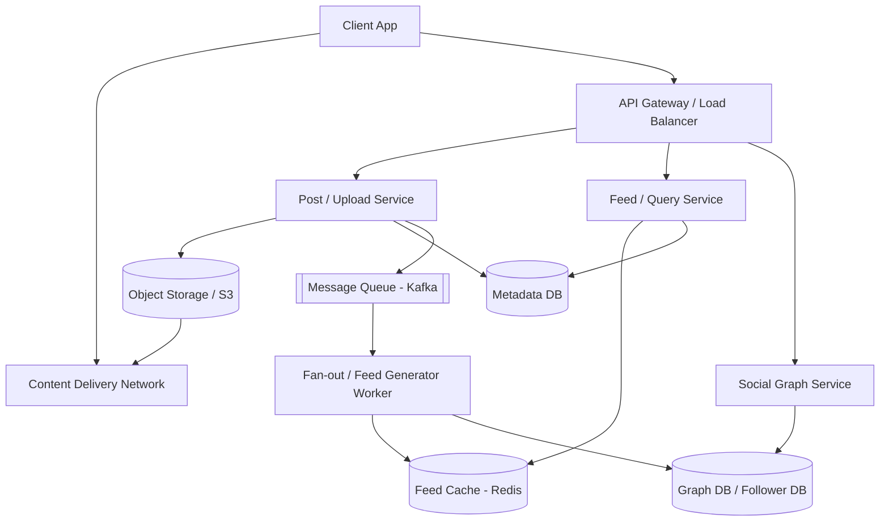

# Design Instagram

Instagram is a photo and video-sharing social networking service. Users can upload media, follow other users, and view a personalized feed of media from the users they follow.

---

## Step 1 — Understand the Problem & Establish Design Scope

### Clarifying Questions

**Candidate:** What are the key features we need to focus on?
**Interviewer:** Focus on uploading photos, following other users, generating the news feed (viewing photos from followed users), and basic search functionality by username.

**Candidate:** What is the scale of the system?
**Interviewer:** Let's assume 500 million Daily Active Users (DAU) and 1 billion total users.

**Candidate:** Are we dealing with just photos, or videos too?
**Interviewer:** Let's stick with just photos for this design to keep it focused.

**Candidate:** How many users can one person follow?
**Interviewer:** A user can follow up to 10,000 people. There are no limits on followers (e.g., celebrities can have hundreds of millions).

### Functional Requirements
- **Upload:** Users can upload/share photos with a caption.
- **Social Graph:** Users can follow/unfollow other users.
- **News Feed:** Users can view a feed consisting of top photos from people they follow, sorted chronologically or by an algorithm.
- **Search:** Users can search for other users by name or username.

### Non-Functional Requirements
- **High Availability:** The system should remain highly available. If the feed slows down, it's not the end of the world, but photo uploads should not fail.
- **Low Latency:** Generating the news feed should be very fast (< 200ms).
- **Reliability (No Data Loss):** Uploaded photos should never be lost.
- **Eventual Consistency:** It's acceptable if a newly uploaded photo takes a few seconds to appear in followers' feeds.

### Back-of-the-Envelope Estimation
- **Traffic:** 500M DAU. If each user posts an average of 2 photos a week, that's roughly ~140 million photos per day, or ~1,600 photos uploaded per second on average.
- **Storage for Photos:** Assume the average photo size is 2MB.
  - 140M photos/day * 2MB = 280 TB/day.
  - Over 10 years, considering growth, we need Exabytes of storage.
- **Storage for Metadata:** Assume 1KB of metadata per photo.
  - 140M * 1KB = 140 GB/day of database storage.
- **Bandwidth:** 280 TB/day = ~3.2 GB/s upload bandwidth. Let's say each user views 50 photos a day. Read bandwidth will be significantly higher: 50 * 2MB * 500M = 50 PB/day read bandwidth (~580 GB/s).

---

## Step 2 — High-Level Design

### Core Entities
1. **User:** Describes user profile (ID, Username, Email, Bio, Creation Date).
2. **Photo:** Metadata describing the photo (Photo ID, User ID, S3 Path, Timestamp, Caption).
3. **User_Follow:** Mapping of social connections (Follower ID, Followee ID).

### API Design
We need a few core APIs to interact with the system.

**1. Upload Photo API:** `POST /api/v1/media`
- **Params:** `auth_token`, `image_file`, `caption`
- **Returns:** `{ "media_id": "12345", "url": "https://cdn.insta.com/...", "status": "success" }`

**2. Get Feed API:** `GET /api/v1/feed`
- **Params:** `auth_token`, `cursor` (for pagination), `limit`
- **Returns:** List of JSON photo objects (id, url, author_info, timestamp, caption) and `next_cursor`.

**3. Follow User API:** `POST /api/v1/users/{user_id}/follow`
- **Params:** `auth_token`
- **Returns:** `{ "status": "success" }`

### System Architecture

---

## Step 3 — Design Deep Dive

### 1. Database Schema & Storage Choice

We need different datastores for different types of data:
- **Media Storage:** Amazon S3 or similar blob storage for photos. S3 is highly durable and scalable.
- **Relational Data (Users, Photos Metadata):** PostgreSQL or MySQL. Since our scale is massive, a single relational DB will choke. We need to shard the database.
- **Social Graph:** We can use an RDBMS with sharding, or a specialized Graph Database (like Neo4j), or a Wide-Column Store (like Cassandra) to store `follower_id` -> `followee_id` mappings.

**Metadata DB Schema:**
- `User` table: `id` (PK), `username` (Indexed), `email`, `created_at`
- `Photo` table: `photo_id` (PK), `user_id` (Indexed), `s3_bucket_path`, `caption`, `created_at`
- `User_Follow` table: `follower_id` (PK part 1), `followee_id` (PK part 2), `created_at`

### 2. Generating the Unique `photo_id`

To shard our database effectively, we need globally unique IDs for photos. We cannot use standard auto-incrementing integer IDs in a distributed database.
- **Twitter Snowflake:** We can use a Snowflake-like ID generation service (e.g., a 64-bit ID comprising timestamp, worker machine ID, and an auto-incrementing sequence). 
- Using timestamps as part of the ID makes the IDs sortable by time, which is incredibly useful for generating feeds.

### 3. Uploading Photos

When a user uploads a photo:
1. The client sends the image to the `Upload Service`.
2. The `Upload Service` generates a new `photo_id`, saves the raw image to S3, and retrieves the URL.
3. It inserts a record into the `Photo` metadata table.
4. It publishes an event `PhotoUploadedEvent` to a Kafka message queue. This allows the upload to return quickly to the user (low latency) while background workers handle the heavy lifting of updating feeds.

### 4. Generating the News Feed (The "Fan-Out" Process)

Generating a feed dynamically on every user request (querying all followed users, gathering their photos, and sorting) is too slow. Instead, we pre-compute feeds.

**Fan-out on Write (Push Model):**
When User A uploads a picture, a background worker consumes the `PhotoUploadedEvent` from Kafka.
It queries the Social Graph for all followers of User A.
It goes into a Redis cluster where feed caches are stored, and pushes the new `photo_id` onto the feed list of *every single follower*.
- **Feed Cache Structure in Redis:** We can use a Redis `List` or `Sorted Set` mapped by the user's ID (`feed:user_id`) containing a bounded list of `photo_id`s (e.g., max 500 photos).

**The Celebrity Problem:**
If Cristiano Ronaldo (with 500M followers) posts a photo, pushing the `photo_id` to 500 million Redis lists takes too long and causes severe lag (the "hotkey" problem).
- **Solution (Hybrid Approach):** 
  - For normal users (e.g., < 10,000 followers), we use **Fan-out on write**.
  - For celebrities, we use **Fan-out on read** (Pull Model). We *do not* push their photos to follower caches. 
  - When a user requests their feed, the system first retrieves their pre-computed feed from Redis, then queries the database for recent photos from any *celebrities* the user follows, merges the lists in memory, sorts them, and returns to the client.

### 5. Media Delivery & CDN

Loading images directly from S3 is slow, especially for users far from the data center.
- All media URL requests should point to a **CDN (Content Delivery Network)** like CloudFront or Akamai.
- When an image is requested, the CDN checks its edge caches. If missing, it fetches from the origin (S3), caches it locally, and serves it. This drastically reduces latency and S3 egress costs.

---

## Step 4 — Wrap Up

### Dealing with Scale & Reliability

- **Database Sharding:** The `Photo` table will grow exponentially. We can shard it based on `user_id`. Doing so ensures that all photos by a single user exist on one shard, making it very fast to fulfill the query "give me all photos for User X" (e.g., when visiting their profile). However, this might lead to uneven shards if some users post a lot. Alternatively, sharding by `photo_id` achieves better distribution but requires scatter-gather queries when loading a user's profile.
- **Resilience:** Use multiple geographic database replicas. If the main DB goes down in a region, failover to a replica.
- **Cache Eviction Policy:** Redis memory is expensive. Feed caches should only store the latest 500 or 1,000 photo IDs. If a user scrolls deeper, the system falls back to querying the database directly. For users who haven't logged in for >30 days, their feed caches can be completely evicted from Redis to save space and recomputed when they eventually log back in.
- **Photo Compression:** To save on the 280TB/day storage cost and improve load times, compress incoming photos asynchronously via workers before storing the final version in S3. Keep multiple resolutions (thumbnail, medium, high) for different screen sizes.

### Additional Talking Points
- **Feed Ranking Algorithms:** While this design sorted chronologically, modern feeds use ML algorithms. Mention that feed lists in Redis would be passed through an ML ranking service that scores photos based on user affinity, engagement history, and photo recency before returning them to the client.
- **Search:** To search for users by name quickly, use an inverted index datastore like **Elasticsearch**, pushing updates to Elasticsearch whenever a new user registers or updates their profile.
