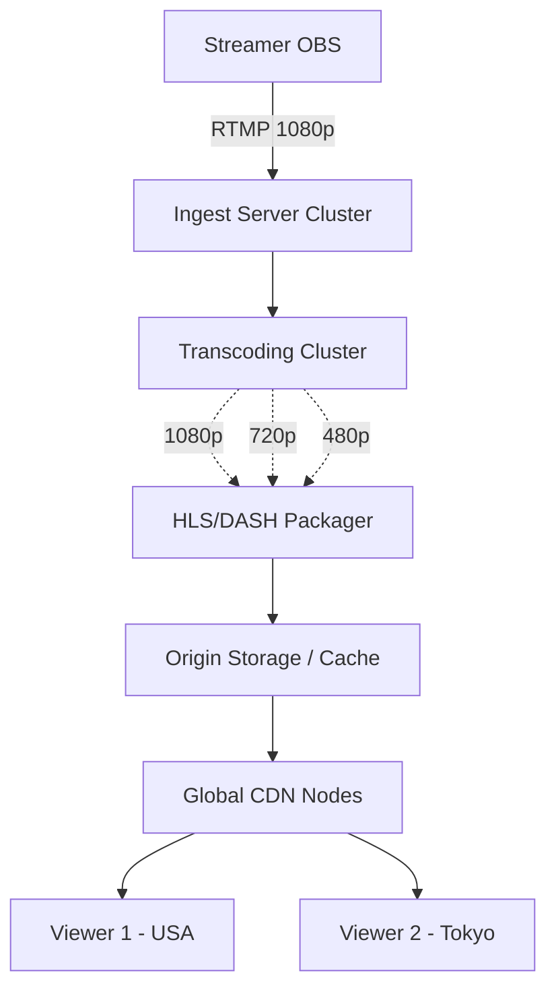

# Design a Live Streaming Platform (Twitch)

A live streaming platform allows broadcasters to capture live video of themselves and distribute it simultaneously to hundreds of thousands—or millions—of concurrent viewers across the globe in near real-time.

---

## Step 1 — Understand the Problem & Establish Design Scope

### Clarifying Questions
**Candidate:** Who are the core actors?
**Interviewer:** Broadcasters (streamers) who create the video, and Viewers who watch it.

**Candidate:** What is the scale?
**Interviewer:** 5 million concurrent viewers globally. Some top streams will have 500,000 concurrent viewers in a single channel.

**Candidate:** Do we need to design the chat system as well?
**Interviewer:** Briefly acknowledge it, but focus 90% of the design on the deep technical architecture of how video moves from *One* person's PC to *500,000* people's monitors with low latency.

### Functional Requirements
- Streamers can broadcast live video from their software (like OBS).
- Viewers can open a webpage and instantly watch the live stream.
- The stream must support different quality levels (e.g., 1080p, 720p, 480p, Auto) so users on bad internet don't buffer.

### Non-Functional Requirements
- **Low Latency:** The delay between the streamer doing something and the audience seeing it should be < 5 seconds. This is critical so the streamer can interact with their chat.
- **High Throughput / Egress Bandwidth:** Pushing video to 5M people requires massive pipes.
- **High Availability:** The streaming infrastructure cannot randomly drop the connection.

### Back-of-the-Envelope Estimation
- **Ingest:** Say 10,000 active streamers concurrently sending 1080p video (≈ 6 Mbps). Ingest bandwidth = ~60 Gbps. Not terrible.
- **Egress (The Hard Part):** 5 million viewers watching at an average of 3 Mbps (mix of 1080p and 720p). Egress bandwidth = 15 Terabits per second (Tbps). You cannot serve this from AWS US-East-1 alone.

---

## Step 2 — High-Level Design

### Core Concept: The Pipeline
Live streaming has three distinct phases:
1. **Ingest (First Mile):** Getting the video from the streamer's PC to our servers.
2. **Processing (Transcoding):** Converting the raw video into various formats and qualities on the fly.
3. **Distribution (Last Mile):** Getting the processed video from our servers to the millions of viewers smoothly.

### Architecture



---

## Step 3 — Design Deep Dive

### 1. Ingest (RTMP)
The streamer's software (OBS) usually sends video to the platform using the **RTMP (Real-Time Messaging Protocol)**. RTMP maintains a continuous TCP connection and streams video packets with very low overhead.
- When the streamer hits "Go Live", their app does a DNS lookup and hits our closest specialized Ingest Server (which might be an edge node near them).
- The Ingest server authenticates their stream key and begins receiving the raw FLV/RTMP packets.

### 2. Transcoding (Encoding for everyone)
The streamer might be on Gigabit fiber optic internet sending flawless 1080p 60fps video. A viewer on a cell phone in a train cannot load that; they need 480p 30fps.
If we don't transcode, the viewer's phone buffers endlessly.

- The Ingest Server passes the raw stream to a powerful **Transcoding Worker Node** (usually running a heavily customized, C-based FFmpeg pipeline).
- This worker physically decompresses the video and immediately re-compresses it simultaneously into 4 different profiles: 1080p, 720p, 480p, 360p.
- This is incredibly CPU intensive. It must be done in real-time. If it takes 2 seconds of compute time to process 1 second of video, the stream breaks. Hardware acceleration (GPUs or specialized ASICs) on the server is almost mandatory.

### 3. Packaging & Segmenting (HLS / DASH)
You cannot send a continuous, endless `video.mp4` file over a standard web browser. Browsers expect standard HTTP files.

Modern live streaming uses protocols like **HLS (HTTP Live Streaming)** (by Apple) or **MPEG-DASH**.
- The Packager takes the continuous video streams from the transcoder and chops them up into tiny files—usually **2-second segments**.
- It creates a text manifest file (an `.m3u8` playlist file).
- The manifest looks like this:
  ```text
  #EXTM3U
  #EXTINF:2.0,
  stream_720p_segment_01.ts
  #EXTINF:2.0,
  stream_720p_segment_02.ts
  ```
- Every 2 seconds, a new `.ts` (transport stream) file is created and the text manifest is updated.

### 4. Distribution (The CDN)
Now that the video is just standard HTTP `.ts` files, this is no longer a "live streaming" problem; it is a standard web caching problem.
- The 2-second segments are pushed to a **Content Delivery Network (CDN)** or edge/proxy layer.
- **The Viewer:** Opens the website. The web player downloads the `.m3u8` manifest file. The player sees `segment_01.ts`. It requests it from the CDN. The CDN serves it instantly.
- While the user watches segment 01, the player downloads segment 02 in the background.

**The "Ultra Low Latency" Problem:**
Standard HLS used to have 10-second segments. If a player buffers 3 segments before playing, the viewer is 30 seconds behind the streamer. When the streamer asks a question, the chat answers 30 seconds later.
- *Fix:* Modern Twitch/YouTube uses **Low-Latency HLS (CMAF)**. Segments are chopped down to 1 second or even 200 milliseconds ("chunks"). The HLS protocol is modified to use HTTP Chunked Transfer Encoding, allowing the CDN to stream the bytes of a file to the user *before the transcoding server has even finished writing the very end of that specific file*. This drops latency from 30s down to 2-3 seconds.

### 5. Chat Architecture (Briefly)
The video is HLS, but the chat is 100% **WebSockets**.
- For a room with 500,000 people, the chat is handled by a distributed Pub/Sub architecture (like Redis Pub/Sub or Kafka).
- 500,000 users are divvied up across maybe 50 WebSocket servers (10,000 connections each).
- When a user sends a message, it hits an API, gets screened for profanity, and is published to the `Channel_123` Kafka topic.
- All 50 WebSocket servers subscribe to that topic, receive the one message, and simultaneously push it down the 10,000 open TCP sockets to the client browsers.

---

## Step 4 — Wrap Up

### Dealing with Scale & Bottlenecks
- **The "Super Streamer" Egress Crash:** If a massive tournament starts and 1 million people simultaneously join one stream, they all hit the CDN asking for `segment_100.ts` at the exact same millisecond. If the CDN node misses its local cache, it sends 1 million requests to the Origin Server, crashing the company backend instantly (The Thundering Herd).
  - *Fix:* **Request Collapsing / Coalescing.** The edge CDN proxy is programmed to realize that 50,000 identical requests just came in for `segment_100.ts`. It puts 49,999 requests on "pause", sends exactly *one* request to the Origin server, gets the 2MB file, and then un-pauses and serves the file out of RAM to all 50,000 connections instantly.

### Architecture Summary
1. Streamers push continuous video via **RTMP** to regional ingest servers for lowest possible first-mile latency.
2. Highly optimized, hardware-accelerated **Transcoding nodes** decompress and re-encode the stream into multiple resolutions (1080p, 720p) in real-time.
3. The continuous streams are packaged into tiny 1-2 second HTTP files using **Low-Latency HLS or DASH**.
4. The files are aggressively pushed and cached across a global **CDN**. Client browsers infinitely poll text manifest files and download these video chunks, ensuring buffering-free viewing across 15 Tbps of combined egress traffic.