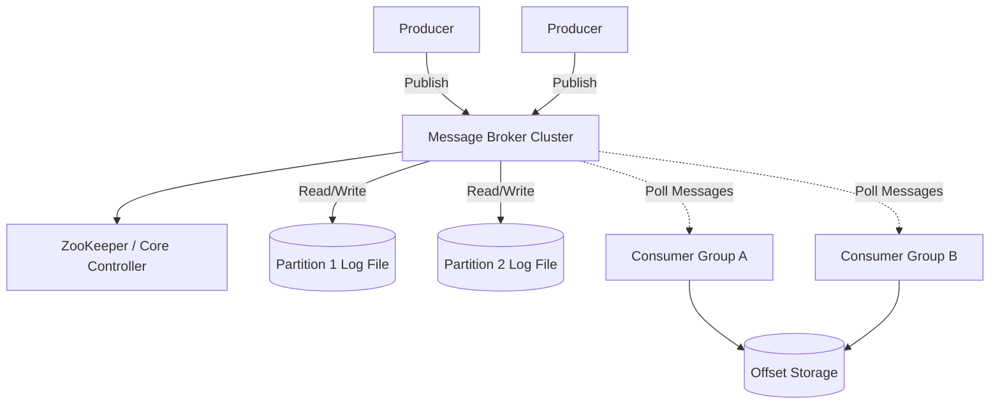

# Design a Distributed Message Queue (like Apache Kafka)

A message queue acts as an asynchronous buffer between a producer (who creates data) and a consumer (who processes data). While RabbitMQ or Amazon SQS are standard queues, designing a high-throughput, persistent, replayable queue like Apache Kafka focuses on a distributed, append-only log architecture.

---

## Step 1 — Understand the Problem & Establish Design Scope

### Clarifying Questions
**Candidate:** Is this a Point-to-Point queue (like SQS) or a Publish/Subscribe system (like Kafka)?
**Interviewer:** It should support Publish/Subscribe, where multiple different consuming applications can read the exact same messages independently.

**Candidate:** Do we need strict ordering?
**Interviewer:** Yes, messages published to a specific topic/partition must be delivered to the consumer in the exact order they were received.

**Candidate:** Must messages be persistent? Can consumers replay old messages?
**Interviewer:** Yes. Messages should be stored on disk for a configurable retention period (e.g., 7 days) and consumers can rewind time to replay them.

### Functional Requirements
- **Producers** can publish messages to a `Topic`.
- **Consumers** can subscribe to a `Topic` and consume messages.
- Support for multiple independent Consumer Groups.
- Data persistence and replayability.

### Non-Functional Requirements
- **Extremely High Throughput:** Millions of messages per second.
- **Low Latency:** Millisecond delay between publishing and consumption.
- **High Availability & Fault Tolerance:** Node failures should not lose data.

---

## Step 2 — High-Level Design

### Core Concept: The Append-Only Log
Unlike traditional databases that use B-Trees, or traditional queues that `DELETE` a message after it's read, a system like Kafka is fundamentally a **Distributed Append-Only Log**. 
- A Topic is backed by a physical file on disk. 
- When a producer sends a message, it is appended to the end of the file. 
- This results in O(1) sequential disk writes, which are incredibly fast (even on HDD).
- Consumers maintain a "cursor" (an offset index). Reading a message simply moves their personal cursor forward. The message is *not* deleted.

### System Architecture

---

## Step 3 — Design Deep Dive

### 1. Topics, Partitions, and Scalability

If a Topic is a single log file on a single server, throughput is bottle-necked by that one server's disk I/O network card. To handle millions of messages/sec, we must distribute the Topic.
- A **Topic** is split into multiple **Partitions** (e.g., Topic "clicks" has 100 partitions).
- These partitions are spread across dozens of servers (Brokers).
- When a Producer sends a message `{"user_id": 123, "action": "click"}`, it typically hashes the `user_id` to select the partition: `hash("123") % 100 = Partition 42`.
- **Key Guarantee:** All messages with the same routing key (`user_id = 123`) end up in the *same* partition. Since a partition is a single sequential file, ordering is strictly guaranteed *within a partition*. (Global ordering across the entire Topic is impossible in distributed systems without sacrificing throughput).

### 2. Reading from the Queue: The Consumer Group

How do we scale consumers? If Partition 42 receives 10,000 writes/sec, a single Consumer app reading from it might choke.
- We utilize **Consumer Groups**. A group represents a single logical application.
- If Consumer Group A has 10 machines (consumers), and the Topic has 100 Partitions, each machine is assigned exactly 10 Partitions.
- They pull data in parallel. No two consumers *in the same group* will read from the same Partition. This prevents duplicate processing and maintains strict ordering.
- If Consumer Group B (a completely different application, like a Data Lake ingestor) also subscribes, it gets its own independent cursors for all 100 Partitions.

### 3. The Offset Manager (Tracking Progress)

How does the queue know who has read what?
- Unlike RabbitMQ which deletes messages, Kafka saves a simple integer **Offset** for every Consumer Group and Partition pair.
- Example: `Group A` has read up to line `45,000` in `Partition 1`. 
- Every time Group A successfully processes a batch of messages, it sends a request: `Commit Offset 45,050 for Partition 1`.
- The Offset Manager stores this integer (often in an internal topic or a fast datastore).
- **Replayability:** If Group A pushes a bad code deployment and corrupts their DB, they can deliberately tell the Offset Manager: `Change my offset for Partition 1 back to 40,000`. Next poll, the broker will physically seek the disk file to line 40,000 and replay the history.

### 4. Zero-Copy Protocol (The Speed Secret)

How does a Java/C++ broker read a file from Disk and send it over the Network at millions of ops/sec without melting the CPU?
- Using a standard OS approach requires copying data 4 times: Disk -> Kernel Buffer -> App Buffer (RAM) -> Kernel Socket Buffer -> Network Card.
- We use the `sendfile()` system call (**Zero-Copy**).
- The application tells the OS: "Copy data directly from the Kernel Page Cache (Disk) to the Kernel Socket (Network Card)." 
- The data *never* enters the JVM/App memory space. The CPU does almost zero work, acting merely as a traffic cop. The throughput becomes limited purely by the physical network cable.

### 5. Replication & Fault Tolerance

If a Broker machine explodes, we lose the Partitions stored on its disk. 
- Every Partition has 1 **Leader** and multiple **Followers** (Replicas).
- All reads and writes for Partition 1 go to its Leader.
- The Followers asynchronously pull the appended bytes from the Leader and write them to their local disks.
- A cluster manager (like Apache ZooKeeper or KRaft) monitors the Brokers. If the Leader for Partition 1 dies, ZooKeeper promotes one of the in-sync Followers to be the new Leader. Clients automatically update their routing tables and resume.

---

## Step 4 — Wrap Up

### Dealing with Edge Cases

- **Message Loss vs Latency Trade-off (`acks`):**
  - `acks=0`: Producer fires and forgets. Lowest latency, but highest chance of data loss.
  - `acks=1`: Producer waits for the Leader to write to its disk. Good balance. But if the leader acknowledges and dies *before* replication, data is lost.
  - `acks=all`: Producer waits until the Leader *and all Followers* have written the data to disk. Highest latency, but mathematically impossible to lose data.
- **Consumer Crashes:** If a consumer in Group A crashes, it stops pulling and sending heartbeats to the cluster via the **Coordinator**. The Coordinator executes a **Rebalance**, reassigning that crashed node's partitions to the remaining healthy nodes in Group A so processing continues.

### Architecture Summary

1. To achieve millions of QPS, the system replaces traditional Database B-Trees with flat, sequential, distributed **Append-Only Logs** spread across partitions.
2. Producers dictate the ordering guarantees by hashing a routing key to target a specific partition.
3. Subscribing applications scale horizontally using **Consumer Groups**, utilizing an **Offset Tracker** to maintain their location in the log file, giving them the ability to replay time.
4. Internal software bottlenecks are eliminated using OS-level **Zero-Copy** file transfers directly to the network interface.
5. High availability is achieved via robust **Leader-Follower replication** managed by a consensus controller.