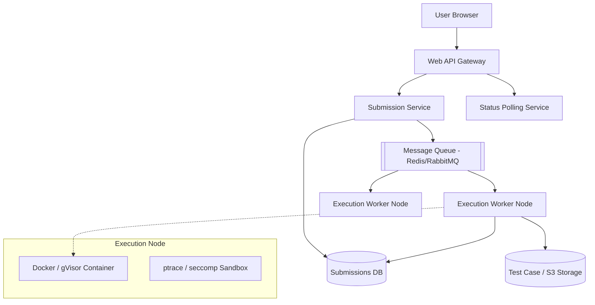

# Design an Online Judge (LeetCode / HackerRank)

An Online Judge is a web-based educational service that presents algorithmic problems to users, accepts source code solutions in various programming languages, compiles/runs the code, tests it against hidden test cases, and returns a verdict (Accepted, Time Limit Exceeded, Wrong Answer, etc.) along with execution metrics.

---

## Step 1 — Understand the Problem & Establish Design Scope

### Clarifying Questions
**Candidate:** Is the focus on the user interface and forum, or the code execution engine?
**Interviewer:** Focus entirely on the code execution engine. How do we securely and reliably run untrusted user code?

**Candidate:** Which languages should we support?
**Interviewer:** Assume standard compiled and interpreted languages (C++, Java, Python).

**Candidate:** What is the scale?
**Interviewer:** Let's say 1 million active users daily, but with huge spikes during weekend contests where thousands of users submit code in the exact same minute.

### Functional Requirements
- Accept user source code and a selected language.
- Run the code against predefined hidden inputs.
- Compare output against expected outputs.
- Return a detailed verdict (Accepted, Wrong Answer, TLE, MLE, Run-Time Error, Compile Error).

### Non-Functional Requirements
- **Security / Isolation:** The system is literally executing unverified, potentially malicious code provided by arbitrary internet users. It MUST prevent them from reading host files, opening network sockets, or running fork-bombs.
- **Fairness / Consistency:** Running `O(N^2)` code on a busy server might take 2.1 seconds, but on an idle server take 1.9s. The system must measure execution time fairly so a user isn't unfairly given a Time Limit Exceeded (TLE) just because the server was busy.
- **Scalability:** Must handle massive bursts of submissions during contests without failing, even if results are slightly delayed via queuing.

---

## Step 2 — High-Level Design

The core of an Online Judge is a combination of a traditional web backend paired with an asynchronous, heavily locked-down **Job Queue** processing system.

### Architecture

---

## Step 3 — Design Deep Dive

### 1. The Asynchronous Submission Flow
Compiling and running code takes anywhere from 500ms to 10 seconds. We cannot keep the HTTP connection open.
1. The client sends `POST /submit { problem_id, code, lang }`.
2. The Submission Service saves it to the Database with a status of `PENDING` and returns a `submission_id`.
3. The Service pushes a message to a Message Queue (e.g., RabbitMQ or AWS SQS).
4. The client UI begins polling `GET /status?id=123` every 1 second (or uses WebSockets/Server-Sent Events) to await the result.

### 2. The Execution Worker
When a worker node picks up the job from the queue:
1. It downloads the user's `code` from the DB.
2. It fetches the hidden test case inputs and expected outputs from Object Storage (S3).
3. It compiles the code (if C++/Java). If the compiler throws an error, it immediately writes `COMPILE_ERROR` to the database and ends the job.
4. It executes the compiled binary (or Python script), feeding the `input.txt` into standard input (`stdin`).
5. It captures the standard output (`stdout`) and standard error (`stderr`).
6. It runs a simple `diff` script on the user's `stdout` versus the `expected_output.txt`.
7. It writes the final verdict back to the Database.

### 3. Security: The Sandbox Environment (The Hard Part)
If we just run `python user_code.py` directly on our Linux worker node, a user could submit `os.system("rm -rf /")` or write a script that joins a botnet.

We must rely on deep Linux Kernel security features:
- **Docker Containers:** Provide a basic layer of filesystem isolation. Each run gets a fresh, ephemeral, alpine Linux container with zero network access and no root privileges.
- **cgroups (Control Groups):** The OS-level feature that Docker uses to restrict hardware. We strictly configure cgroups to enforce the Time Limit (e.g., max 2.0 CPU seconds) and Memory Limit (e.g., max 256 MB RAM). If the code exceeds this, the OS kernel literally murders the process, returning a `SIGKILL` (Out of Memory/TLE).
- **seccomp (Secure Computing Mode):** Even within Docker, we need to prevent the code from executing malicious system calls. `seccomp` allows us to define a strict whitelist of allowed sys calls (e.g., `read`, `write`, `exit`, `brk`). If the user code requests a socket connection or tries to `fork()` a new process, `seccomp` instantly terminates it.
- **gVisor / Firecracker:** For absolute security, standard Docker isn't enough (due to shared kernel vulnerabilities). Systems like Google's gVisor or AWS Firecracker run the code inside lightweight micro-VMs that intercept all system calls, providing near-impenetrable isolation.

### 4. Fairness and CPU Time Measurement
Measuring standard "Wall Clock Time" (how many real-world seconds passed) is unfair. If the worker machine is running 4 Docker containers at once, they fight for CPU, and wall time increases.
Instead, we must measure **CPU Time** (the exact number of CPU cycles consumed by the specific thread). We query Linux `rusage` (resource usage) stats to measure exact CPU execution time down to the millisecond to evaluate Time Limit Exceeded fairly, regardless of server load.

---

## Step 4 — Wrap Up

### Dealing with Scale & Edge Cases
- **Handling Contests:** During a Saturday LeetCode contest, 50,000 people might hit "Submit" at minute 89. The Web API cluster must Auto-Scale rapidly. The database write throughput might spike. Because we use a Message Queue, the system won't crash. The Queue will simply back up. Users might "Sit in Queue" for 30 seconds before their code runs, which is an acceptable UX trade-off to prevent catastrophic server outages.
- **Test Case Caching:** Pulling a 50MB `input100.txt` string from S3 for every single submission is incredibly slow. The Execution Worker nodes should maintain an LRU cache of recently used Test Cases on their fast, local NVMe SSDs.
- **Database Sharding:** Over years, storing millions of text files (the user's code) and their outputs inside an RDBMS will bloat it. The DB should only hold metadata (User ID, Problem ID, Status, Timestamp). The actual raw text of the `.java` files and error stack traces should be offloaded to AWS S3 / Blob Storage.

### Architecture Summary
1. The system utilizes a strongly decoupled asynchronous architecture driven by a high-throughput **Message Queue** to survive massive traffic spikes during contests.
2. Code execution happens entirely asynchronously on specialized Worker Nodes.
3. Untrusted security threats are neutralized using OS-level virtualization (**Docker/Micro-VMs**) paired with strict kernel guardrails (**cgroups** for memory/CPU capping and **seccomp** for blocking malicious system calls).
4. Fairness is guaranteed by utilizing lowest-level OS metrics to calculate exact CPU execution time rather than real-world wall time.