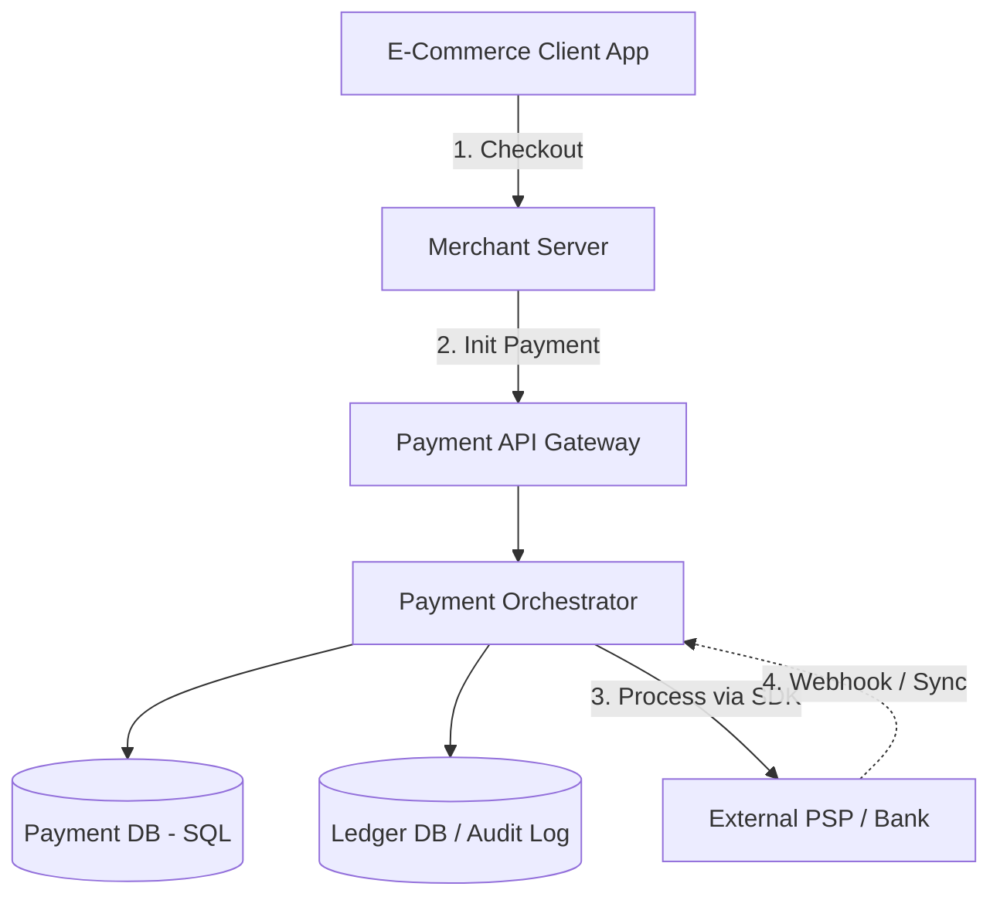

# Design a Payment System (Stripe / PayPal API)

Designing a payment system requires shifting focus entirely away from traditional "High Throughput / Low Latency" design, and almost exclusively towards **Extreme Consistency**, **Idempotency**, and **Fault Tolerance**. In a payment system, losing a record or double-charging a user is a catastrophic failure.

---

## Step 1 — Understand the Problem & Establish Design Scope

### Clarifying Questions
**Candidate:** Who are the actors?
**Interviewer:** A User (Buyer) wants to pay a Merchant (Seller). We are the Payment Gateway (like Stripe) facilitating this.

**Candidate:** Which payment methods are supported?
**Interviewer:** Credit cards via an external Bank/Payment Processor.

**Candidate:** What is the scale?
**Interviewer:** Let's say 1 million transactions per day. Scale is not the primary challenge here; correctness is.

### Functional Requirements
- Process a payment from a user's credit card.
- Deduct money from the user, add money to the merchant.
- Provide a clear Success / Failure / Pending status.

### Non-Functional Requirements
- **ACID Consistency:** No lost data. No double-charging.
- **Idempotency:** If the client's network drops and they click "Pay" twice, they must only be charged once.
- **Auditability:** Every step of the money's journey must be logged in a ledger for accounting and legal compliance.

### Back-of-the-Envelope Estimation
- **Traffic:** 1 million / 86400 = ~12 Transactions Per Second (TPS). This is trivial. A single database could technically handle this. 
- **Storage:** 1M transactions * 1KB metadata = 1 GB / day. 

---

## Step 2 — High-Level Design

We cannot directly transfer money between bank accounts ourselves. We integrate with an external Payment Service Provider (PSP) like Chase, Visa, or Mastercard. 

Our system's job is orchestrating the flow: talking to the merchant's app, saving our internal state, talking to the PSP, updating our state, and responding to the merchant.

### Architecture

---

## Step 3 — Design Deep Dive

### 1. The Database Choice: Strict ACID

In payment systems, **NoSQL is out.** We use a strict Relational Database (like PostgreSQL) configured for maximum durability (Synchronous replication, strong consistency).
Why? Because we need **Distributed Transactions**. If we credit the merchant's balance but the deduction from the user fails, our database must roll back the entire transaction instantly.

**Payment Event Schema:**
- `transaction_id` (PK, UUID)
- `idempotency_key` (Unique constraint)
- `merchant_id`
- `amount`, `currency`
- `status` (`PENDING`, `EXECUTED`, `FAILED`, `REFUNDED`)
- `created_at`, `updated_at`

### 2. Idempotency (The Most Critical Concept)

**Scenario:** The user clicks "Checkout". Our Payment Service calls the Bank. The Bank charges the card and returns "Success". But right as the Bank returns the response, our Payment server's network cable is cut. Our Server never tells the User app "Success". The User sees a spinning wheel, panics, and clicks "Checkout" again.
*Result without Idempotency:* The user is charged a second time.

**Solution: The Idempotency Key.**
1. When the user opens the checkout page, the Merchant server generates a unique UUID called an `idempotency_key`.
2. The user clicks "Pay". The request is: `POST /charge { amount: 100, idempotency_key: "abc-123" }`.
3. The Payment API receives it. It attempts to insert a row into the database. There is a **Unique Database Constraint** on the `idempotency_key` column.
4. The DB locks the row. The payment is processed with the Bank, and the DB status is updated to `EXECUTED`.
5. *The Retry:* The user clicks "Pay" again. The exact same request is sent with `idempotency_key: "abc-123"`.
6. Our API hits the DB. The DB says, "Hold on, I already have a row with `abc-123`, and its status is `EXECUTED`."
7. Our API *does not* talk to the Bank. It simply returns the cached success response. The user is protected from double-charging.

### 3. The Ledger (Double-Entry Accounting)

Payment systems don't just update an "Account Balance" column from $100 to $50. If there's a bug, you can't trace where the $50 went. You must implement a strict **Double-Entry Ledger**.
Every transaction involves two entries: a debit and a credit, which must sum to zero.

*Example of a $10 payment from User to Merchant taking a $1 fee:*
| Account | Amount |
|---------|---------|
| User_Wallet | -$10.00 |
| Merchant_Wallet| +$9.00 |
| Stripe_Revenue | +$1.00 |
| **Sum** | **$0.00** |

This ledger is append-only. It is immutable. If a mistake is made, you do not `UPDATE` the row; you insert a new compensatory refund row.

### 4. Handling External PSP Failures (The 2-Phase Commit / Polling)

What happens if we ask the External Bank to process the card, and the Bank times out? Did it fail? Did it succeed but just fail to tell us? 

We cannot leave the database status as `PENDING` forever.
1. **Timeouts & Job Queues:** When a payment enters `PENDING`, we publish a message to a delayed queue (like AWS SQS) for 30 seconds in the future.
2. **Reconciliation Worker:** 30 seconds later, a worker wakes up and checks the DB. If the status is still `PENDING`, the worker assumes the connection dropped.
3. The worker actively makes a `GET` request to the External Bank: `GET /bank/transactions/status?tx=123`.
4. If the Bank says "I have no record of that", our worker safely marks our DB as `FAILED`.
5. If the Bank says "Oh yeah, that was successful", our worker marks our DB as `EXECUTED` and continues the flow.

---

## Step 4 — Wrap Up

### Dealing with Scale & Edge Cases

- **Security (PCI-DSS):** Storing raw credit card numbers (PANs) requires extreme, legally mandated security audits (PCI Compliance). Modern payment systems never touch the raw card. The client's browser sends the card directly to a highly secure Vault (like Stripe Elements). The Vault returns a randomized "Token" (e.g., `tok_1xyz`). Our payment system only ever stores and uses this meaningless Token to interact with the Bank.
- **Microservices vs Monolith:** For payments, a monolith or macro-service is often preferred over deep microservices. Network hops between 15 microservices greatly increase the chances of a partial failure requiring devastatingly complex distributed rollbacks (Saga patterns). Keep the core money-movement within a single ACID transaction boundary.
- **Asynchronous Webhooks:** Since talking to the bank can take 2-5 seconds, never hold the user's HTTP thread open. Return `202 Accepted` immediately. Have the front-end poll for status, or once the internal reconciliation finishes, fire an async Webhook to the Merchant's server: `POST /webhook { event: "payment_success", id: "123" }`.

### Architecture Summary

1. To process payments without errors, the architecture prioritizes relational databases with strong ACID guarantees over highly distributed NoSQL stores.
2. **Idempotency Keys** are generated by the client and enforced via database unique constraints to completely eliminate double-charging during network retries.
3. An append-only **Double-Entry Ledger** tracks every cent moving through the system to guarantee financial auditability.
4. Because external boundaries (Banks) are unreliable, robust background Reconciliation Workers and Cron Jobs continuously audit `PENDING` states to ensure the system achieves Eventual Consistency without holding up the user.