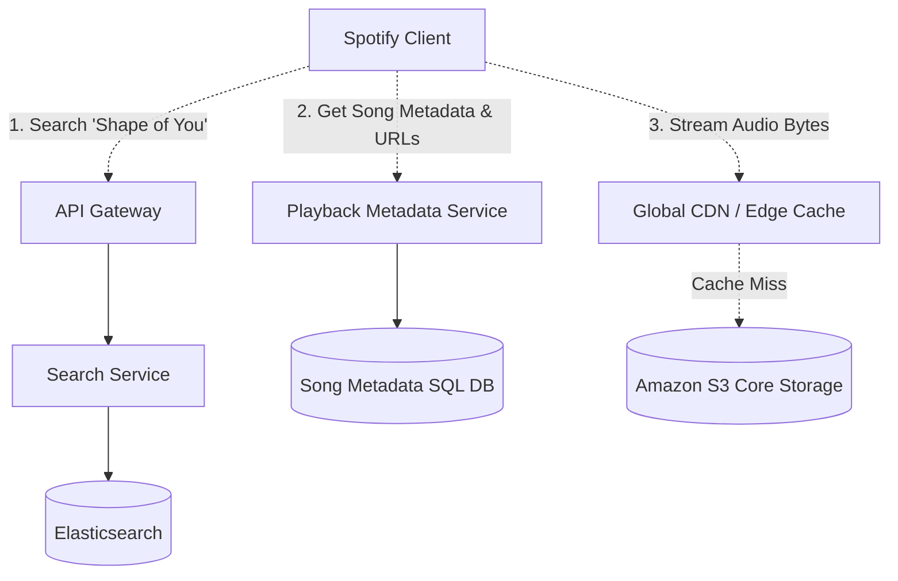

# Design Spotify

Spotify is a digital music, podcast, and video service that gives users access to millions of songs and other content from creators all over the world.

---

## Step 1 — Understand the Problem & Establish Design Scope

### Clarifying Questions
**Candidate:** The main feature is audio streaming, correct? Do we also need to consider searching for songs, personalized home page recommendations, or user uploads?
**Interviewer:** Focus mainly on the audio streaming architecture, song search, and how you would store the massive audio catalog. Don't worry about user uploads (Spotify gets its catalog from labels, not end-users).

**Candidate:** What is the scale?
**Interviewer:** 500 million active users. Peak concurrent users streaming music is 50 million. The catalog has about 100 million songs.

**Candidate:** Is it just mobile or desktop too?
**Interviewer:** Assume both. The client must be able to handle changing network conditions (e.g., driving through a tunnel).

### Functional Requirements
- Listeners can search for songs by title, artist, or album.
- Listeners can play a song on demand.
- The playback must be smooth, continuous, and buffer-free.

### Non-Functional Requirements
- **Low Latency:** Playback should begin in less than 500ms after tapping a song.
- **High Availability:** The service must be highly reliable.
- **Bandwidth Efficiency:** The system needs to serve 50 million concurrent audio streams without melting our servers. Audio streaming is fundamentally an IO/Bandwidth problem, not a CPU problem.

### Back-of-the-Envelope Estimation
- **Storage:** 100 million songs. A typical 3-minute song encoded in a high-quality format (e.g., 320 kbps Ogg Vorbis or high-res MP3) is ~8MB. 
  - $100,000,000 * 8\text{ MB} \approx 800\text{ Terabytes}$. This is the *raw* catalog. When we account for multiple formats (e.g., 96kbps, 160kbps, 320kbps) and replicas, it's several Petabytes. It easily fits in modern cloud object storage (S3).
- **Network Bandwidth:** 50 million concurrent streams at 160 kbps (20 KB/sec).
  - $50,000,000 * 20\text{ KB/s} \approx 1\text{ Terabyte/second}$ (or 8 Tbps). Serving 1 TB/s of egress traffic from a single central data center is impossible and prohibitively expensive. We *must* use a CDN.

---

## Step 2 — High-Level Design

### System Architecture

The architecture separates the metadata (searching, getting song text data) from the actual audio payload delivery.

---

## Step 3 — Design Deep Dive

### 1. Song Storage & Transcoding (The Offline Pipeline)

When a music label sends a new album to Spotify (usually as massive lossless FLAC or WAV files):
1. The new files are dropped into a protected "Ingestion Bucket".
2. A message is sent to a Kafka queue.
3. Transcoding Worker nodes (running FFmpeg) pick up the job and transcode the massive file into various bitrates (e.g., 96kbps for poor mobile connections, 160kbps standard, 320kbps premium) and formats (Ogg Vorbis, AAC).
4. The transcoded files are split into small chunks (e.g., 3 to 5-second segments). Splitting allows the mobile client to adjust the quality mid-song if the user drives into an area with bad reception (Adaptive Bitrate Streaming).
5. The chunks are saved in Amazon S3, and the new URLs to those chunks are saved into the `Metadata Database`.

### 2. Delivering the Audio (The CDN)

We established we need 1 Terabyte per second of egress bandwidth. 
We push all song *files* out to a **Content Delivery Network (CDN)** or an internet-edge cache layer.
- When an iPhone in London hits play, it doesn't request the MP3 from a server in Virginia. It uses geographic DNS mapping to hit a CDN edge server located physically in London.
- If the CDN doesn't have the segment, it pulls it from S3, caches it, and serves it. The latency is practically zero for popular songs.
- **The Long Tail Problem:** The top 20% of the catalog (Taylor Swift, Drake) serves 80% of the traffic. These songs stay hot in the CDN cache. The bottom 80% of songs are rarely played. If someone plays an obscure indie track, the CDN will experience a cache miss and must fetch from S3.

### 3. The Client Architecture (The true secret to "Instant Play")

The majority of Spotify's magic happens inside the user's mobile app, not on the backend.
- **Aggressive Local Caching:** The app reserves a chunk of the phone's hard drive (e.g., 2GB). It aggressively caches the segments of songs you just played, or songs on your "Liked" playlist. If you hit play on a Liked song, the app fetches the first 30 seconds straight from the phone's flash memory. Latency is literally 0ms.
- **Pre-fetching:** If you are listening to Track 1 on an album, the app assumes you are about to listen to Track 2. While Track 1 is playing, the app silently starts downloading the first 10 seconds of Track 2 in the background. When Track 1 organically ends, Track 2 begins instantly from RAM.
- **Adaptive Bitrate Streaming (ABR):** The client constantly monitors its internet speed. If the OS reports bandwidth dropping from 4G to 3G, the client dynamically switches its HTTP requests from `segment4_320kbps.ogg` to `segment5_96kbps.ogg`.

### 4. Search Service

When a user searches "Ed Sheer", we need instant auto-complete suggestions.
- **Database:** A relational DB is too slow for fuzzy text searching. We use **Elasticsearch** (an inverted index).
- **Index Structure:** We build specific indices for "Artists", "Albums", and "Tracks".
- **Optimization (Trie/Prefix Tree):** For the auto-complete dropdown, relying purely on Elasticsearch can be overkill. The top 100,000 most popular search terms can be stored in RAM in a purely memory-based **Prefix Tree (Trie)** structure on a specialized microservice, returning suggestions in < 10ms.

---

## Step 4 — Wrap Up

### Trade-offs & Bottlenecks

- **Cost of CDNs:** Utilizing Akamai or AWS CloudFront for 1 TB/sec is insanely expensive. Big tech companies like Netflix and Spotify eventually build their own custom CDN hardware (Open Connect, or Spotify's P2P networking experiments—though they abandoned P2P for central CDNs on Google Cloud recently). 
- **Analytics & Royalties:** Every time a user listens to > 30 seconds of a song, Spotify must pay the label. This requires a perfectly accurate analytics pipeline. The client logs every play event to a local buffer. Periodically, the client flushes these events to a backend Log Ingestion API -> Kafka -> Spark/Hadoop data lake. This data lake is used to compute the massive payroll jobs at the end of the month, as well as the Machine Learning algorithms for "Discover Weekly".

### Architecture Summary

1. To achieve sub-second play times, the mobile Client relies heavily on local flash storage caching, predictive pre-fetching, and Adaptive Bitrate Streaming (ABR).
2. The heavy lifting of the audio payload is entirely offloaded to a globally distributed CDN, isolating the application servers from the immense egress bandwidth.
3. Actual application servers are stateless REST APIs that merely serve text JSON metadata (Search results, playlist structures, URLs to CDN assets) backed by an Elasticsearch cluster.
4. Heavy computational workloads (transcoding new music, calculating royalty payouts, training recommendation models) are handled offline via asynchronous Message Queues and Big Data processing clusters.