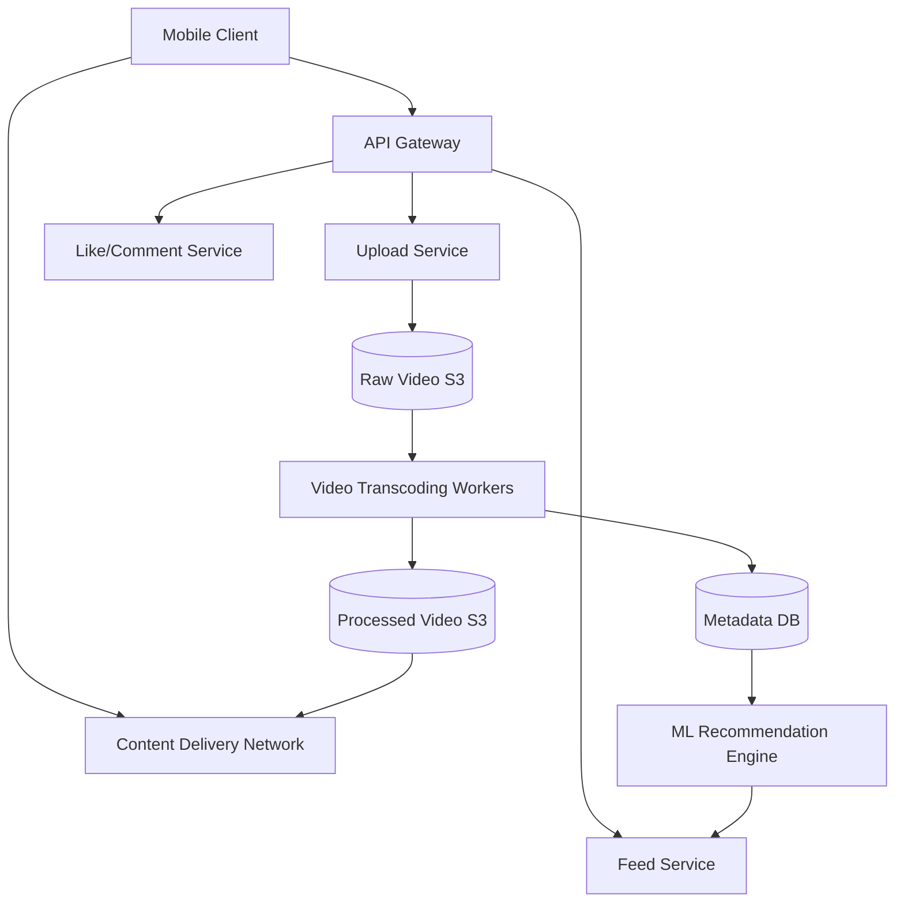

# Design TikTok / Instagram Reels

TikTok is a short-form video hosting service characterized by highly personalized "For You" feeds, rapid media consumption, and vast, continuous video buffering.

---

## Step 1 — Understand the Problem & Establish Design Scope

### Clarifying Questions
**Candidate:** What is the primary focus of this design?
**Interviewer:** Focus on video uploading, transcoding, media streaming, and the architecture behind generating the endless personalized feed. 

**Candidate:** What is the scale?
**Interviewer:** 1 billion monthly active users, 100 million Daily Active Users (DAU). Users watch an average of 100 videos a day.

**Candidate:** How long are the videos?
**Interviewer:** Up to 3 minutes, but an average of 15 seconds.

### Functional Requirements
- **Upload:** Users can upload short videos.
- **Feed Generation:** An infinite scrolling "For You" feed, purely algorithm-driven (not just chronological from followed users).
- **Streaming:** Fast, buffer-free video playback on mobile devices.

### Non-Functional Requirements
- **Low Latency:** Feed fetching must be instant. Video playback must start in < 200ms.
- **High Throughput:** The system must handle immense amounts of video streaming globally.
- **High Availability:** A user should always have videos to swipe to.

### Back-of-the-Envelope Estimation
- **Traffic / Reads:** 100M DAU * 100 videos/day = 10 Billion video views per day (~115,000 requests per second).
- **Writes:** Assume 1 in 100 users uploads a video daily = 1M uploads/day.
- **Storage:** Average video size for 15s is ~3MB (compressed). 
  - 1M uploads * 3MB = 3 TB/day of storage.
- **Read Bandwidth:** 10 Billion views * 3MB = 30 Petabytes/day (~350 GB/second). This is an astronomical bandwidth requirement.

---

## Step 2 — High-Level Design

Handling video is fundamentally different from a text-based system like Twitter. The core challenge is network bandwidth and CPU-intensive file conversions (transcoding).

---

## Step 3 — Design Deep Dive

### 1. Video Upload & Transcoding Pipeline
When a user records a video on their phone, it's often in a raw, heavy format (e.g., 4K, 60fps) based on the device's hardware. You cannot stream this raw file to an older smartphone on a 3G network in a different country.

- **Upload:** The client uploads the raw video file to the `Upload Service`.
- **Pre-signed URLs:** To save bandwidth on our own application servers, the `Upload Service` generates an AWS S3 "Pre-signed URL". The client app then uploads the heavy video bytes *directly* to S3.
- **Message Queue:** Once S3 confirms the upload, a message is dropped into a Kafka topic (`raw_video_uploaded`).
- **Transcoding (Encoding):** A fleet of heavily parallelized worker nodes (running FFmpeg) picks up the message. They convert the single raw video into multiple different formats and resolutions (e.g., 1080p, 720p, 480p, 360p, H.264 mp4, H.265, WebM). They also extract the audio track to a separate file, and create a thumbnail image.
- **Storage:** The processed chunks are saved back to S3, and the new URLs are written to the `Metadata DB` (PostgreSQL/Cassandra).

### 2. Video Streaming & The CDN
Delivering 350 GB/s of video directly from application servers or even from an S3 bucket in one region would melt the internet pipes.
- We must use a **CDN (Content Delivery Network)** globally (e.g., Akamai, Cloudflare, Fastly).
- When a user in Tokyo swipes to a video, their app hits the CDN edge node in Tokyo. 
- If the video isn't there, the CDN pulls it from S3, caches it in Tokyo, and serves it. The next 1,000 users in Tokyo get the cached version instantly.

**Streaming Protocol:** For short videos, standard HTTP Range Requests (downloading chunks of a `.mp4` file) are often sufficient, or we can use **HLS (HTTP Live Streaming)** / **DASH**. HLS slices the video into 2-second segments. The client can dynamically switch resolutions (e.g., drop from 1080p to 480p) mid-video if their cell connection drops.

### 3. The "For You" Feed Generation
Unlike a social graph feed (Twitter/Instagram) which relies on who you follow, the TikTok feed relies on ML recommendations. It must feel endless and highly personalized.

1. **Feature Extraction:** Every swipe, watch-time duration, like, and share is streamed via Kafka to a real-time data pipeline (e.g., Flink/Spark).
2. **The ML Model:** A massive recommendation model computes a score for the user against thousands of candidate videos predicting CTR (Click-Through Rate) and watch-time.
3. **The Feed Cache:** Running deep ML models on the fly for every single swipe for 115k QPS is impossible. 
   - Instead, the system operates asynchronously. An offline ML worker periodically generates a list of 500 recommended `video_id`s for a given user.
   - It stores these in a fast, in-memory cache like **Redis** or **Memcached** (Key: `feed:user_123`, Value: `[vid1, vid2, ..., vid500]`).
4. **Client API Request:** The client app requests `GET /feed`. The Feed API simply pops the first 10 `video_id`s from the user's Redis list, queries the database for the CDN URLs, and returns them to the client.

### 4. Client-Side Optimizations (Crucial for TikTok)
The backend architecture is only half the battle. To achieve "instant start" when a user swipes:
- **Pre-fetching:** While the user is watching Video 1, the client app is already downloading the first 1 MB of Video 2, Video 3, and Video 4 in the background. When the user swipes, the video is already in RAM and plays instantly.
- **Watermarking / Parallel Load:** The first frame of the video is often downloaded as an image first. By the time the image renders, the actual video bytes arrive to replace it seamlessly.

---

## Step 4 — Wrap Up

### Dealing with Scale & Edge Cases

- **The "Viral" Video Problem (Hot Keys):** If a single video goes viral and 50 million people request its metadata simultaneously, it will crash the PostgreSQL database shard or Redis node that holds its metadata.
  - *Fix:* Aggressive cascading caching. The CDN caches the video file. A localized internal cache layer (like Memcached on the application servers themselves) caches the metadata (author name, likes count).
- **Celebrity Fan-outs vs Algorithmic Feeds:** If a celebrity posts a video, the system doesn't need to push it to millions of followers' inboxes instantly. Instead, the ML engine boosts the ranking score of that new video so that it naturally surfaces at the top of their followers' ML-generated lists the next time their feeds are recomputed.
- **Transmitter / Transcoding Costs:** Transcoding video is notoriously expensive regarding CPU power. Using spot instances or serverless functions (AWS Step Functions/Lambda) for transcoding can help manage bursts in uploads while keeping cloud bills down.

### Architecture Summary

1. Videos are uploaded via pre-signed URLs to object storage.
2. An asynchronous pipeline (Message Queue + Worker Nodes) chunks, transcodes, and compresses the video into various formats suited for streaming.
3. Heavy ML models constantly analyze aggregate user interaction streams to pre-compute and cache a unique list of recommended video IDs for every active user in Redis.
4. Clients request batches of metadata from the Feed API, and aggressively pre-fetch video chunks directly from Edge CDNs to guarantee zero-latency swiping.