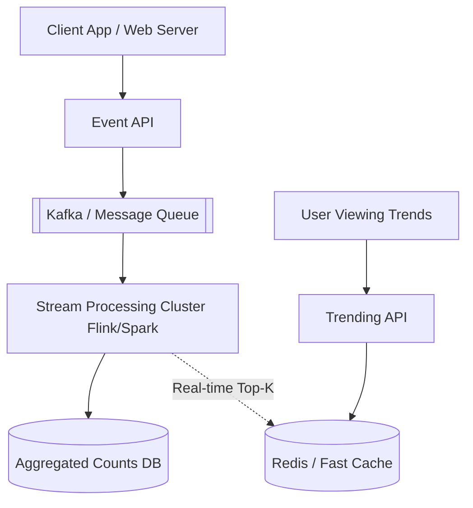

# Design a Top-K / Heavy Hitters System (e.g. Trending Hashtags)

A "Top-K" or "Heavy Hitters" system calculates the most frequently occurring items in a massive data stream within a specific time window. Examples include Twitter's "Trending Hashtags", YouTube's "Top 10 Viewed Videos Today", or Amazon's "Top Selling Products".

---

## Step 1 — Understand the Problem & Establish Design Scope

### Clarifying Questions
**Candidate:** What exactly are we counting? Words, video IDs, or search queries?
**Interviewer:** Let's say search queries (or hashtags).

**Candidate:** What is the time window over which we calculate the Top K?
**Interviewer:** It needs to be flexible. Let's aim for a sliding window of the last 1 hour, 1 day, and 1 week.

**Candidate:** Do we need 100% mathematical accuracy, or is an approximation acceptable?
**Interviewer:** A highly accurate approximation is perfectly fine. At our scale, missing 1 count out of 10 million doesn't change the "trending" status.

### Functional Requirements
- Accept a stream of events/strings (e.g., `#olympics`).
- Return a list of the top $K$ most frequent events for a given time window (e.g., top 100).

### Non-Functional Requirements
- **High Throughput:** Handle 100,000 to 1,000,000 incoming events per second.
- **Low Latency Read:** Returning the Top K list should be almost instantaneous.
- **Resource Efficient:** We cannot store and sort 1 billion unique strings in a single machine's RAM.

### Back-of-the-Envelope Estimation
- **Traffic:** 100k events/sec = ~8.6 billion events/day.
- **Unique Items:** Suppose out of 8.6B events, there are 100M unique strings/hashtags.
- **Memory:** Storing 100M unique strings (average 20 bytes) + a 4-byte counter = 2.4 GB. So, aggregating locally on one machine is possible, provided we partition incoming traffic properly. However, transferring 100k QPS across the network directly to a database will crush the DB.

---

## Step 2 — High-Level Design

### Core Concept: Stream Processing & Aggregation
To handle the "firehose" of data, you cannot insert 100,000 rows into a SQL table every second and run `SELECT string, COUNT(*) GROUP BY string ORDER BY COUNT DESC LIMIT 10`. The database will instantly explode.

We must pre-aggregate the data using a **Stream Processing Framework** (like Apache Flink, Spark Streaming, or Kafka Streams). The stream processor reads the firehose, counts occurrences over small time increments (e.g., 1-minute blocks), and writes the *aggregated* counts to a Database/Cache, drastically reducing the write load.

### Architecture

---

## Step 3 — Design Deep Dive

### 1. The Stream Processing Pipeline (Map-Reduce model)
Let’s assume we are using Apache Flink to process the Kafka stream. 

1. **Partitioning:** The Kafka stream must be partitioned so multiple Flink worker nodes can process it in parallel. We partition by the Hash of the string. (All `#olympics` events go to Node A. All `#tech` events go to Node B).
2. **Tumbling Windows:** Instead of updating the DB 10,000 times a second for `#olympics`, Node A keeps a local Hash Map in its RAM: `{ "#olympics": 1, "#cats": 1 }`. Every time it sees an event, it increments the RAM counter.
3. Every 60 seconds (a tumbling window), Node A flushes its aggregated Hash Map to the Database. So instead of 600,000 DB writes a minute for `#olympics`, it commits exactly **one** write: `("#olympics", 600000, "12:00PM - 12:01PM")`.

### 2. Algorithmic Approach (Count-Min Sketch)
If memory usage becomes a severe constraint (e.g., we have billions of unique strings and cannot afford memory for a standard Hash Map even in Flink), we can trade perfect accuracy for immense memory savings using probabilistic data structures.

**Count-Min Sketch (CMS):**
- It works similarly to a Bloom Filter but tracks frequencies.
- It uses a 2D matrix of integers and several different hash functions.
- When an item arrives, it is passed through $N$ hash functions, determining its column index in each of the $N$ rows. You increment the counter at those $N$ cells.
- To estimate the count of an item, you hash it again, look at the values in its $N$ cells, and take the **minimum** value.
- *Pros:* Tracks the frequencies of 1 billion items using just a few Megabytes of RAM.
- *Cons:* Because of hash collisions, it might slightly over-count items. (It never under-counts). Since we only care about the *heavy hitters*, this slight over-estimation on popular items is mathematically acceptable.

### 3. Calculating the Global Top K
If Node A has the Top K for A-M, and Node B has the Top K for N-Z, how do we get the Global Top K?
- Every 1-minute window, the leaf nodes (Flink workers) send their local Top `K` lists to a single **Reducer Node**.
- Since `K` is small (e.g., 100), the Reducer Node receives maybe `100 items * 50 workers = 5000 items` per minute. 
- The Reducer maintains a `Min-Heap` (Priority Queue) of size `K`. It processes the 5000 items, and pushes the final Global Top 100 list to Redis.

### 4. Designing for Different Time Windows (Sliding Windows)
The requirement was querying trending tags over 1 hour, 1 day, and 1 week.

**The Time-Decayed Aggregation (Roll-up) Strategy:**
- We store the data in an extremely fast DB (like Cassandra or Redis Sorted Sets).
- We store raw aggregations in 1-minute blocks.
- **1 Hour Query:** A background worker reads the last 60 1-minute blocks, adds them together, and calculates the Top-K for the hour, saving the result to a cache.
- **Roll up (Data lifecycle):** At the end of the day, an offline batch job (like Hadoop/Spark) takes the 1440 1-minute blocks for the day, sums them up, and creates a single "1-Day Block" for that date. It then deletes the 1-minute blocks. 
- This ensures we don't have to query 10,080 1-minute blocks to calculate a 7-day trend; we just query seven 1-day blocks.

---

## Step 4 — Wrap Up

### Dealing with Edge Cases
- **The "Lady Gaga" / Justin Bieber Problem (Data Skew):**
  If we partition our Kafka queue by the Hash of the String, and `#LadyGaga` goes globally viral, 95% of the traffic might be hashed to `Partition 42` and processed by `Flink Node A`. Node A's CPU hits 100%, and the stream backs up.
  - *Mitigation:* We must implement a **Two-Stage Architecture (Local + Global Aggregation)**. Do not hash-partition immediately. Use Round-Robin to distribute traffic perfectly evenly across the first layer of Flink workers. These workers maintain local Hash Maps for 10 seconds. After 10 seconds, they emit the *aggregated subset* (e.g., `#LadyGaga: +50,000`) downstream to the second layer of workers, which *are* hash-partitioned. This reduces the load on the `#LadyGaga` hash-node from 50,000 ops/sec to 1 op/sec.
- **Bots & Spam:** Real systems filter out click-farms. The API layer should pass the user ID/IP. If a single IP sends 500 clicks a second, the API layer drops them before they even reach Kafka.

### Architecture Summary
1. A massive firehose of clicks/searches is buffered by a distributed message queue (Kafka).
2. A two-stage **Stream Processing cluster** consumes the queue.
3. The first stage uses round-robin routing and in-memory Hash Maps (or Count-Min Sketch) to swallow massive traffic spikes for viral items over a small time window.
4. The second stage applies hash-based routing to ensure final distributed aggregation.
5. The processed chunks are saved to an Aggregation DB, and a Reducer node uses a **Min-Heap** to compute the Global Top K.
6. The final Top K list is pushed to Redis, allowing users to query trending items with zero-latency.