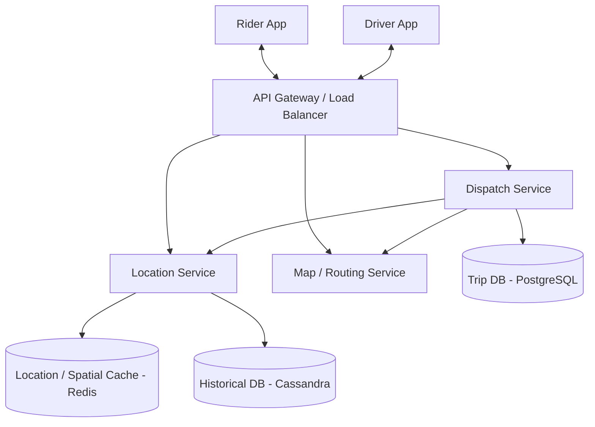

# Design Uber / Lyft (Ride-Sharing Service)

A ride-sharing service connects passengers who need a ride with drivers who have available cars.

---

## Step 1 — Understand the Problem & Establish Design Scope

### Clarifying Questions
**Candidate:** What is the most important feature we should focus on for this 45-minute interview?
**Interviewer:** Matching riders with nearby available drivers, and the real-time location tracking of the driver as they approach.

**Candidate:** How many users are we talking about?
**Interviewer:** Let's say 50 million total riders, 1 million total drivers. Assume 1 million rides per day.

**Candidate:** Do we need to handle the payment processing and surge pricing algorithms?
**Interviewer:** Briefly touch upon where surge pricing fits in, but focus primarily on the dispatch, matching, and location-tracking systems.

### Functional Requirements
- Riders can request a ride and receive an estimated price and ETA.
- Nearby available drivers receive a notification of the request and can accept or reject it.
- Riders can track the driver's location in real-time on a map.
- Drivers continually broadcast their live location to the system.

### Non-Functional Requirements
- **Low Latency:** The matching process must happen quickly. Live tracking must feel genuinely real-time (not highly delayed).
- **High Availability:** If the system goes down, thousands of people are stranded. The core dispatching must be highly resilient.
- **High Throughput:** 1 million drivers constantly sending location pings creates a massive write-heavy workload that the system must absorb smoothly.

### Back-of-the-Envelope Estimation
- **Data Ingestion (Writes):** Let's assume 1M active drivers sending a location update (latitude, longitude, timestamp, driver_id) every 5 seconds. 
  - 1M / 5 = **200,000 requests per second (QPS)** just for location updates. This is a massive firehose of data.
- **Storage:** If we keep driver tracking history for analytics (assume 100 bytes per point): 
  - 200k writes/sec * 100 bytes = 20 MB/sec.
  - 20 MB/sec * 86,400 secs in a day = **~1.7 TB per day** just for location logs.

---

## Step 2 — High-Level Design

### Core Entities
- **Driver:** ID, Location (Lat, Long), Status (`Available`, `En Route`, `On Trip`, `Offline`), Car Type.
- **Rider:** ID, Location (Lat, Long), Payment Info.
- **Trip:** Trip ID, Rider ID, Driver ID, Pickup Location, Drop-off Location, Price, Status (`Requested`, `Accepted`, `In Progress`, `Completed`).

### System Architecture

---

## Step 3 — Design Deep Dive

### 1. Driver Location Service
This is the most critical and heavily loaded component. 200k QPS of location writes must be handled seamlessly.

**Storage - The Spatial Database:** 
How do we store and mathematically query locations quickly to find "Nearest Drivers"? We cannot use a standard SQL database with `SELECT * FROM drivers WHERE lat > x AND lat < y`. That requires scanning massive tables and is far too slow for real-time operations.

We must use spatial indexing structures. Common algorithms involve converting 2D coordinates into a 1D string for standard indexing (e.g., **Geohash**, **QuadTree**, or Google's **S2 geometry**).
- For a service like Uber, using **Redis** is a pragmatic and powerful choice. Redis offers built-in Geospatial commands (`GEOADD`, `GEORADIUS`). 
- Since we only care about the *current, up-to-the-second* location of active drivers for the dispatch match, holding this data in an **in-memory datastore** like Redis is perfect and easily handles 200k QPS.

**The Split Architecture:**
- **Hot Write Path (Real-time):** Driver App -> API Gateway -> Location Service -> `GEOADD active_drivers <long> <lat> <driver_id>` in Redis.
- **Cold Write Path (History):** We also want to save historical paths for billing, dispute resolution, and ML training. The Location Service will asynchronously publish these location points to a Kafka queue, which dumps them into a distributed database optimized for heavy writes, like **Cassandra**.

### 2. Dispatch / Matching Service
This service orchestrated the actual magic of the app.

When a rider requests a car:
1. The Rider App sends a POST request with pickup and drop-off coordinates.
2. The Dispatch Service hits the Map Service to get an ETA and Price. *(Surge pricing logic happens here, pulling data from a real-time analytics engine monitoring exactly how many riders vs drivers are in the specific Geohash area).*
3. The Dispatch Service contacts the Location Service (asking Redis) to find the nearest *N* available drivers (e.g., within a 3-mile radius).
4. **Crucial Optimization:** Straight-line distance (what Redis calculates) is rarely accurate in cities due to one-way streets, rivers, or highways. The Dispatch Service takes the 10 closest drivers and asks the Map Service for actual road-routing ETAs. It sorts the drivers by true ETA.
5. It selects the #1 driver and initiates a ride offer.

### 3. Asynchronous Driver Notification
How does the server push the "Ride Request!" pop-up to the driver's phone with 0 latency?
- We cannot use standard HTTP requests where the server makes a call and hangs waiting for the driver to tap "Accept". The driver might lose signal via a tunnel.
- We must establish **WebSockets**. This creates a persistent, bidirectional TCP connection between the driver's app and a server.
- The Dispatch service puts the ride offer into a **Message Queue** (or directly targets the WebSocket manager). A notification pushes down the socket to the phone.
- **State Machine:** We need a timeout. If Driver A doesn't accept within 10 seconds, the ride offer expires. The Dispatch service's state machine notes the denial, blocks Driver A from this trip, and sends the offer to Driver B.

### 4. Real-time Tracking (The moving car on the map)
Once the driver accepts, the rider needs to see the car moving toward them.
1. The driver's phone is still continually sending location updates over their WebSocket connection every 2-5 seconds.
2. The system looks up the matched `Rider` associated with this `Driver`.
3. The system pushes this incoming `(Lat, Long)` point directly down to the Rider's active WebSocket connection.
4. The Rider App receives the coordinate. It uses simple local interpolation/animation to drag the tiny car icon smoothly from the last coordinate to the new one, making it look like a smooth driving animation rather than a teleporting dot.

---

## Step 4 — Wrap Up

### Trade-offs & Bottlenecks

- **WebSocket Connection Management:** Managing millions of long-lived, active WebSockets requires dedicated infrastructure. A vast cluster of specialized WebSocket servers (perhaps using Node.js or Go) is needed. If a server dies, thousands of mobile apps will instantly drop connection. The apps must be programmed to automatically retry and re-establish a socket with a surviving node immediately.
- **Handling Intermittent Disconnects:** Drivers go through dead zones and tunnels. The system must gracefully handle temporary internet loss. The driver app should cache location points locally. When 4G is restored, it bulk-uploads the buffered points to ensure the final route (and therefore the final bill parameter) is mathematically accurate and no distance was "skipped."
- **Geospatial Sharding:** A single Redis cluster will eventually choke on global queries. We *must* shard the geospatial data. The most logical sharding key is **City** or **Region**. A separate Redis cluster handles New York vs. London vs. San Francisco. This is highly effective because a rider in NY will never match with a driver in SF; the data is naturally isolated geographically.

### Architecture Summary

1. Drivers constantly stream their location over WebSockets to a Region-Sharded Redis cluster via the Location Service.
2. Riders request a trip. The Dispatch Service calculates the fare, checks Redis for nearby drivers, and cross-references an internal Map routing engine for true ETAs.
3. The top driver receives a push notification via their WebSocket to accept the trip.
4. If accepted, the trip state moves to "En Route" in a durable PostgreSQL/Aurora Trip Database.
5. The ongoing stream of the Driver's location updates is piped almost directly through the backend to the matched Rider's WebSocket, animating the car on the rider's screen.