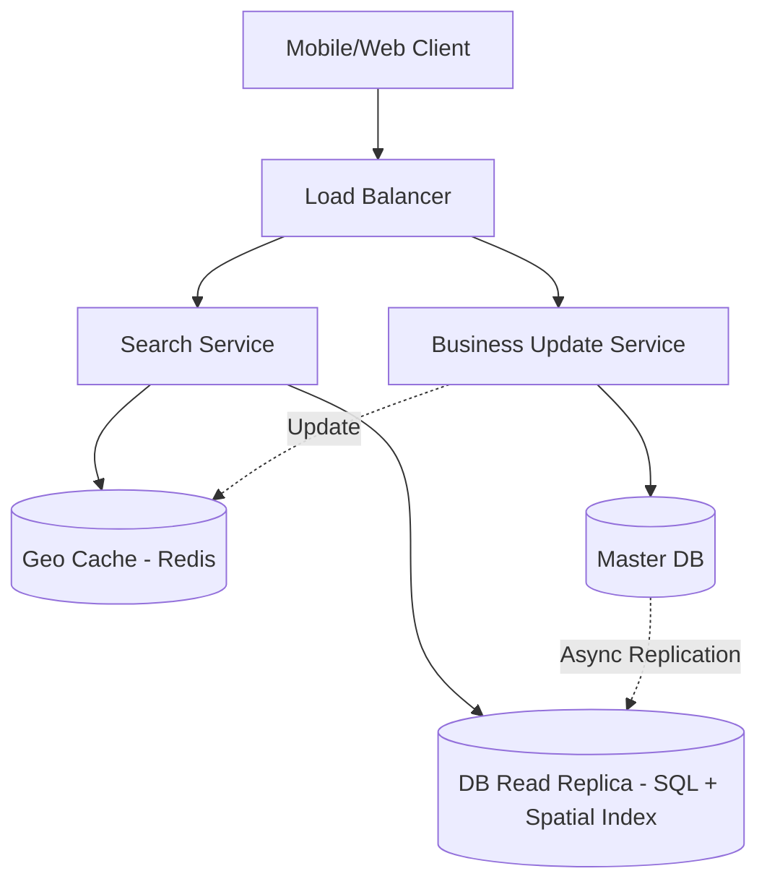

# Design Yelp or Nearby Places

Yelp is a local business directory service and review site. Central to the platform is its search engine, which allows users to find businesses (like "Pizza" or "Plumbers") near a specific location.

---

## Step 1 — Understand the Problem & Establish Design Scope

### Clarifying Questions
**Candidate:** What are the key features for this interview?
**Interviewer:** Focus on querying businesses near a specific location within a radius, and allowing business owners to add or update their local business.

**Candidate:** What is the scale?
**Interviewer:** 500 million places/businesses worldwide. 100,000 queries per second (QPS) for searching. Business additions/updates are low, maybe 1,000 requests per day.

**Candidate:** How should results be sorted?
**Interviewer:** For today, just return businesses within the radius, sorted by distance from the user.

### Functional Requirements
- **Search (Read):** Given a GPS coordinate (latitude, longitude) and a radius (e.g., 5km), return a list of nearby places.
- **Add/Update Place (Write):** Add a point of interest with its location and metadata (Name, Category).

### Non-Functional Requirements
- **Low Latency:** Spatial queries must be executed rapidly (< 50ms).
- **High Read Availability:** The system is extremely read-heavy. Reads must remain available.
- **Eventual Consistency:** When a new business is added, it is completely acceptable if it takes a few minutes to appear in search results across the globe.

### Back-of-the-Envelope Estimation
- **Traffic:** 100k QPS (Read-heavy). 1k/day (Write-light). We have a ~100,000 : 1 read-to-write ratio.
- **Storage:** 500M places * ~2KB of metadata per place = 1 Terabyte of data. This is small enough to fit on the SSD of a single server, but we will need memory caching for high QPS.

---

## Step 2 — High-Level Design

### The Core Problem: 2D Spatial Search
Traditional SQL databases index data in one dimension (e.g., alphabetically or numerically).
If we store data like `id, name, lat, long`, a query to find a place would look like:
`SELECT * FROM places WHERE lat > (myLat - radius) AND lat < (myLat + radius) AND long > (myLong - radius) AND long < (myLong + radius);`

This forces the database to intersect two massive result sets (one for latitude, one for longitude). It is extremely slow and unscalable for 100k QPS.

**We need a Spatial Index.** 
We must map 2D coordinates (lat, long) into a 1D string or number so the database can structure it as a standard B-Tree index. Let's use **Geohashing**.
Geohash divides the world into a grid of grids. The longer the Geohash string, the smaller and more precise the grid square is. For example, `9q8yy` is an area in San Francisco. A place inside that area will start with the exact same string prefix.

### Architecture

---

## Step 3 — Design Deep Dive

### 1. Database Schema

Since the dataset is 1TB and highly structured, a Relational Database like **PostgreSQL** is an excellent choice. PostgreSQL has an extension called **PostGIS** which is explicitly built to handle Geospatial indexing and Geohash conversions seamlessly.

**Places Table:**
- `place_id` (PK)
- `name` (String)
- `category` (String)
- `lat` (Float)
- `long` (Float)
- `geohash` (String) -> Indexed.

### 2. The Search Algorithm (Reads)

1. A user in Manhattan opens the app and requests nearby pizza. The app sends `(lat, long, radius=2km, term="pizza")` to the `Search Service`.
2. The `Search Service` mathematically calculates the Geohash prefix that corresponds to the user's location and requested radius. Let's say a 2km radius corresponds to a 5-character Geohash like `dr5ru`.
3. An optimization: A user might be sitting exactly on the border of a Geohash boundary. So the service calculates the user's grid square *and* its 8 neighboring grid squares.
4. The service queries the DB Replica (or Cache): 
   `SELECT * FROM places WHERE geohash LIKE 'dr5ru%' AND category = 'pizza';` (repeated for the 8 neighbors).
5. The service receives the results. Because grids are squares, some results might technically be just outside the true circular radius. The application server quickly calculates the Haversine distance exactly for the returned results, filters out any > 2km, sorts them by distance, and returns the JSON.

### 3. Scaling the Reads

Because our read-to-write ratio is incredibly skewed (100k reads vs 0.01 writes per sec), our entire architecture must prioritize caching and read scalability.

- **Read Replicas:** We set up a large cluster of PostgreSQL Read Replicas. The Master DB handles the ~1,000 business uploads per day (which is nothing). It asynchronously replicates to the read replicas globally.
- **In-Memory Caching (Redis):** Even querying SQL read replicas might bottleneck at 100k QPS. We can keep the spatial index in RAM. For example, Redis has Geohash support built directly into it via commands like `GEORADIUS`. 
  - On application startup (or continuously), all Places are loaded into a Redis cluster: `GEOADD global_places <long> <lat> <place_id>`.
  - The Search API hits Redis first. Redis instantly returns the matching `place_id`s within the radius.
  - The API then hydrates the data (gets the name, photos, opening hours) either from a separate Memcached layer or by doing a fast batch ID lookup to the SQL read replica.

### 4. Adding/Updating a Business (Writes)

1. A business owner submits a new location.
2. The `Business Update Service` writes to the Master PostgreSQL database. 
3. It immediately returns "Success" to the user.
4. The Master DB begins asynchronously syncing the new row to the global Read Replicas (this takes seconds/minutes).
5. A background worker (or CDC stream like Debezium) triggers an update to the Redis Geo-cache so that the search layer knows about the new coordinate.

---

## Step 4 — Wrap Up

### Dealing with Scale & Edge Cases

- **Sharding the Database:** 1TB fits on a single machine, but for massive QPS, what if we need to horizontally shard the database itself? We should **Shard by Geohash Prefix**. 
  - All places starting with `9q` (California) go to Database Cluster A. 
  - All places starting with `dr` (New York) go to Database Cluster B.
  - *Risk:* Dense cities like New York will have far more places and queries than rural Wyoming. This creates hot shards. To fix this, we might need a dynamic sharding mechanism (a consistent hashing ring) or shard by `place_id` (though sharding by ID means spatial queries must hit *every* shard to aggregate results).
- **Pagination:** Handling pagination with a moving user is tricky. The simplest way is a cursor-based approach where the client sends the ID of the last viewed place, but since distances change as the user walks, standard offset pagination is usually "good enough" for local searches.

### Architecture Summary

1. Yelp is an ultra-read-heavy system dealing in 2D coordinates.
2. We map 2D coordinates to 1D strings using **Geohashes** so they can be indexed via standard B-Trees.
3. Business creations happen on a Master RDBMS and are asynchronously replicated to a fleet of read replicas.
4. High-velocity searches hit an in-memory spatial cache (like Redis GEO commands) to instantly find nearby `place_id`s, followed by fetching the rich metadata from the read replica fleet.
