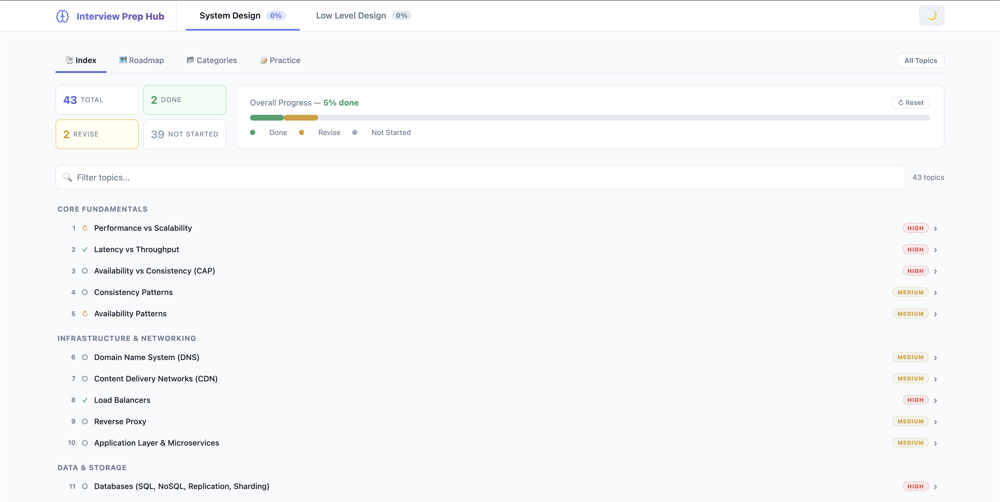

# InterviewPrepHub

A personal interview prep tracker built with React and Vite. Focused on System Design and Low-Level Design with curated notes, roadmaps, and practice questions. Runs fully offline with progress stored in localStorage.

---

## Highlights

- Two tracks: System Design (SD) and Low-Level Design (LLD) with per-track progress stats
- Roadmap view with phased skill-tree layout and prep-time filters (1 week, 2 weeks, 1 month, comprehensive)
- Categories view with a collapsible sidebar, search, and quick review from Revise topics
- Practice view with SD system design case studies and LLD problem solutions (plus OOD practice)
- Inline SD QnA flashcards for topics 1-24 and embedded videos when available
- Theme toggle and deep links via URL hash for fast resume

---

## Repo Structure

```
InterviewPrepHub/
├── src/                # React/Vite app
│   ├── components/     # dashboard, roadmap, notes, sidebar
│   ├── data/           # topics, roadmaps, practice questions
│   └── store/          # progress, theme, URL hash state
├── Notes/
│   ├── SystemDesign/
│   │   ├── Topics/     # SD notes + QnA key
│   │   ├── Solutions/  # SD system design solutions
│   │   └── README.md   # SD study guide and table of contents
│   ├── LowLevelDesign/
│   │   ├── *.md        # LLD concept notes
│   │   └── Solutions/  # LLD problem solutions
│   └── Other/          # misc engineering notes
└── public/             # app assets
```

---

## The App



### Sections

- System Design (SD)
- Low-Level Design (LLD)

### Views

| View | What it shows |
|---|---|
| Roadmap | Phased plan that tracks progress by phase; click a topic to open it in Categories. |
| Categories | Topics grouped by category with a sidebar, search, and per-topic status actions. |
| Practice | Practice questions grouped by difficulty or type with solution notes. |
| Index | Flat list of all topics with global stats and reset. |

### Roadmap and prep-time filters

The roadmap is a skill-tree style phase list for both SD and LLD. Each phase maps directly to topic IDs so progress stays consistent across views.

Prep time filters narrow the roadmap to the most important topics for a given timeline:

- 1 Week (~30h): SD 9 topics, LLD 9 topics
- 2 Weeks (~70h): SD 19 topics, LLD 17 topics
- 1 Month (~120h): SD 30 topics, LLD 27 topics
- Comprehensive (All): full coverage

Topics outside the selected scope are dimmed, and in-scope topics are highlighted. Your selection is persisted in localStorage.

---

## Coverage

### System Design topics

- Core fundamentals: performance vs scalability, latency vs throughput, CAP, consistency and availability patterns
- Infrastructure and networking: DNS, CDN, load balancers, reverse proxy, app layer and microservices
- Data and storage: databases, caching
- Async, communication, APIs: queues and back pressure, protocols, API design
- Security and reliability: security, rate limiting, SLO/SLA/SLI
- Advanced: distributed systems, event-driven architecture, observability, data pipelines, containers
- Building blocks: ID generation, location services, search, object storage, distributed locking, consistent hashing, service discovery
- Cloud and DevOps: serverless, cloud patterns, IaC, CI/CD, DR, cost planning, workflow orchestration
- Specialized: ML system design, advanced data modeling, graph databases, trust and safety
- Deep dives and reference: networking deep dive, estimation, appendix, interview cheat sheet

### Low-Level Design topics

- OOP fundamentals, class relationships, SOLID, design principles, dependency injection
- UML diagrams
- Creational, structural, and behavioral patterns
- Concurrency notes and deep dive
- LLD interview cheat sheet
- Problem sets: easy, medium, hard, concurrency problems, and extra machine-coding problems
- OOD practice set (Hash Map, LRU cache, call center, deck of cards, parking lot, chat server, circular array)

---

## Practice and notes

### Practice questions

- System Design: 38 case studies with solution notes in `Notes/SystemDesign/Solutions`.
- Low-Level Design: 75 problem solutions plus 7 OOD practice prompts in `Notes/LowLevelDesign/Solutions`.

### Notes and QnA

- Topic notes live in `Notes/SystemDesign/Topics` and `Notes/LowLevelDesign`.
- SD topics 1-24 include QnA flashcards sourced from `Notes/SystemDesign/Topics/QnA-Answer-Key.md`.
- When a topic has a `youtubeId`, a Video tab appears in the content panel.

---

## Progress tracking and persistence

Each topic can be set to Not Started, Done, or Revise. Progress, theme, prep-time filters, and QnA answers are saved in localStorage. Use the Index view to reset a section. The sidebar also offers a Quick Review button for random Revise topics.

Navigation state is stored in the URL hash, so refreshes keep your place. Examples:

- `#sd/roadmap`
- `#lld/categories/lld-parking-lot`
- `#sd/practice/q-uber`

---

## Running Locally

Requires Node.js.

```bash
npm install
npm run dev
```

Open `http://localhost:5173` in your browser.

```bash
npm run build     # Production build -> dist/
npm run preview   # Preview the production build
npm run lint      # Run ESLint
```

---

## Tech Stack

- React 19 + Vite
- react-markdown with `remark-gfm` and `rehype-raw`
- localStorage persistence (no backend)

---

## Content and roadmap data

Roadmaps and topic metadata live in:

- `src/data/roadmap.js` and `src/data/lldRoadmap.js`
- `src/data/topics.js` and `src/data/lldTopics.js`
- QnA parsing in `src/data/qna.js`

Add new notes under `Notes/` and update the relevant data files to surface them in the app.
